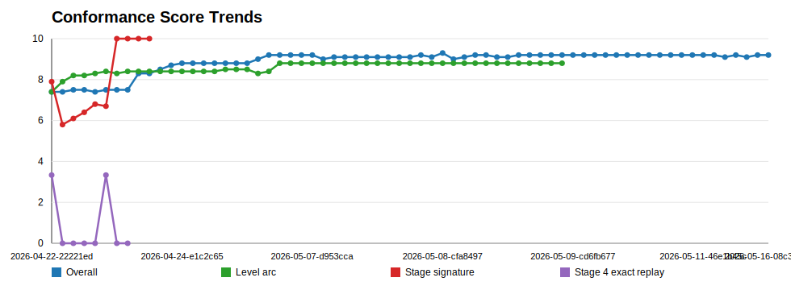
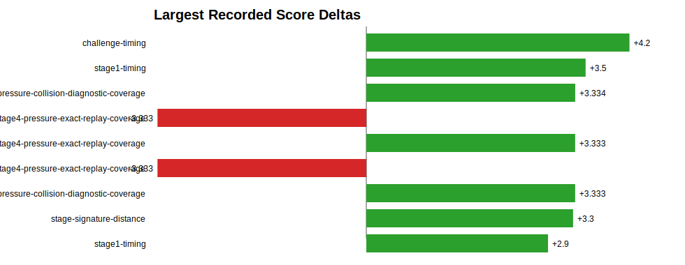
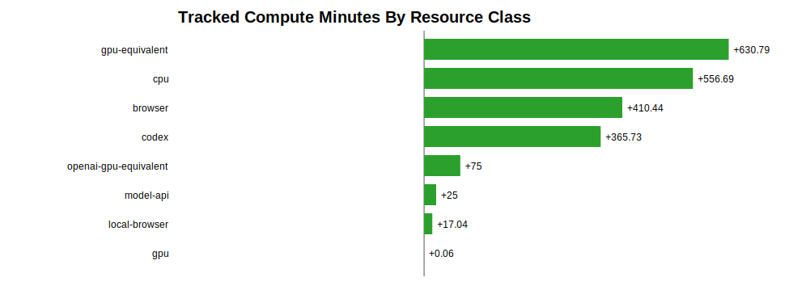
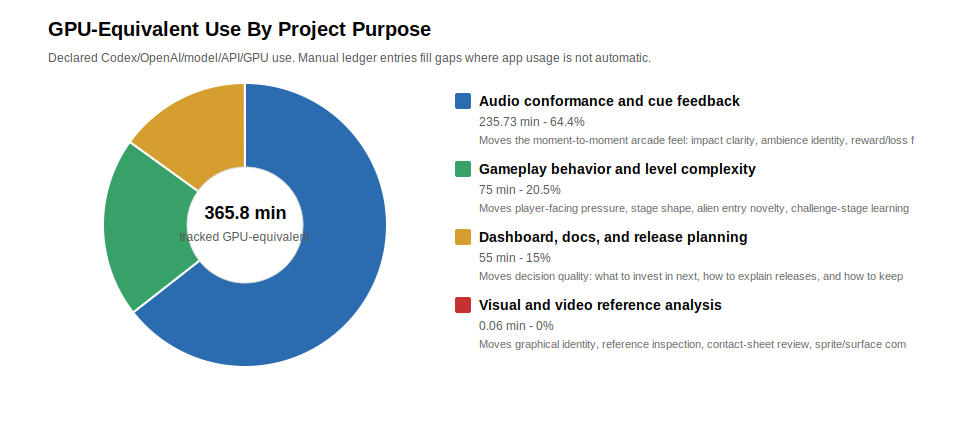
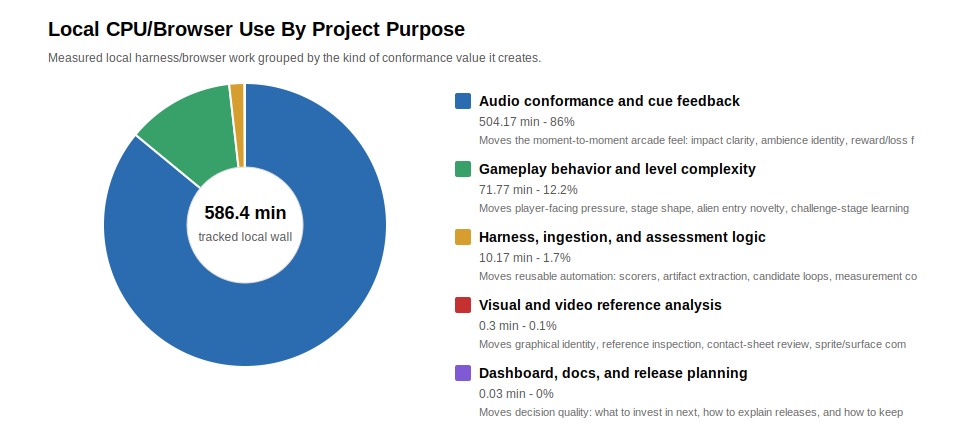
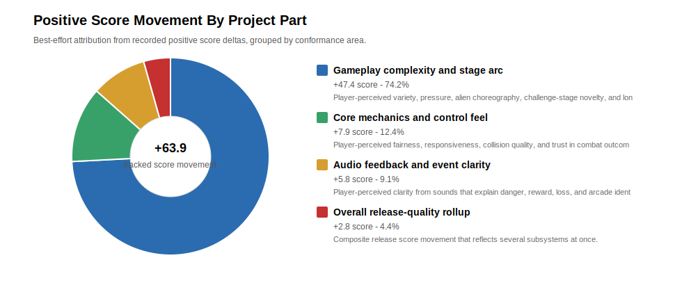

# Conformance Economics And Resource Usage

This is the project section for tracking how Aurora / Platinum conformance improves relative to the resources spent to get there. It is intentionally local-first: we want the MacBook CPU/browser harnesses to carry as much measurement and iteration as possible, while Codex/OpenAI model work is used for strategy, harness design, code generation, interpretation, and selected higher-value analysis.

Generated: `2026-05-19T21:55:51.267Z`
Latest artifact: `reference-artifacts/analyses/conformance-economics/2026-05-19-95995f49/report.json`

## Current Local-Vs-Cloud Read

| Read | Current value | Interpretation |
| --- | --- | --- |
| Overall quality | 9.2/10 | Current release-quality conformance roll-up. |
| Level arc | 8.8/10 | Current long-play/gameplay-shape roll-up. |
| Measured runs | 848 | Commands or manual entries logged in the economics ledger. |
| Local CPU tracked wall | 556.7 min | Main measured engine for harness execution, report generation, waveform/spectral work, and scoring. |
| Browser-backed local wall | 410.4 min | Subset of local work that exercised Chromium/gameplay runtime. |
| GPU-equivalent tracked wall | 630.8 min | Declared Codex/model/API/GPU usage. This is currently small and under-instrumented. |
| GPU-equivalent share | 66.3% | Approximate declared cloud/model share of tracked wall time. |
| Artifact growth | 1426.4 MB | Evidence volume and review/storage-cost proxy. |

The important read today: measured conformance advancement is overwhelmingly local CPU/browser driven. Codex and OpenAI model work are essential for reasoning, implementation, and synthesis, but the repository ledger currently records only a small fraction of that cloud-side work. We should keep pushing computation into reusable local harnesses whenever possible and explicitly log Codex/model/API assistance as `gpu-equivalent` when it materially drives a work cycle.

## Latest Self-Critical Retrospective

The past focused block substantially improved our honesty and repeatability, but only modestly improved player-facing conformance. Challenge stages are now scored with a strict 1/10 baseline and have risen to 3.8/10; that is a real improvement from the strict 2.5/10 baseline, but still far from human-level Galaga conformance. The biggest remaining failures are movement grammar, alien novelty, stage-to-stage challenge progression, and stable audio runtime promotion.

| Metric | Start | Current | Delta | Read |
| --- | --- | --- | --- | --- |
| Challenge-stage strict conformance | 2.5/10 | 3.8/10 | +1.3 | advanced |
| Challenge-stage interesting factor | 2.6/10 | 3.8/10 | +1.2 | advanced |
| Challenge movement / trajectory conformance | 2.3/10 | 3.4/10 | +1.1 | advanced |
| Challenge graphical conformance | 2.1/10 | 4.3/10 | +2.2 | advanced |
| Challenge alien novelty | 3.4/10 | 3.4/10 | +0 | stalled |
| Challenge stage-to-stage progression | 2.8/10 | 3.0/10 | +0.2 | nudged |
| Challenge scoring/shot opportunity | n/a | 5.1/10 | n/a | stalled |
| Challenge no-combat safety guardrail | 10.0/10 | 10.0/10 | +0 | guardrail |
| Overall quality rollup after strict challenge metric | 8.7/10 | 8.8/10 | +0.1 | nudged |
| Audio release-category read | 7.0/10 | 7.3/10 | +0.3 | mixed |

Key correction: treat improved measurement as valuable, but do not confuse it with human-level gameplay conformance. The latest retrospective says the recurring weak spots are challenge movement grammar, alien novelty, challenge progression, and stable audio runtime promotion.

Retrospective artifact: `reference-artifacts/analyses/conformance-investment-retrospective/2026-05-18-e583b558/report.json`

## Resource Spend

| Resource class | Measured runs | Wall time | CPU time | Share of tracked wall |
| --- | --- | --- | --- | --- |
| gpu-equivalent | 18 | 630.8 min | 1.2 min | 66.3% |
| cpu | 810 | 556.7 min | 894.3 min | 58.5% |
| browser | 304 | 410.4 min | 633.8 min | 43.1% |
| codex | 13 | 365.7 min | 1.2 min | 38.4% |
| openai-gpu-equivalent | 1 | 75 min | 0 min | 7.9% |
| model-api | 2 | 25 min | 0 min | 2.6% |
| local-browser | 4 | 17 min | 30.8 min | 1.8% |
| gpu | 1 | 0.1 min | 0.1 min | 0% |

## Compute Application And Impact

These tables answer the practical question behind the economics work: when we spend local CPU/browser time or GPU-equivalent model time, what kind of conformance value are we buying?

### GPU-Equivalent Use By Purpose

| GPU-equivalent purpose | Runs | Wall time | Share | Meaning |
| --- | --- | --- | --- | --- |
| Audio conformance and cue feedback | 9 | 235.7 min | 64.4% | Moves the moment-to-moment arcade feel: impact clarity, ambience identity, reward/loss feedback, and player understanding. |
| Gameplay behavior and level complexity | 1 | 75 min | 20.5% | Moves player-facing pressure, stage shape, alien entry novelty, challenge-stage learning value, and long-play texture. |
| Dashboard, docs, and release planning | 2 | 55 min | 15% | Moves decision quality: what to invest in next, how to explain releases, and how to keep dev/beta/prod evidence aligned. |
| Visual and video reference analysis | 1 | 0.1 min | 0% | Moves graphical identity, reference inspection, contact-sheet review, sprite/surface comparison, and readability. |

### Local CPU/Browser Use By Purpose

| Local CPU/browser purpose | Runs | Wall time | Share | Meaning |
| --- | --- | --- | --- | --- |
| Audio conformance and cue feedback | 510 | 504.2 min | 86% | Moves the moment-to-moment arcade feel: impact clarity, ambience identity, reward/loss feedback, and player understanding. |
| Gameplay behavior and level complexity | 306 | 71.8 min | 12.2% | Moves player-facing pressure, stage shape, alien entry novelty, challenge-stage learning value, and long-play texture. |
| Harness, ingestion, and assessment logic | 9 | 10.2 min | 1.7% | Moves reusable automation: scorers, artifact extraction, candidate loops, measurement confidence, and future game ingestion. |
| Visual and video reference analysis | 10 | 0.3 min | 0.1% | Moves graphical identity, reference inspection, contact-sheet review, sprite/surface comparison, and readability. |
| Dashboard, docs, and release planning | 6 | 0 min | 0% | Moves decision quality: what to invest in next, how to explain releases, and how to keep dev/beta/prod evidence aligned. |

### Positive Score Movement By Project Area

| Project part | Positive score movement | Share | Player/designer meaning |
| --- | --- | --- | --- |
| Gameplay complexity and stage arc | +47.4 | 74.2% | Player-perceived variety, pressure, alien choreography, challenge-stage novelty, and long-play learning curve. |
| Core mechanics and control feel | +7.9 | 12.4% | Player-perceived fairness, responsiveness, collision quality, and trust in combat outcomes. |
| Audio feedback and event clarity | +5.8 | 9.1% | Player-perceived clarity from sounds that explain danger, reward, loss, and arcade identity. |
| Overall release-quality rollup | +2.8 | 4.4% | Composite release score movement that reflects several subsystems at once. |

## Spend By Conformance Axis

| Axis | Measured runs | Wall time | CPU time |
| --- | --- | --- | --- |
| audio | 309 | 253.7 min | 459.4 min |
| conformance-analysis | 5 | 235.2 min | 0.4 min |
| challenge-perfect | 71 | 180.7 min | 180.1 min |
| audio-runtime-trial | 27 | 162.1 min | 31.9 min |
| audio-activity-profile | 10 | 127.2 min | 14 min |
| audio-risk-stability | 8 | 91.4 min | 2.7 min |
| release-hardening | 1 | 90 min | 0 min |
| challenge-stage | 94 | 84.2 min | 16.1 min |
| audio-theme-comparison | 39 | 84.2 min | 100.1 min |
| audio-focus-candidate | 39 | 78.5 min | 146.2 min |
| conformance-economics | 101 | 76.4 min | 30.7 min |
| sprite-conformance | 10 | 75.2 min | 0.3 min |

## Cost Per Score Movement

| Axis | Runs | Wall min | Positive score gain | Wall min / +1 score | Attribution |
| --- | --- | --- | --- | --- | --- |
| formation-boss-grammar | 4 | 0.139 | 2.5 | 0.06 | tracked-spend-and-score-movement |
| overall-quality | 2 | 2.178 | 2.8 | 0.78 | tracked-spend-and-score-movement |
| stage4-pressure | 28 | 12.824 | 10 | 1.28 | tracked-spend-and-score-movement |
| level-arc | 96 | 8.742 | 3.4 | 2.57 | tracked-spend-and-score-movement |
| audio | 309 | 253.734 | 5.8 | 43.75 | tracked-spend-and-score-movement |
| movement | 0 | 0 | 7.9 | n/a | historical-score-movement-without-tracked-spend |
| challenge-timing | 0 | 0 | 6.5 | n/a | historical-score-movement-without-tracked-spend |
| stage1-timing | 0 | 0 | 6.4 | n/a | historical-score-movement-without-tracked-spend |
| stage-signature-distance | 0 | 0 | 4.3 | n/a | historical-score-movement-without-tracked-spend |
| movement-grammar-expansion | 0 | 0 | 3.4 | n/a | historical-score-movement-without-tracked-spend |
| stage-distinctiveness | 0 | 0 | 3.3 | n/a | historical-score-movement-without-tracked-spend |
| long-run-non-repetition | 0 | 0 | 2.5 | n/a | historical-score-movement-without-tracked-spend |

## Charts














## Codex / OpenAI Accounting

- Latest Codex quota snapshot: 2026-05-08T17:14:03.471Z
- General 5h left: 92%
- General weekly left: 86%
- Model 5h left: 100%
- Model weekly left: 100%

| Cloud/model measure | Current logged value |
| --- | --- |
| Codex resource runs | 13 |
| Model/API resource runs | 2 |
| GPU-equivalent resource runs | 18 |
| Declared model calls | 0 |
| Declared input tokens | 0 |
| Declared output tokens | 0 |
| Declared model minutes | 365 |

Current limitation: Codex conversation usage is not automatically visible to the repo. The project can track manual snapshots and declared model/API usage, but it cannot infer all cloud GPU use from a chat session unless we log it. Treat missing Codex/model entries as accounting debt, not proof that no model compute was used.

## Local-First Doctrine

- Prefer repeatable local CPU/browser harnesses for long-cycle assessment, sweeps, scoring, and regression checks.
- Use Codex/OpenAI model work to design better measurements, write harness logic, interpret failures, summarize tradeoffs, and choose high-value next investments.
- Convert model insight into persisted local logic whenever possible: new scorers, event extractors, dashboards, candidate loops, and artifact reports.
- Track model/API/Codex help as `gpu-equivalent` when it materially changes the plan, creates a harness, reviews evidence, or performs nontrivial analysis.
- Separate gameplay-facing gains from measurement-facing gains. A better scorer may not move the game score immediately, but it can reduce the cost of every future decision.

## How To Measure Future Work

Wrap meaningful local commands with the economics ledger:

```sh
npm run harness:measure -- \
  --axis audio \
  --resource cpu \
  --resource browser \
  --notes "audio cue segmentation sweep" \
  -- npm run harness:analyze:aurora-audio-event-gap
```

Log Codex/model/API-only work without storing prompts, secrets, or private transcript content:

```sh
npm run harness:measure -- \
  --manual \
  --axis audio \
  --resource codex \
  --resource model-api \
  --model-provider openai \
  --model gpt-5.3-codex \
  --model-minutes 30 \
  --notes "model-assisted cue-window review and harness design"
```

If the Codex app usage screen is consulted, record only quota percentages and reset dates:

```sh
npm run harness:measure -- \
  --manual \
  --axis conformance-planning \
  --resource codex \
  --codex-usage-5h-left-percent 92 \
  --codex-usage-week-left-percent 86 \
  --codex-model-5h-left-percent 100 \
  --codex-model-week-left-percent 100 \
  --usage-reset "2026-05-08 15:52" \
  --weekly-reset "2026-05-11" \
  --notes "quota snapshot before long conformance planning cycle"
```

## Release Documentation Rule

Before a serious `/dev`, `/beta`, or `/production` candidate, refresh:

```sh
npm run harness:analyze:conformance-economics
npm run harness:build:release-conformance-dashboard
npm run harness:build:dev-conformance-dashboard
```

The release record should include conformance score movement, local CPU/browser spend, GPU/model/API spend where declared, artifact volume, confidence/resolution, and the highest-value next resource investment.