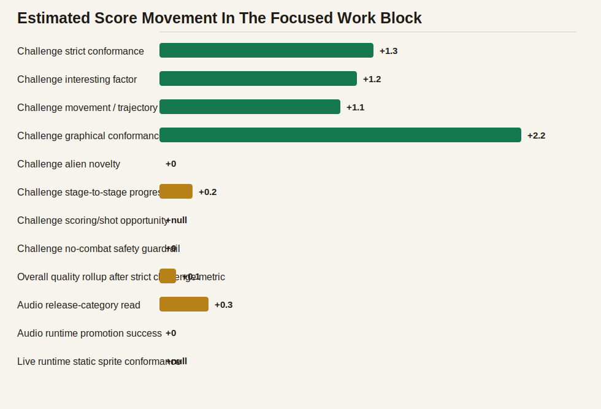
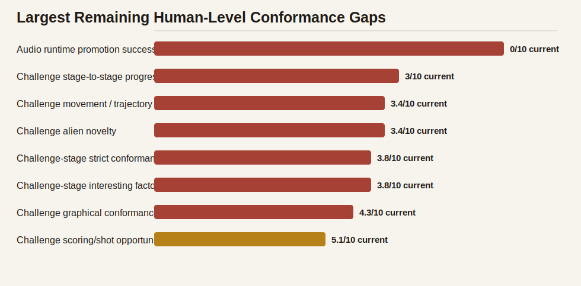
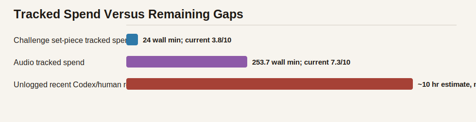

# Conformance Investment Retrospective

Generated: `2026-05-18T12:43:17.737Z`
Commit: `e583b558`

## Purpose

This artifact is the self-critical read for the most recent focused conformance work block. It separates measurement progress from player-facing progress, then names the areas where Aurora is still not moving toward human-level Galaga conformance fast enough.

## Executive Read

The past focused block substantially improved our honesty and repeatability, but only modestly improved player-facing conformance. Challenge stages are now scored with a strict 1/10 baseline and have risen to 3.8/10; that is a real improvement from the strict 2.5/10 baseline, but still far from human-level Galaga conformance. The biggest remaining failures are movement grammar, alien novelty, stage-to-stage challenge progression, and stable audio runtime promotion.

## Metric Movement

| Metric | Start | Current | Delta | Read |
| --- | ---: | ---: | ---: | --- |
| Challenge-stage strict conformance | 2.5/10 | 3.8/10 | +1.3 | Highest-priority gameplay authenticity gap. |
| Challenge-stage interesting factor | 2.6/10 | 3.8/10 | +1.2 | Bonus stages should feel authored and exciting, not merely safe. |
| Challenge movement / trajectory conformance | 2.3/10 | 3.4/10 | +1.1 | True alien path grammar and motion shape. |
| Challenge graphical conformance | 2.1/10 | 4.3/10 | +2.2 | Visible alien/sprite/readability fit against target challenge artifacts. |
| Challenge alien novelty | 3.4/10 | 3.4/10 | +0 | Whether later challenges introduce memorable alien families and roles. |
| Challenge stage-to-stage progression | 2.8/10 | 3/10 | +0.2 | Whether the eight challenge stages escalate as distinct lessons. |
| Challenge scoring/shot opportunity | n/a | 5.1/10 | n/a | Whether players get clear, learnable bonus-shot routes. |
| Challenge no-combat safety guardrail | 10/10 | 10/10 | +0 | No enemy shots, no attack starts, no ship deaths in challenge windows. |
| Overall quality rollup after strict challenge metric | 8.7/10 | 8.8/10 | +0.1 | Release score moved only slightly because the stricter challenge metric exposed a large gap. |
| Audio release-category read | 7/10 | 7.3/10 | +0.3 | The release score nudged upward, but accepted runtime cue promotion remains blocked by full-theme instability. |
| Audio runtime promotion success | 0/10 | 0/10 | +0 | No candidate is accepted into runtime audio yet; the process improved, the shipped sound did not meaningfully move from these candidates. |
| Live runtime static sprite conformance | n/a | 6.2/10 | n/a | Static runtime sprite identity is measured around 6/10 and active motion is still a planning row, so graphics remain visually incomplete. |

## Where We Moved Most

- Strict challenge-stage truth improved: the old broad read around 6.1/10 was replaced by a stricter baseline at 2.5/10, then recovered to 3.8/10. This is progress, but it is mostly better measurement plus partial graphical evidence, not a solved gameplay problem.
- Challenge graphical conformance moved from 2.1/10 to 4.3/10 after object-track/static visual evidence landed.
- Overall quality under the strict challenge metric moved only 8.7/10 -> 8.8/10, which is an honest signal that the user-visible game has not leapt forward as much as the harness did.

## Where We Moved Least

- Alien novelty remains 3.4/10; it did not materially move during the focused block.
- Stage-to-stage challenge progression remains 3/10; late challenges still do not yet read as distinct Galaga-like lessons.
- Challenge movement conformance is only 3.4/10 and has plateaued relative to the amount of analysis effort.
- Audio runtime promotion is still zero accepted cues even though cue contracts and candidate loops improved the process.

## Where We Are Consistently Failing

- Challenge-stage layout sweeps are too shallow for the real problem. The gap is trajectory grammar, entry/exit choreography, alien-family staging, and temporal sprite motion, not just spawn timing and lane offsets.
- Audio candidate loops are optimizing isolated clips faster than they are improving full-theme live capture. Reference-vs-reference calibration and repeated full-theme stability gates must come before more runtime promotion.
- Some graphics artifacts are useful to the harness but not useful enough to a human reviewer. Dense contact sheets and tiny "view larger" images need to become stage-by-stage temporal crop strips and object-track overlays.
- The economics ledger still undercounts Codex/model/human orchestration time. The charts correctly show measured local CPU/browser spend, but cloud/model work is only visible when manually logged.
- High broad scores can mask low strict scores. The broad alien/challenge novelty score is useful context, but the strict challenge-stage set-piece score is the one that matches the human complaint.

## Recommended Corrections

- Make challenge-stage path grammar the next primary gameplay investment: define per-challenge contracts for group order, first-visible frame, path length, turn count, exit side, alien family, animation phases, and bonus-shot opportunity.
- Build direct target object tracks from the supplied Galaga challenge videos and compare Aurora tracks against those trajectories before authoring another large sweep.
- Replace dense challenge contact sheets in the human docs with larger expandable crop sequences: reference target strip, Aurora current strip, object-track overlay, and per-axis score.
- Freeze audio runtime promotion until reference-vs-reference and current-vs-current variance is known for challengePerfect, challengeTransition, gameOver, captureBeam, and stagePulse.
- Log every multi-hour cycle with `npm run harness:measure`, and add a manual GPU-equivalent Codex entry whenever model work materially designs, interprets, or changes the harness.
- Treat the next beta justification as requiring visible player-facing lift in challenge movement/novelty or audio clarity, not just more documentation or scorer sophistication.

## Resource Accounting Read

- Challenge-stage dashboard spend: 161 runs; 24 min wall; 39.7 min CPU.
- Audio dashboard spend: 309 runs; 253.7 min wall; 459.4 min CPU.
- Accounting debt: Recent repo work includes merge/review/documentation and model-assisted reasoning that is not fully represented in the measured run ledger. Treat cost charts as a lower bound until manual Codex/model entries are logged per work cycle.
- Estimated unlogged review/model/human orchestration time in this focused block: about 10 hours.

## Charts

## Deep Links

- [Local Cost / Value dashboard](http://127.0.0.1:4312/local-dev/conformance-dashboard.html?game=aurora-galactica#cost)
- [Hosted dev Cost / Value dashboard](https://sgwoods.github.io/Aurora-Galactica/dev/conformance-dashboard.html?game=aurora-galactica#cost)
- [Hosted dev conformance dashboard](https://sgwoods.github.io/Aurora-Galactica/dev/conformance-dashboard.html?game=aurora-galactica#conformance)
- [Project guide retrospective section](project-guide.html#conformance-investment-retrospective-doc)
