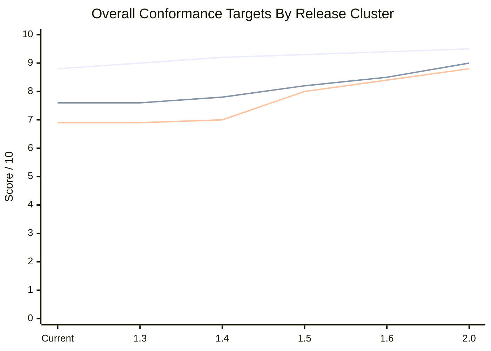

# Conformance Metrics Overview

Generated: `2026-05-18T11:39:39.322Z`

This document summarizes the current conformance scoring model for both the shipped Aurora application and the Galaxy Guardians 0.1 development preview. Aurora uses the release-quality scorecard; Guardians uses both a reference-conformance preview metric set and a stricter playtest-weighted score because its Galaxian evidence is still being promoted from source footage into frame-level/audio-level measurements.

## Overall Comparison

| Game / scope | Primary score | Secondary scores | Status | Weakest current area | Evidence |
| --- | --- | --- | --- | --- | --- |
| Aurora Galactica current dev line | 8.8/10 | strongest Player movement conformance 10/10; weakest Challenge-stage set-piece conformance 3.8/10; broad alien/challenge variation 8.3/10; dedicated challenge-stage conformance 3.8/10; audio contract readiness 9.3/10 | release-quality conformance score plus audio cue-contract read | Challenge-stage set-piece conformance (3.8/10) | reference-artifacts/analyses/quality-conformance/2026-05-18-6d76050d/report.json; reference-artifacts/analyses/aurora-audio-cue-contracts/latest.json; reference-artifacts/analyses/challenge-stage-conformance/latest.json |
| Galaxy Guardians 0.1 playable preview | 7.6/10 | playtest weighted 6.9/10; maturity 7.2/10; gate coverage 9.6/10; public readiness 4.2/10 | preview-reference-conformance-model-not-production-release-score | Formation and rack timing | reference-artifacts/analyses/galaxy-guardians-identity/reference-conformance-0.1.json |

## Galaxy Guardians First-Class Promotion Read

Near-parity for `Galaxy Guardians` means process parity before score parity. The game should keep its own ingestion package, conformance metrics, score/progression/result identity, manual-review loop, and candidate-review path even while its absolute score remains lower than Aurora. The maintained Galaxy-specific strategy is in [GALAXY_GUARDIANS_FIRST_CLASS_CONFORMANCE_PLAN.md](GALAXY_GUARDIANS_FIRST_CLASS_CONFORMANCE_PLAN.md), and the standing aggregate process gate is `npm run harness:check:galaxy-guardians-first-class-conformance`.

Current read: reference 7.6/10, playtest 6.9/10, maturity 7.2/10, gate coverage 9.6/10, public readiness 4.2/10.

## Metric Model Recommendation

No wholesale metric rewrite is needed right now. Keep Aurora on the release-quality scorecard, keep Guardians on the paired reference/playtest preview model, and keep platform-boundary metrics separate. The next metric work should be targeted:

- promote the opening-slice baseline into an explicit scored gate
- add a platform-frame parity axis for sign-in, scores, replay/video capture, bug reports, and music controls
- keep deeper-run fairness and public-readiness as separate later concerns instead of collapsing them into the opening-slice score

## Release Cluster Conformance Targets

These are planning targets, not release promises. They give each upcoming cluster a measurable quality bar so Aurora and Guardians can improve for different reasons without blurring their application boundaries. Aurora targets use the release-quality scorecard. Guardians targets use the preview-reference scorecard until it becomes a public playable game.

| Release cluster / focus | Aurora target | Aurora focus metrics | Guardians target | Guardians focus metrics | Release decision meaning |
| --- | --- | --- | --- | --- | --- |
| Current dev baseline | 8.8/10 | audio 7.3; movement 10; boss/formation 9.4; broad alien/challenge 8.3; dedicated challenge-stage 3.8; stage opening 8.5; challenge timing 10; shell integrity 9.2 | 7.6/10 reference; 6.9/10 playtest | maturity 7.2; gate coverage 9.6; public readiness 4.2; audio feel 6.4 | Baseline for the next beta-candidate discussion, now weighted by local playtest feel. |
| `1.3` Fidelity and Trust | 9.0/10 | audio >= 7.2; movement >= 8.6; trust/fairness >= 9.3; shell integrity >= 9.4 | 7.6/10 reference; 6.9/10 playtest | rack timing >= 6.2; movement pressure 6.3; visual identity 6.8; audio feel 6.4 | Aurora can move beta if the weakest feel gaps improve and Guardians stays out of production but credible as a beta preview. |
| `1.4` Arcade Depth / Guardians 0.1 Preview | 9.2/10 | level-depth >= 8.4; boss/formation grammar >= 8.0; challenge-stage identity >= 8.6; later-level variation >= 8.2; audio >= 7.6 | 7.8/10 reference; 7.0/10 playtest | frame-derived rack timing >= 7.2; dive paths >= 7.2; alien visuals >= 7.0; audio feel >= 7.0 | Aurora gains real stage-by-stage depth; Guardians becomes a strong first preview, not a reskinned Aurora. |
| `1.5` Flight Recorder and Shared Evidence | 9.3/10 | replay/video evidence >= 8.8; published-run traceability >= 8.5; reference-event mapping >= 8.6 | 8.2/10 | source-video extraction >= 8.4; waveform/audio comparison >= 6.8; event-log durability >= 9.0 | Shared video and evidence become release infrastructure for both applications. |
| `1.6` Message to Pilot / Platform Shell | 9.4/10 | popup containment >= 9.6; message channel >= 8.8; shell copy ownership >= 9.5 | 8.5/10 | platform integration >= 9.5; preview messaging >= 8.8; pack-boundary durability 10.0 | Platinum feels like a coherent cabinet shell across multiple games. |
| `2.0` Multi-Game Platinum Candidate | 9.5/10 | arcade-depth stability >= 9.0; release evidence >= 9.2; pilot/replay operations >= 9.0 | 9.0/10 | playable conformance >= 8.6; scoring/progression >= 8.8; audio/visual identity >= 8.5; public readiness >= 8.5 | Platinum can credibly claim more than one serious game experience. |

## Application Metric Target Matrix

| Metric family | Aurora current | Aurora next target | Guardians current | Guardians next target | Why it matters |
| --- | --- | --- | --- | --- | --- |
| Movement and pressure | 10/10 | 8.6/10 in `1.3`; 8.8/10 in `1.4` | 6.2/10 playtest; 6.2/10 reference category | browser-reviewed runtime tuning in `1.3`; 7.2/10 playtest in `1.4` | This is the strongest direct feel signal during live play. |
| Audio identity / acoustic fit | 7.3/10 | 7.2/10 in `1.3`; 7.6/10 in `1.4` | 6.4/10 playtest; 6.4/10 reference category | human-listened cue cleanup in `1.3`; 7.0/10 playtest in `1.4` | Audio is the weakest shared conformance area today. |
| Visual identity | 9.2/10 shell integrity; game sprites not separately scored in the roll-up | add a visible arcade-depth visual score in `1.4` | 6.7/10 playtest; 6.8/10 reference category | browser-reviewed component-sprite polish in `1.3`; 7.0/10 playtest in `1.4` | Guardians especially needs recognizably distinct alien silhouettes before beta-facing preview. |
| Boss entry and formation grammar | 9.4/10 | >=8.0 first gate in `1.4`; >=9.0 with path/rack extraction | rack timing 6.2/10 reference category | frame-derived rack timing >=7.2; dive paths >=7.2 | Boss entry, escort composition, formation settling, and challenge set pieces are the arcade choreography players recognize by stage. |
| Alien entry and broad challenge planning variation | 8.3/10 | >=8.6/10 in `1.4`; arrival-versus-appearance and pattern novelty both above 7.5/10 | not yet a separate Guardians roll-up | add first-visible arrival, entry side, target group, exit, and bonus-opportunity labels | This catches the gap players notice when challenge aliens feel like they appear rather than arrive through learnable arcade set pieces. |
| Dedicated challenge-stage set-piece conformance | 3.8/10; interesting factor 3.8/10 | >=6.0/10 in the next local/dev pass; >=9.2/10 when stage-by-stage reference labels and temporal windows cover late challenge stages | not yet a separate Guardians roll-up | create the same challenge-stage harness once Guardians has its Galaxian rack/challenge equivalents promoted | This is the stricter score for actual challenge-stage arrival, alien novelty, choreography, and bonus-opportunity readability. It is intentionally lower than the broad planning score. |
| Stage / rack / wave timing | stage opening 8.5; challenge timing 10 | challenge and later-stage targets >= 8.6 in `1.4` | rack timing 6.2/10 | browser-reviewed rack timing in `1.3`; 7.2/10 in `1.4` | Timing separates authentic arcade pressure from approximate motion. |
| Scoring and progression | progression/persona 8.8; shot/hit 10.0 | level-depth and scoring stability >= 9.0 by `2.0` | single-shot threat/scoring 7.5 | 7.6 in `1.4`; 8.8 by `2.0` | Guardians should not publish persistent scoreboards until scoring is reference-aligned. |
| Evidence and replay durability | scorecard artifacts exist; video publishing is not yet a full product surface | replay/video evidence >= 8.8 in `1.5` | evidence durability 9.7 | human-approved sprite/cue extraction durability >= 9.7 in `1.5` | Shared videos and source-controlled artifacts should become normal release evidence. |
| Platform boundaries and shell containment | shell integrity 9.2 | popup/message/shell containment >= 9.6 in `1.6` | platform boundaries 10.0 | keep 10.0 through `2.0` | Game work must not leak mechanics across applications; shared behavior belongs in Platinum. |

## Galaxy Guardians 0.1 Preview Metrics

| Metric | Weight | Reference score | Evidence level | Current read | Remaining gap |
| --- | --- | --- | --- | --- | --- |
| Reference source coverage | 8 | 9.6/10 | source-manifested-contact-sheets-waveforms-frame-proxies-object-track-proxies-runtime-comparison-component-sprite-and-labeled-cue-analysis | Three Galaxian sources are committed with manifests, contact sheets, waveform windows, spectrograms, frame indexes, frame-motion proxies, a CPU-only connected-component/object-track proxy pass, runtime-vs-reference movement comparison, sprite crop extraction, component sprite target extraction, audio reference comparison, mixed-source cue-candidate analysis, and labeled waveform/spectrogram cue previews. | Promote component sprite/cue proxies into stronger artifact-backed sprite recognition and cleaner isolated acoustic cue matching, while keeping the opening-slice baseline package tied to the committed source manifests. |
| Promoted semantic event coverage | 12 | 7.8/10 | promoted-event-log-plus-runtime-events-and-visible-surfaces | The preview covers the core runtime promoted events: formation entry, rack complete, dives, flagship/escort pressure, single-shot fire, shot resolution, wrap/return, plus an owned score table, stage-advance progression contract, and visible wait-mode/preview-modal attract surfaces. | Score-table and attract-screen evidence still needs frame-level extraction and pixel-layout comparison against the reference footage, and the opening-slice baseline should be promoted into its own explicit scored gate. |
| Formation and rack timing | 11 | 6.2/10 | promoted-events-runtime-bands-frame-motion-proxy-and-object-track-proxy | Formation entry, settle, rack complete, and first-dive delay are modeled and gated. The latest runtime pass shortened entry and first-dive timing after playtest review found the preview too slow. | The object proxy is still connected-component tracking rather than final sprite recognition, so runtime timing needs measured rack-march, starfield-motion, and top-reentry scoring beside instrumented reference tracks. |
| Movement and pressure model | 12 | 6.2/10 | reference-window-inspired-runtime-contract-plus-runtime-vs-reference-track-comparison-plus-stage-rank-pressure-gate | Scout dives, flagship dives, escort joins, enemy shots, and wrap/return pressure are implemented and gated. The latest pass increases dive speed, dive acceleration, enemy-shot pressure, wrap cadence, and bounded stage-rank pressure so stages three and five are measurably more urgent than stage one. | The preview still feels proxy-tuned rather than Galaxian-tight; the next best return is measured opening-slice motion work on march cadence, starfield motion, and bottom-pass-through top reentry before broader production-facing claims. |
| Single-shot threat and scoring | 11 | 7.5/10 | game-owned-runtime-and-score-contract | Single-shot firing, enemy shots, role-specific score values, player loss, game-over behavior, owned score table, wave clear, and stage advance are implemented without Aurora capture/dual-fighter semantics. | The score table remains a playable-preview contract rather than a frame-extracted Galaxian table, and persistent public scoring is still intentionally blocked. |
| Visual alien identity | 9 | 6.8/10 | game-owned-visual-catalog-readability-gate-frame-crops-object-proxies-sprite-extraction-grid-targets-and-component-targets | Flagship, escort, scout, and player interceptor visuals are now tuned from component crop targets, remain separate from Aurora, and are gated for role readability. The promoted component target artifact covers all four sprite roles with checked crop previews and silhouette target similarity. | Sprites now read much closer to the reference family, but the component crops still need human visual review and browser play review before beta-facing confidence. |
| Audio character and reference fit | 9 | 6.4/10 | cue-shape-contract-plus-measured-square-noise-targets-plus-waveform-spectrogram-pcm-proxy-plus-labeled-cue-window-previews-plus-runtime-reference-cue-lab | Runtime cue IDs and role-separated cue shapes are gated, the cue target bands use labeled Galaxian cue-window candidates, the new reusable Platinum audio conformance lab compares runtime cue synthesis against promoted reference windows, and runtime cues were retuned toward sharper, higher-register square/noise character. The lab reports 8.3/10 cue-shape fit while the older whole-window acoustic proxy still reads 5.3/10, so the conformance score is intentionally conservative. | This remains a key Guardians area: the labels need human listening, dirty mixed-gameplay windows need replacement, and live playback still needs a subjective browser/audio review before the preview can claim beta-ready sound. |
| Platform and game boundaries | 10 | 10/10 | pack-adapter-renderer-boundary-gates | The preview remains non-production, does not inherit Aurora capture/dual/challenge/scoring mechanics, and uses Platinum only through shared capability boundaries. | Keep this mandatory as Guardians gets more real gameplay, and extend it into explicit platform-frame parity across sign-in, scores, replay/video capture, bug reports, and music controls. |
| Evidence durability | 8 | 9.7/10 | source-controlled-artifacts-and-harnesses | The reference profile, event log, identity artifacts, score/progression artifact, attract/score surface artifact, frame-motion artifact, object-track artifact, runtime-reference movement artifact, stage-rank pressure artifact, sprite extraction artifact, sprite-grid and component-target artifacts, audio comparison artifact, cue-candidate/labeled-cue artifacts, and 0.1 gates are committed and rerunnable. | Add human-reviewed component sprite/cue approval and browser-reviewed beta-candidate evidence. |
| Long-surface stage arc and persona review | 10 | 7/10 | source-derived-stage-band-contract-plus-deterministic-persona-review-runs | Guardians now has a longer-surface review contract that matches how this game really grows today: repeated racks, bounded stage-band escalation, shell-presentation shifts, and deterministic novice-to-professional review personas. The life-loss flow now preserves rack progress, which makes longer-surface review honest instead of constantly restarting from a fresh board. | The later-session model is still weakest from stage five onward, where dive-collision fairness and consistent clear potential need another measured/browser-reviewed pass. |

## Galaxy Guardians Playtest-Weighted Metrics

| Metric | Weight | Previous official | Playtest before pass | Current playtest score | Compelling target | Metric set |
| --- | --- | --- | --- | --- | --- | --- |
| Audio character and Galaxian acoustic feel | 24 | 5.3/10 | 2.5/10 | 6.4/10 | 7/10 | hardware-like square/noise timbre, short dry shot envelopes, dive siren descent character, event mix density during live play, waveform/spectrogram proxy fit, isolated cue candidate family coverage, labeled cue-window waveform/spectrogram previews, runtime cue versus promoted reference-window lab score |
| Motion pace and lower-field pressure | 24 | 6.7/10 | 4.8/10 | 6.3/10 | 7.2/10 | formation entry duration, first scout dive timing, flagship/escort dive timing, dive vertical speed and acceleration, lateral curve shape, enemy shot density, bottom wrap/return cadence |
| Graphic alignment and alien/player likeness | 24 | 7/10 | 4.5/10 | 6.8/10 | 7/10 | alien silhouette family likeness, flagship/escort/scout separation, palette family match, sprite scale and rack density, player ship likeness, score/attract visual layout, broad crop-grid silhouette similarity, component crop target similarity |
| Platform boundary and preview safety | 10 | 10/10 | 10/10 | 10/10 | 10/10 | no Aurora capture/dual/challenge leakage, game-owned runtime and scoring, Platinum APIs only for shared shell behavior, dev-only public release boundary |
| Long-surface readiness and persona utility | 18 | 6.2/10 | 5.6/10 | 6.5/10 | 7/10 | stage-band escalation readability, life-loss rack preservation, stage-theme progression, deterministic persona differentiation, five-ship review survivability, stage-five stress visibility |

## Aurora Galactica Current Metrics

| Metric | Score | Evidence | Current read |
| --- | --- | --- | --- |
| Player movement conformance | 10/10 | player-movement report | Current movement scored 10/10 against the control-principles profile, versus 10/10 for the shipped local baseline. |
| Shot and hit responsiveness | 10/10 | close-shot-hit, movement fire window | Close-shot responsiveness passed, and movement-fire post-shot travel was 55.46, with shot delay 0ms. |
| Stage-1 opening timing fidelity | 8.5/10 | stage1-opening-first-dive report | 4/4 metrics were within tolerance; worst current delta was 0.18. |
| Stage-1 opening geometry fidelity | 10/10 | stage1-opening-spacing report | Geometry held steady with 0 changed targets and max drift 0. |
| Dive fairness and safety | 9.1/10 | persona-stage2-safety | Shared stage-2 safety seeds passed, which keeps the early dive/collision windows within the intended persona guardrail. |
| Capture and rescue rule fidelity | 10/10 | capture-rescue correspondence | 3/3 capture scenarios matched, with worst tracked-time drift 0.004. |
| Challenge-stage timing fidelity | 10/10 | challenge-stage correspondence | 5/5 challenge timing metrics were within tolerance; worst current delta was 0.032. |
| Challenge-stage set-piece conformance | 3.8/10 | challenge-stage-conformance strict scorer | Strict challenge-stage score is 3.8/10 with movement 3.4/10, graphics 4.3/10, alien novelty 3.4/10, and safety 10/10. current challenge stages are functionally safe but not yet fully credible Galaga-like bonus exhibitions: strict movement is 3.4/10, strict graphics is 4.3/10, alien/stage novelty is 3.4/10, player shot opportunity is 5.1/10, active sprite-motion now includes object-tracked runtime pixel/silhouette evidence but not yet Galaga target-crop sequence comparison, and late challenge references are still first-pass group labels rather than full object tracks. Diagnostic legacy coverage was 6.9/10, which is why the old read was too generous. |
| Progression and persona depth | 8.4/10 | persona-progression correspondence | 19/20 persona checks passed; progression ordering is still missing one ordering edge case. |
| Boss entry and formation grammar | 9.4/10 | formation-boss-grammar-conformance report, stage-signature-distance report, level-expansion cycle evidence | Boss/formation grammar scores 9.4/10 across 11 evidence windows; weakest metric is Path shape and set-formation precision (8.2/10). |
| Level arc and encounter shape | 8.8/10 | level-arc-conformance report, stage-signature-distance report, level-expansion cycle evidence | Level arc score is 8.8/10 with 6/6 stage families blueprinted and 11/6 evidence windows present; weakest submetric is Long-run non-repetition (6/10). |
| Audio identity and cue alignment | 7.3/10 | audio-cue-alignment correspondence, aurora-audio-theme-comparison, galaga-audio-overlap, aurora-audio-event-gap semantic read, audio-cue-contracts, audio-promotion-precheck | Audio score blends cue identity, active reference similarity, reference-window precision, overlap timing, cue alignment, semantic event mapping, and acoustic event-gap severity. 0/21 reference windows still need tighter segmentation; 25 candidate subwindows were found; semantic event score is 9.78/10, acoustic event score is 6.53/10, and highest segment risk is challengePerfect onset. Cue-contract readiness is 9.3/10; latest contract next step: Do not promote Challenge Perfect from isolated onset/body candidates. Replace the next audio strategy with full-phrase/segment-boundary work: stabilize the scorer on canonical reference-vs-reference capture, then generate candidates that optimize onset, body, tail, and live capture segmentation together. |
| UI, shell, and graphics integrity | 9.2/10 | dev candidate surface suite | The bundled front-door, panel, dock, graphics, attract, leaderboard, and audio shell surface suite passed. |
| Alien entry and broad challenge planning variation | 8.3/10 | reference-artifacts/analyses/alien-entry-challenge-variation/latest.json, stage-signature-distance report, formation-boss path-family comparison | Aurora still reads too repetitive for alien entry and challenge-stage invention: regular stages are not distinct enough, challenge stages need stronger arrival-versus-appearance evidence, and alien novelty is not yet scored against multiple reference-like challenge set pieces. Weakest metric: Regular-entry geometry separation (5.2/10). |
| Dedicated challenge-stage set-piece conformance | 3.8/10; interesting factor 3.8/10 | reference-artifacts/analyses/challenge-stage-conformance/latest.json, CHALLENGE_STAGE_CONFORMANCE_ANALYSIS.md, challenge-stage correspondence and motion-profile harnesses | current challenge stages are functionally safe but not yet fully credible Galaga-like bonus exhibitions: strict movement is 3.4/10, strict graphics is 4.3/10, alien/stage novelty is 3.4/10, player shot opportunity is 5.1/10, active sprite-motion now includes object-tracked runtime pixel/silhouette evidence but not yet Galaga target-crop sequence comparison, and late challenge references are still first-pass group labels rather than full object tracks. Diagnostic legacy coverage was 6.9/10, which is why the old read was too generous. Player meaning: A player should experience challenging stages as safe but tense score exhibitions with memorable entry routes, fresh alien types, readable trajectories, and a learnable perfect-bonus opportunity. Aurora currently preserves the safety rule, but the actual spectacle, motion, and visual novelty are still early. Next recommended step: Use strict challenge-stage scores as the release-facing truth; keep broad coverage scores only as diagnostics. |

## Guardians Scoring Decision

Guardians preview scoring should exist locally now, and it does: the dev runtime awards points by alien role, formation/dive state, and flagship escort count, with a harnessed contract in `npm run harness:check:galaxy-guardians-threat-scoring`. Persisted leaderboard submission should wait until the Galaxian score-advance table, wave progression, and public-release scoring policy are closer to reference conformance.

## Current Guardians Highest-Return Next Steps

- Opening-slice baseline artifact package and scored gate for WAIT, score table, rack march cadence, explosions, palettes, starfield, reserve ships, missile-ready state, flags, and top re-entry.
- Measured opening-slice motion pass for rack march cadence, starfield motion, and bottom-pass-through top re-entry against Matt Hawkins and Nenriki sources.
- Platform-frame parity pass for sign-in, high scores, pilot card, replay/video capture, bug reports, and music/sound controls.
- Measured later-band fairness pass for stage-five-and-beyond collision stability and clear consistency.
- Selective audio cue cleanup only after the opening-slice and motion passes expose the next highest-value audible miss.
