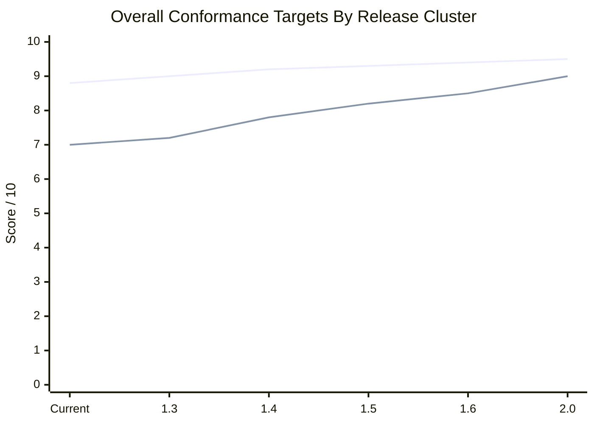

# Conformance Metrics Overview

Generated: `2026-05-03T14:16:49.436Z`

This document summarizes the current conformance scoring model for both the shipped Aurora application and the Galaxy Guardians 0.1 development preview. Aurora uses the release-quality scorecard; Guardians uses a reference-conformance preview metric set that is intentionally more conservative because its Galaxian evidence is still being promoted from source footage into frame-level measurements.

## Overall Comparison

| Game / scope | Primary score | Secondary scores | Status | Weakest current area | Evidence |
| --- | --- | --- | --- | --- | --- |
| Aurora Galactica current dev line | 8.8/10 | strongest Shot and hit responsiveness 10/10; weakest Audio identity and cue alignment 6.1/10 | release-quality conformance score | Audio identity and cue alignment (6.1/10) | reference-artifacts/analyses/quality-conformance/2026-05-03-5f92eab/report.json |
| Galaxy Guardians 0.1 dev preview | 7/10 | maturity 5.8/10; gate coverage 9/10; public readiness 3.5/10 | dev-preview-reference-conformance-model-not-public-release-score | Audio character and reference fit | reference-artifacts/analyses/galaxy-guardians-identity/reference-conformance-0.1.json |

## Release Cluster Conformance Targets

These are planning targets, not release promises. They give each upcoming cluster a measurable quality bar so Aurora and Guardians can improve for different reasons without blurring their application boundaries. Aurora targets use the release-quality scorecard. Guardians targets use the preview-reference scorecard until it becomes a public playable game.

| Release cluster / focus | Aurora target | Aurora focus metrics | Guardians target | Guardians focus metrics | Release decision meaning |
| --- | --- | --- | --- | --- | --- |
| Current dev baseline | 8.8/10 | audio 6.1; movement 8.1; stage opening 8.5; challenge timing 8.4; shell integrity 9.2 | 7.0/10 | maturity 5.8; gate coverage 9.0; public readiness 3.5; audio fit 4.5 | Baseline for the next beta-candidate discussion. |
| `1.3` Fidelity and Trust | 9.0/10 | audio >= 7.2; movement >= 8.6; trust/fairness >= 9.3; shell integrity >= 9.4 | 7.2/10 | rack timing >= 6.4; movement pressure >= 5.8; visual identity >= 6.8; audio fit >= 5.2 | Aurora can move beta if the weakest feel gaps improve and Guardians stays dev-only but credible. |
| `1.4` Arcade Depth / Guardians 0.1 Preview | 9.2/10 | level-depth >= 8.4; challenge-stage identity >= 8.6; later-level variation >= 8.2; audio >= 7.6 | 7.8/10 | frame-derived rack timing >= 7.2; dive paths >= 6.8; alien visuals >= 7.6; scoring model >= 7.5 | Aurora gains real stage-by-stage depth; Guardians becomes a strong first preview, not a reskinned Aurora. |
| `1.5` Flight Recorder and Shared Evidence | 9.3/10 | replay/video evidence >= 8.8; published-run traceability >= 8.5; reference-event mapping >= 8.6 | 8.2/10 | source-video extraction >= 8.4; waveform/audio comparison >= 6.8; event-log durability >= 9.0 | Shared video and evidence become release infrastructure for both applications. |
| `1.6` Message to Pilot / Platform Shell | 9.4/10 | popup containment >= 9.6; message channel >= 8.8; shell copy ownership >= 9.5 | 8.5/10 | platform integration >= 9.5; preview messaging >= 8.8; pack-boundary durability 10.0 | Platinum feels like a coherent cabinet shell across multiple games. |
| `2.0` Multi-Game Platinum Candidate | 9.5/10 | arcade-depth stability >= 9.0; release evidence >= 9.2; pilot/replay operations >= 9.0 | 9.0/10 | playable conformance >= 8.6; scoring/progression >= 8.8; audio/visual identity >= 8.5; public readiness >= 8.5 | Platinum can credibly claim more than one serious game experience. |

## Application Metric Target Matrix

| Metric family | Aurora current | Aurora next target | Guardians current | Guardians next target | Why it matters |
| --- | --- | --- | --- | --- | --- |
| Movement and pressure | 8.1/10 | 8.6/10 in `1.3`; 8.8/10 in `1.4` | 5.2/10 | 5.8/10 in `1.3`; 6.8/10 in `1.4` | This is the strongest direct feel signal during live play. |
| Audio identity / acoustic fit | 6.1/10 | 7.2/10 in `1.3`; 7.6/10 in `1.4` | 4.5/10 | 5.2/10 in `1.3`; 6.8/10 in `1.5` | Audio is the weakest shared conformance area today. |
| Visual identity | 9.2/10 shell integrity; game sprites not separately scored in the roll-up | add a visible arcade-depth visual score in `1.4` | 6.4/10 | 6.8/10 in `1.3`; 7.6/10 in `1.4` | Guardians especially needs recognizably distinct alien silhouettes before beta-facing preview. |
| Stage / rack / wave timing | stage opening 8.5; challenge timing 8.4 | challenge and later-stage targets >= 8.6 in `1.4` | rack timing 5.8/10 | 6.4/10 in `1.3`; 7.2/10 in `1.4` | Timing separates authentic arcade pressure from approximate motion. |
| Scoring and progression | progression/persona 8.8; shot/hit 10.0 | level-depth and scoring stability >= 9.0 by `2.0` | single-shot threat/scoring 7.0 | 7.5 in `1.4`; 8.8 by `2.0` | Guardians should not publish persistent scoreboards until scoring is reference-aligned. |
| Evidence and replay durability | scorecard artifacts exist; video publishing is not yet a full product surface | replay/video evidence >= 8.8 in `1.5` | evidence durability 8.5 | event-log durability >= 9.0 in `1.5` | Shared videos and source-controlled artifacts should become normal release evidence. |
| Platform boundaries and shell containment | shell integrity 9.2 | popup/message/shell containment >= 9.6 in `1.6` | platform boundaries 10.0 | keep 10.0 through `2.0` | Game work must not leak mechanics across applications; shared behavior belongs in Platinum. |

## Galaxy Guardians 0.1 Preview Metrics

| Metric | Weight | Score | Evidence level | Current read | Remaining gap |
| --- | --- | --- | --- | --- | --- |
| Reference source coverage | 8 | 8.5/10 | source-manifested-contact-sheets-waveforms | Three Galaxian sources are committed with manifests, contact sheets, and waveform windows. | Promote more windows into frame-level timing measurements. |
| Promoted semantic event coverage | 14 | 7.4/10 | promoted-event-log-plus-runtime-events | The preview covers the core runtime promoted events: formation entry, rack complete, dives, flagship/escort pressure, single-shot fire, shot resolution, wrap/return, plus an owned score table and stage-advance progression contract. | Attract mission text is not yet rendered as a first-class runtime/wait-mode screen, and score-table evidence still needs frame-level extraction. |
| Formation and rack timing | 12 | 5.8/10 | promoted-events-with-runtime-bands | Formation entry, settle, rack complete, and first-dive delay are modeled and gated, with the quick peek adjusted to a tighter and calmer rack. | Timing is still not derived from direct frame-level Galaxian extraction, so the score remains conservative. |
| Movement and pressure model | 14 | 5.2/10 | reference-window-inspired-runtime-contract | Scout dives, flagship dives, escort joins, and wrap/return pressure are implemented and gated, and this pass slowed the first pressure cycle. | Local play still reads as approximate; dive curves, lower-field traversal, and wave-to-wave pacing need direct measurement from the source videos. |
| Single-shot threat and scoring | 12 | 7.5/10 | game-owned-runtime-and-score-contract | Single-shot firing, enemy shots, role-specific score values, player loss, game-over behavior, owned score table, wave clear, and stage advance are implemented without Aurora capture/dual-fighter semantics. | The score table remains a dev-preview contract rather than a frame-extracted Galaxian table, and persistent public scoring is still intentionally blocked. |
| Visual alien identity | 10 | 6.4/10 | game-owned-visual-catalog-and-readability-gate | Flagship, escort, scout, and player interceptor visuals are smaller and closer to Galaxian contact-sheet proportions while remaining distinct and gated. | Sprites are still hand-authored preview approximations rather than extracted pixel-faithful reference assets. |
| Audio character and reference fit | 10 | 4.5/10 | internal-cue-shape-contract | Runtime cue IDs and role-separated cue shapes are gated. | This is the least reference-faithful Guardians area: acoustic comparison against Galaxian footage is not yet automated. |
| Platform and game boundaries | 10 | 10/10 | pack-adapter-renderer-boundary-gates | The preview remains dev-only, does not inherit Aurora capture/dual/challenge/scoring mechanics, and uses Platinum only through shared capability boundaries. | Keep this mandatory as Guardians gets more real gameplay. |
| Evidence durability | 10 | 8.7/10 | source-controlled-artifacts-and-harnesses | The reference profile, event log, identity artifacts, score/progression artifact, and 0.1 gates are committed and rerunnable. | Add a generated Guardians numeric score artifact per run once the metrics are less manually calibrated. |

## Aurora Galactica Current Metrics

| Metric | Score | Evidence | Current read |
| --- | --- | --- | --- |
| Player movement conformance | 8.1/10 | player-movement report | Current movement scored 8.1/10 against the control-principles profile, versus 10/10 for the shipped local baseline. |
| Shot and hit responsiveness | 10/10 | close-shot-hit, movement fire window | Close-shot responsiveness passed, and movement-fire post-shot travel was 79.68, with shot delay 3ms. |
| Stage-1 opening timing fidelity | 8.5/10 | stage1-opening-first-dive report | 4/4 metrics were within tolerance; worst current delta was 0.18. |
| Stage-1 opening geometry fidelity | 10/10 | stage1-opening-spacing report | Geometry held steady with 0 changed targets and max drift 0. |
| Dive fairness and safety | 9.1/10 | persona-stage2-safety | Shared stage-2 safety seeds passed, which keeps the early dive/collision windows within the intended persona guardrail. |
| Capture and rescue rule fidelity | 10/10 | capture-rescue correspondence | 3/3 capture scenarios matched, with worst tracked-time drift 0.004. |
| Challenge-stage timing fidelity | 8.4/10 | challenge-stage correspondence | 5/5 challenge timing metrics were within tolerance; worst current delta was 0.483. |
| Progression and persona depth | 8.8/10 | persona-progression correspondence | 20/20 persona checks passed; progression ordering is still missing one ordering edge case. |
| Audio identity and cue alignment | 6.1/10 | audio-cue-alignment correspondence, aurora-audio-theme-comparison, galaga-audio-overlap | Audio score blends cue identity with measured cue timing. The dedicated cue-alignment report passed 9/9 metrics, with worst current delta 6.317. |
| UI, shell, and graphics integrity | 9.2/10 | dev candidate surface suite | The bundled front-door, panel, dock, graphics, attract, leaderboard, and audio shell surface suite passed. |

## Guardians Scoring Decision

Guardians preview scoring should exist locally now, and it does: the dev runtime awards points by alien role, formation/dive state, and flagship escort count, with a harnessed contract in `npm run harness:check:galaxy-guardians-threat-scoring`. Persisted leaderboard submission should wait until the Galaxian score-advance table, wave progression, and public-release scoring policy are closer to reference conformance.

## Current Guardians Promotion Priorities

- automated frame-level rack-entry timing from matt-hawkins-arcade-intro
- automated dive-path extraction from arcades-lounge-level-5 and nenriki-15-wave-session
- Guardians attract mission-language conformance
- acoustic cue comparison against waveform windows

