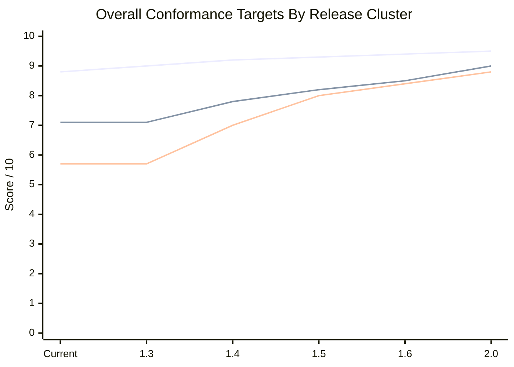

# Conformance Metric Overview

This document summarizes the current Aurora / Platinum conformance map: what is
scored numerically, what is gated as pass/fail, and where the next measurement
cycle should focus.

Last refreshed: May 3, 2026 on
`codex/macbook-pro-guardians-identity-0-1-candidate`.

## Current Aurora Score

Latest artifact:

- `reference-artifacts/analyses/quality-conformance/2026-05-03-5f92eab/`

### At A Glance

| Area | Score | Status | What It Means |
| --- | ---: | --- | --- |
| Overall Aurora quality | `8.8/10` | Strong | Public-quality baseline; still needs fidelity polish before the next serious beta claim. |
| Strongest category | `10/10` | Protected | Combat responsiveness, stage-1 geometry, and capture/rescue rules are the safest parts of the current model. |
| Weakest category | `6.1/10` | Needs work | Audio identity and cue alignment remain the biggest measurable quality gap. |
| Next visible feel gap | `8.0/10` | Needs work | Player movement is playable, but tap correction and hold travel need more reference-led tuning. |
| Guardians 0.1 preview | `7.1/10` reference conformance; `5.7/10` playtest weighted | Dev-preview | Score/progression, visible attract/score surfaces, frame/object proxies, runtime-vs-reference movement tuning, sprite crop extraction, audio waveform/spectrogram comparison, and playtest-weighted gap scoring are now harnessed. |

## Release Cluster Conformance Targets

These are planning targets, not release promises. They give each upcoming
cluster a measurable quality bar so Aurora and Guardians can improve for
different reasons without blurring their application boundaries. Aurora targets
use the release-quality scorecard. Guardians targets use the preview-reference
scorecard until it becomes a public playable game.

| Release cluster / focus | Aurora target | Aurora focus metrics | Guardians target | Guardians focus metrics | Release decision meaning |
| --- | ---: | --- | ---: | --- | --- |
| Current dev baseline | `8.8/10` | audio 6.1; movement 8.1; stage opening 8.5; challenge timing 8.4; shell integrity 9.2 | `7.1/10` reference; `5.7/10` playtest | maturity 6.4; gate coverage 9.2; public readiness 3.5; audio feel 3.8 | Baseline for the next beta-candidate discussion, now weighted by local playtest feel. |
| `1.3` Fidelity and Trust | `9.0/10` | audio >= 7.2; movement >= 8.6; trust/fairness >= 9.3; shell integrity >= 9.4 | `7.1/10` reference; `5.7/10` playtest | rack timing >= 6.2; movement pressure >= 5.9; visual identity >= 5.4; audio feel >= 3.8 | Aurora can move beta if the weakest feel gaps improve and Guardians stays dev-only but credible. |
| `1.4` Arcade Depth / Guardians 0.1 Preview | `9.2/10` | level-depth >= 8.4; challenge-stage identity >= 8.6; later-level variation >= 8.2; audio >= 7.6 | `7.8/10` reference; `7.0/10` playtest | frame-derived rack timing >= 7.2; dive paths >= 7.2; alien visuals >= 7.0; audio feel >= 7.0 | Aurora gains real stage-by-stage depth; Guardians becomes a strong first preview, not a reskinned Aurora. |
| `1.5` Flight Recorder and Shared Evidence | `9.3/10` | replay/video evidence >= 8.8; published-run traceability >= 8.5; reference-event mapping >= 8.6 | `8.2/10` | source-video extraction >= 8.4; waveform/audio comparison >= 6.8; event-log durability >= 9.0 | Shared video and evidence become release infrastructure for both applications. |
| `1.6` Message to Pilot / Platform Shell | `9.4/10` | popup containment >= 9.6; message channel >= 8.8; shell copy ownership >= 9.5 | `8.5/10` | platform integration >= 9.5; preview messaging >= 8.8; pack-boundary durability 10.0 | Platinum feels like a coherent cabinet shell across multiple games. |
| `2.0` Multi-Game Platinum Candidate | `9.5/10` | arcade-depth stability >= 9.0; release evidence >= 9.2; pilot/replay operations >= 9.0 | `9.0/10` | playable conformance >= 8.6; scoring/progression >= 8.8; audio/visual identity >= 8.5; public readiness >= 8.5 | Platinum can credibly claim more than one serious game experience. |

### Application Metric Target Matrix

| Metric family | Aurora current | Aurora next target | Guardians current | Guardians next target | Why it matters |
| --- | ---: | ---: | ---: | ---: | --- |
| Movement and pressure | `8.1/10` | `8.6/10` in `1.3`; `8.8/10` in `1.4` | `5.9/10` playtest | browser-reviewed runtime tuning in `1.3`; `7.2/10` playtest in `1.4` | This is the strongest direct feel signal during live play. |
| Audio identity / acoustic fit | `6.1/10` | `7.2/10` in `1.3`; `7.6/10` in `1.4` | `3.8/10` playtest | isolated cue comparison in `1.3`; `7.0/10` playtest in `1.4` | Audio is the weakest shared conformance area today. |
| Visual identity | `9.2/10` shell integrity; game sprites not separately scored in the roll-up | add a visible arcade-depth visual score in `1.4` | `5.4/10` playtest | final sprite recognition in `1.3`; `7.0/10` playtest in `1.4` | Guardians especially needs recognizably distinct alien silhouettes before beta-facing preview. |
| Stage / rack / wave timing | stage opening 8.5; challenge timing 8.4 | challenge and later-stage targets >= 8.6 in `1.4` | rack timing `6.2/10` | browser-reviewed rack timing in `1.3`; `7.2/10` in `1.4` | Timing separates authentic arcade pressure from approximate motion. |
| Scoring and progression | progression/persona 8.8; shot/hit 10.0 | level-depth and scoring stability >= 9.0 by `2.0` | single-shot threat/scoring `7.5/10` | 7.6 in `1.4`; 8.8 by `2.0` | Guardians should not publish persistent scoreboards until scoring is reference-aligned. |
| Evidence and replay durability | scorecard artifacts exist; video publishing is not yet a full product surface | replay/video evidence >= 8.8 in `1.5` | evidence durability `9.3/10` | final sprite/cue extraction durability >= 9.4 in `1.5` | Shared videos and source-controlled artifacts should become normal release evidence. |
| Platform boundaries and shell containment | shell integrity `9.2/10` | popup/message/shell containment >= 9.6 in `1.6` | platform boundaries `10.0/10` | keep `10.0/10` through `2.0` | Game work must not leak mechanics across applications; shared behavior belongs in Platinum. |

### Aurora Category Detail

| Category | Current score | Evidence posture | Read |
| --- | ---: | --- | --- |
| Overall quality | `8.8/10` | Numeric roll-up | Strong public-quality baseline, but not yet a fidelity finish line. |
| Player movement | `8.0/10` | Trace-backed harness | Still one of the main feel gaps; tap correction and hold travel need more reference-led work. |
| Shot and hit responsiveness | `10/10` | Harness-backed | Strong. Keep this protected while tuning movement and pacing. |
| Stage-1 opening timing | `8.5/10` | Reference timing harness | Healthy, but still not perfect. |
| Stage-1 opening geometry | `10/10` | Reference geometry harness | Strong. Preserve during level expansion. |
| Dive fairness and safety | `9.1/10` | Persona safety harness | Good enough for beta discussion; continue watching collision pressure. |
| Capture and rescue rules | `10/10` | Correspondence harness | Strong. Do not regress during platform/game separation work. |
| Challenge-stage timing | `8.4/10` | Correspondence harness | Needs richer challenge-stage content and timing variety in the level expansion cycle. |
| Progression and persona depth | `8.8/10` | Persona progression harness | Solid, with one remaining ordering edge case noted by the scorecard. |
| Audio identity and cue alignment | `6.1/10` | Audio comparison and correspondence artifacts | Weakest category. Cue phase gates are green again, but identity and acoustic fit remain the biggest quality gap. |
| UI, shell, graphics integrity | `9.2/10` | Dev-candidate surface suite | Strong after refreshing stale leaderboard/attract/audio phase expectations. |

### Release Read

| Rank | Opportunity | Current score | Release implication |
| ---: | --- | ---: | --- |
| 1 | Audio identity and cue alignment | `6.1/10` | Do not claim a major fidelity step until reference-derived acoustic/cue work improves. |
| 2 | Player movement conformance | `8.0/10` | Tune from measured traces; avoid blind control-constant changes. |
| 3 | Challenge-stage timing and content | `8.4/10` | Timing is decent, but content variety needs the level-expansion program. |
| 4 | Progression/persona depth | `8.8/10` | Good base; remaining edge cases should stay visible. |
| 5 | UI/shell/graphics integrity | `9.2/10` | Good enough for beta support when paired with game-fidelity gains. |

## Galaxy Guardians Preview Gates

Galaxy Guardians is still a development-preview application, not a public
playable release. It now has its own first reference conformance metric set,
separate from the Aurora `8.8/10` roll-up.

Current candidate artifact:

- `reference-artifacts/analyses/galaxy-guardians-identity/candidate-0.1.json`

Current reference metric artifact:

- `reference-artifacts/analyses/galaxy-guardians-identity/reference-conformance-0.1.json`
- `reference-artifacts/analyses/galaxy-guardians-identity/playtest-conformance-review-0.1.json`

### Guardians Reference Score

| Metric | Score | Read |
| --- | ---: | --- |
| Reference conformance | `7.1/10` | Useful development-preview baseline, with score/progression, attract/score surfaces, frame/object proxies, runtime movement tuning, sprite extraction, audio reference comparison, and playtest-weighted review now harnessed. |
| Playtest-weighted conformance | `5.7/10` | Stricter local feel score. Audio, pace, and graphic likeness are still below a compelling preview bar. |
| Reference maturity | `6.4/10` | Contact sheets, waveforms, spectrograms, frame indexes, frame/object metrics, runtime comparison, sprite crop metrics, and audio PCM proxies exist; final extraction is still needed. |
| Implementation gate coverage | `9.2/10` | Most 0.1 runtime/visual/audio/platform gates are durable and rerunnable. |
| Public release readiness | `3.5/10` | The preview remains intentionally dev-only and should not be treated as public playable yet. |

### Guardians Reference Category Detail

| Category | Score | Status | Read |
| --- | ---: | --- | --- |
| Reference source coverage | `9.2/10` | Good | Three Galaxian sources are committed with manifests, contact sheets, waveforms, spectrograms, frame/object metrics, sprite crop extraction, runtime comparison, and audio comparison. |
| Promoted semantic event coverage | `7.8/10` | Partial | Core runtime events are covered, and the owned score table, wave/stage progression contract, and visible attract surfaces now exist. |
| Formation and rack timing | `6.2/10` | Partial | Entry, settle, rack complete, and first-dive delay are gated; the latest pass shortened entry after playtest review found the preview slow. |
| Movement and pressure model | `5.9/10` | Improving but not convincing yet | Scout, flagship, escort, shots, and wrap pressure exist; the latest pass increased speed and pressure, but still needs browser-reviewed reference feel. |
| Single-shot threat and scoring | `7.5/10` | Partial | Single-shot play, enemy shots, player loss, role scoring, score table, wave clear, and stage advance are game-owned. |
| Visual alien identity | `5.4/10` | Better separated, still partial | Sprites are smaller and distinct, and 27 crop references now feed a sprite extraction artifact, but they are still hand-authored approximations. |
| Audio character and reference fit | `3.8/10` | Weakest Guardians category | Runtime cue IDs are gated and cue shapes were made raspier/lower, but playtest review says the sound is still far from Galaxian. |
| Platform and game boundaries | `10.0/10` | Strong | Guardians remains dev-only and does not inherit Aurora capture/dual/challenge/scoring behavior. |
| Evidence durability | `9.3/10` | Good | Reference profile, event log, identity artifacts, movement tuning, sprite extraction, audio comparison, and gates are source-controlled and rerunnable. |

### Guardians 0.1 Gate Detail

| Gate | Artifact / harness | Current posture |
| --- | --- | --- |
| Identity baseline | `identity-baseline-0.1.json`, `check-galaxy-guardians-identity-baseline.js` | Passes; game-owned visual/audio identity exists. |
| Formation entry | `formation-entry-0.1.json`, `check-galaxy-guardians-formation-entry.js` | Passes; rack entry, settle, and first-dive timing are explicit. |
| Frame motion proxy | `frame-motion-conformance-0.1.json`, `analyze/check-galaxy-guardians-frame-motion-conformance.js` | Passes; five Galaxian frame windows now produce rack and lower-field motion proxy metrics. |
| Object-track proxy | `object-track-conformance-0.1.json`, `analyze/check-galaxy-guardians-object-track-conformance.js` | Passes; five Galaxian frame windows now produce rack object signals and lower-field candidate tracklets. |
| Playtest-weighted conformance | `playtest-conformance-review-0.1.json`, `check-galaxy-guardians-playtest-conformance-review.js` | Passes; audio, motion, and graphics now have stricter feel scores and compelling-preview targets. |
| Runtime-reference movement | `runtime-reference-movement-0.1.json`, `analyze/check-galaxy-guardians-runtime-reference-movement.js` | Passes; tuned dive speed/lateral span and wrap pressure from the object-track bands. |
| Sprite extraction | `sprite-reference-extraction-0.1.json`, `analyze/check-galaxy-guardians-sprite-reference-extraction.js` | Passes; 27 rack/diver/player crops now anchor runtime sprite authoring. |
| Audio reference comparison | `audio-reference-comparison-0.1.json`, `analyze/check-galaxy-guardians-audio-reference-comparison.js` | Passes; 9 waveform/spectrogram windows now feed PCM proxy comparison. |
| Movement pacing | `movement-pacing-0.1.json`, `check-galaxy-guardians-movement-pacing.js` | Passes; scout/flagship/escort pressure is measurable. |
| Attract / score surface | `attract-score-surface-0.1.json`, `check-galaxy-guardians-attract-score-surface.js` | Passes; wait-mode showcase and preview modal expose mission text and score table inside the frame. |
| Score progression | `score-progression-0.1.json`, `check-galaxy-guardians-score-progression.js` | Passes; score table, mission text, wave clear, and stage advance are game-owned. |
| Threat and scoring | `threat-scoring-0.1.json`, `check-galaxy-guardians-threat-scoring.js` | Passes; single-shot and role scoring are game-owned. |
| Visual readability | `visual-readability-0.1.json`, `check-galaxy-guardians-visual-readability.js` | Passes; rows, palettes, hit flashes, and snapshots are distinct. |
| Audio character | `audio-character-0.1.json`, `check-galaxy-guardians-audio-character.js` | Passes; cue shapes, role-hit separation, and runtime cue coverage are explicit. |
| Candidate aggregate | `candidate-0.1.json`, `check-galaxy-guardians-0-1-candidate.js` | Passes; preview remains dev-only and does not inherit Aurora-only mechanics. |
| Platform boundaries | pack/adapters/renderer boundary harnesses | Passes; game behavior remains application-owned, with shared capability only through Platinum APIs. |

## Current Conformance Priorities

1. Audio identity remains the biggest Aurora gap.
- The next useful work is reference-derived acoustic and timing comparison,
  especially demo cadence, stage pulse, shots, dive cues, challenge transition,
  and game-over/loss behavior.

2. Player movement is the next most visible feel gap.
- Current score is `8.0/10`.
- The next tuning cycle should use preserved traces and direct frame-level
  reference extraction rather than blind constants.

3. Challenge-stage expansion needs to become content conformance, not just
   timing conformance.
- The current score measures timing, but future gates should also measure alien
  families, movement variety, scoring pressure, and stage-family progression.

4. Guardians 0.1 should move from internal contracts to reference-derived
   evidence.
- Current Guardians gates are useful and green, but the playtest-weighted score
  is only `5.7/10`. The next step is isolated Galaxian cue matching, final
  sprite-grid extraction, and a browser-reviewed pacing pass.

5. Platform/game boundaries should stay mandatory.
- Any common behavior needed by both Aurora and Guardians belongs in Platinum as
  an API, interface, renderer hook, catalog, or harness capability.
- Game-specific behavior should remain owned by that game pack/runtime/adapter.

## Release Use

Before beta discussion:

- run `npm run harness:score:quality-conformance`
- run the Guardians 0.1 candidate gate if the beta includes the preview
- confirm browser-backed surface checks are green
- refresh `QUALITY_RELEASE_SCORECARD.md` if the numeric score materially changes
- keep generated conformance artifacts in `reference-artifacts/analyses/`

This MacBook may generate and push development evidence, but it must not approve
or publish beta/production unless release authority is explicitly transferred.
