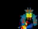
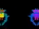
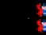
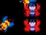
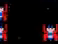
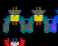
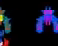
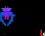

# Galaga Alien Cadence Validation

Generated: 2026-05-20T00:08:24.169Z

This report checks whether the segmented Galaga alien cadence rows are contradicted or corroborated by raw gameplay video. The raw gameplay source currently available is low-resolution and compressed, so this is a safety validation, not a final ROM-frame timing claim.

## Summary

- Validation status: segmented-cadence-corroborated-by-low-resolution-gameplay
- Average raw corroboration score: 8.04/10
- Corroborated rows: 3/3
- Remaining timing confidence: medium: enough to keep segmented-reference cadence in scoring; not enough for final arcade-perfect timing.
- Next best step: Acquire or produce a higher-resolution frame-stepped Galaga gameplay/ROM capture, then replace this low-resolution corroboration with direct per-sprite phase labels.

## Rows

| Row | Raw Gameplay Read | Preview | Metrics | Decision |
| --- | --- | --- | --- | --- |
| boss-galaga-pulse-pair | Low-resolution raw gameplay window around the Stage 1 upper formation boss/leader area. It can corroborate visible pulse rhythm, but not exact ROM frame timing. <code>snake-latino-stage-1-raw-gameplay</code> |  <code>19.35s</code>  <code>21.35s</code>  <code>23.1s</code> | score 8.02/10 lit 247.13; adjacent delta 43.178; half/full 0.79 | raw-gameplay-corroborated-low-resolution |
| bee-zako-pulse-pair | Low-resolution raw gameplay window around the Stage 1 lower formation/entry bee area. Compression and movement limit exact phase attribution. <code>snake-latino-stage-1-raw-gameplay</code> |  <code>19.35s</code>  <code>21.35s</code>  <code>23.1s</code> | score 8.04/10 lit 403.25; adjacent delta 69.445; half/full 0.827 | raw-gameplay-corroborated-low-resolution |
| butterfly-escort-pulse-pair | Low-resolution raw gameplay window around the Stage 1 upper butterfly area. It is useful as a contradiction check against the segmented cadence, not as final timing truth. <code>snake-latino-stage-1-raw-gameplay</code> |  <code>19.35s</code>  <code>21.35s</code>  <code>23.1s</code> | score 8.05/10 lit 469.5; adjacent delta 69.033; half/full 0.83 | raw-gameplay-corroborated-low-resolution |

## Limits

- The raw gameplay source is low-resolution 346x480, compressed, and shows moving aliens, so exact per-sprite phase labels are not reliable.
- The validation looks for visible rhythmic sprite changes and no contradiction of the 1s segmented-reference cadence; it does not prove ROM frame timing.
- A final confirmation still needs a higher-resolution direct gameplay capture, emulator frame stepping, or ROM-derived sprite animation timing.
