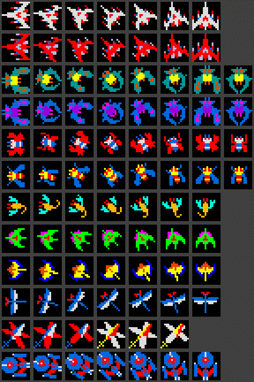
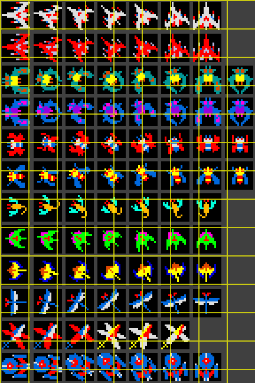
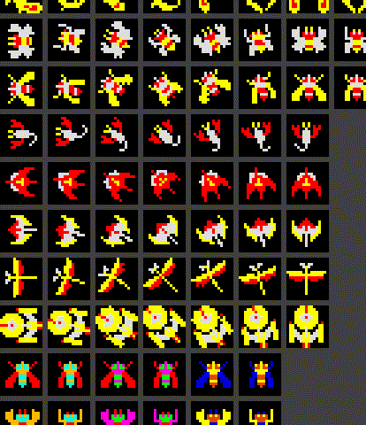
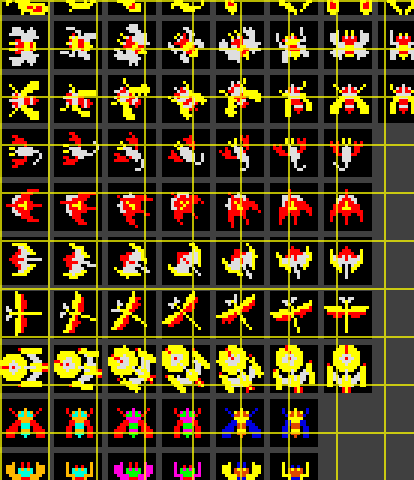
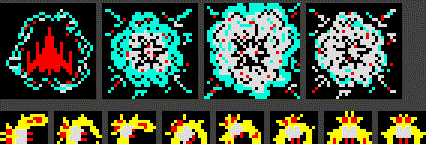
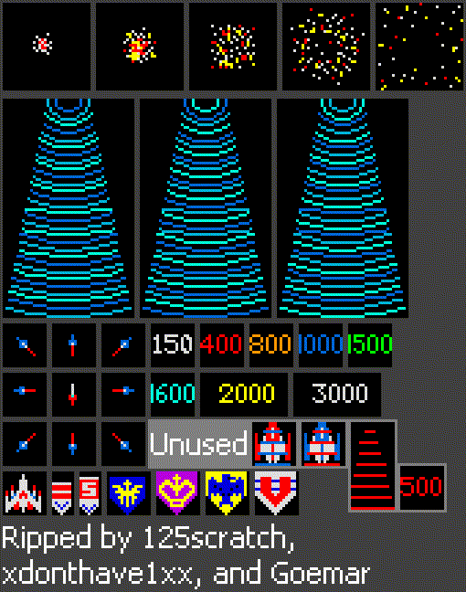

# Galaga Alien Crop Preview

Generated: 2026-05-18T16:50:10.974Z

This report turns the supplied Galaga general sprite sheet into reviewable region previews and candidate cells. It is not yet a canonical promoted target-crop set; exact per-role and per-pose boxes still need review.

## Summary

- Source image: `reference-artifacts/ingestion/galaga-alien-visual-reference/source-images/general-sprites-sheet.png`
- Regions: 4
- Grid cells scanned: 197
- Interesting lit cells: 187
- Persisted interesting cell boxes: 187
- Target role plans: 7

## Region Previews

| Region | Preview | Grid Preview | Candidate Read |
| --- | --- | --- | --- |
| Primary enemy/player sprite grid `left-primary-sprite-grid` |  |  | 108/117 lit candidate cells; channels B, G, M, R, W, Y |
| Alternate alien pose and color grid `center-alien-pose-grid` |  |  | 79/80 lit candidate cells; channels G, M, R, W, Y |
| Top effects and capture icons `top-effects-and-capture-icons` |  | n/a | region-level review; 2329 lit pixels; channels G, R, W, Y |
| Tractor beam, projectiles, scoring, and emblems `right-tractor-beam-and-scoring` |  | n/a | region-level review; 5294 lit pixels; channels B, G, R, W, Y |

## Role Review Plan

| Role | Required Poses | Candidate Regions | Next Action |
| --- | --- | --- | --- |
| `player-fighter` | single-ship-front, dual-fighter, captured-or-carried-fighter, ship-loss-fragment-or-explosion-context | left-primary-sprite-grid | Promote exact player-fighter cells and compare against the existing source-frame target. |
| `bee-zako` | formation-front, flap-a, flap-b, dive-or-rotation | left-primary-sprite-grid, center-alien-pose-grid | Map cells for formation and dive poses so challenge scoring is not forced to reuse one dive crop. |
| `butterfly-escort` | formation-front, flap-a, flap-b, escort-dive | left-primary-sprite-grid, center-alien-pose-grid | Promote multiple escort poses and update runtime scoring to treat flap cadence as a first-class identity signal. |
| `boss-galaga` | formation-front, flap-a, flap-b, damage-state, capture-beam-host | left-primary-sprite-grid, center-alien-pose-grid | Promote boss pose and damage-state boxes so first-hit and boss-death feedback can be scored visually. |
| `challenge-specialty-aliens` | dragonfly-or-scorpion-family, mosquito-or-serpentine-family, late-blue-purple-family, flap-cycle | left-primary-sprite-grid, center-alien-pose-grid | Separate challenge alien families instead of scoring them through a single generic specialty target. |
| `projectiles-and-impacts` | player-shot, enemy-shot, first-hit-impact, enemy-explosion, boss-explosion | top-effects-and-capture-icons, right-tractor-beam-and-scoring | Promote projectile and explosion boxes so hit feedback can be measured against target visual vocabulary. |
| `tractor-beam` | beam-start, beam-mid, beam-wide, beam-collapse | right-tractor-beam-and-scoring | Extract beam bands and compare against Aurora capture-beam width, cadence, and color-band motion. |

Next best step: Review the generated grid overlays and interesting cells, then promote exact accepted per-role and per-pose crops into a scored target-pose artifact.

