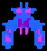
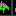
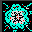
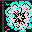
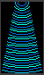
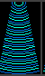
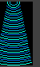

# Galaga Alien Target Crops

Generated: 2026-05-27T06:57:46.883Z

This report promotes target crops from two evidence classes: trusted cleaned crops from the segmented Galaga alien motion reference, and provisional/exact crops from the supplied Galaga general sprite sheet. The trusted motion crops now anchor the primary Boss, Bee, and Butterfly formation targets after human review found polluted sheet-cell evidence. These are conformance targets for measurement, not production art, and they do not yet score temporal motion by themselves.

## Summary

- Source image: `reference-artifacts/ingestion/galaga-alien-visual-reference/source-images/general-sprites-sheet.png`
- Promoted target crops: 33
- Role sets: 7
- Review status: trusted-motion-authority-tiered-target-crops

## Role Sets

| Role | Promoted Poses | Coverage Read |
| --- | --- | --- |
| `bee-zako` | `formation-front`, `flap-a`, `flap-b`, `dive-left`, `dive-right` | 5 promoted crop(s); required pose contract: formation-front, flap-a, flap-b, dive-or-rotation |
| `boss-galaga` | `formation-front`, `flap-a`, `flap-b`, `dive-left`, `dive-right` | 5 promoted crop(s); required pose contract: formation-front, flap-a, flap-b, damage-state, capture-beam-host |
| `butterfly-escort` | `formation-front`, `flap-a`, `flap-b`, `dive-left`, `dive-right` | 5 promoted crop(s); required pose contract: formation-front, flap-a, flap-b, escort-dive |
| `challenge-specialty-aliens` | `green-family-front`, `green-family-dive`, `yellow-family-front`, `yellow-family-dive`, `magenta-family-front`, `blue-yellow-family-front` | 6 promoted crop(s); required pose contract: dragonfly-or-scorpion-family, mosquito-or-serpentine-family, late-blue-purple-family, flap-cycle |
| `player-fighter` | `single-ship-front`, `turn-left`, `turn-right`, `dual-fighter-front` | 4 promoted crop(s); required pose contract: single-ship-front, dual-fighter, captured-or-carried-fighter, ship-loss-fragment-or-explosion-context |
| `projectiles-and-impacts` | `enemy-explosion-small`, `boss-explosion-large`, `player-shot`, `enemy-shot`, `diagonal-shot` | 5 promoted crop(s); required pose contract: player-shot, enemy-shot, first-hit-impact, enemy-explosion, boss-explosion |
| `tractor-beam` | `beam-wide`, `beam-mid`, `beam-narrow` | 3 promoted crop(s); required pose contract: beam-start, beam-mid, beam-wide, beam-collapse |

## Target Crops

| Role | Pose | Crop | Source | Authority | Metrics | Note |
| --- | --- | --- | --- | --- | --- | --- |
| `player-fighter` | `single-ship-front` |  | segmented-alien-motion-reference `248,430 82x64` | 7.5/10 `trusted-cleaned-motion-reference` Primary runtime scoring target with medium-high confidence; still not ROM-perfect source truth. | 894 lit px; channels B, G, R, W, Y | Trusted clean player-fighter crop from the segmented alien motion reference; replaces the provisional sheet-cell primary fighter target. |
| `player-fighter` | `turn-left` |  | left-primary-sprite-grid r1 c6 `80,0 16x16` | 4.4/10 `provisional-pose-cell` Pose-planning evidence only; useful for candidate ranking but not strong enough for a release-facing score claim. | 62 lit px; channels B, R, W | Rotation/turn pose for future motion and capture/rescue scoring. |
| `player-fighter` | `turn-right` |  | left-primary-sprite-grid r1 c7 `96,0 16x16` | 4.4/10 `provisional-pose-cell` Pose-planning evidence only; useful for candidate ranking but not strong enough for a release-facing score claim. | 86 lit px; channels B, R, W | Rotation/turn pose for future motion and capture/rescue scoring. |
| `bee-zako` | `formation-front` |  | segmented-alien-motion-reference `384,86 58x54` | 7.5/10 `trusted-cleaned-motion-reference` Primary runtime scoring target with medium-high confidence; still not ROM-perfect source truth. | 766 lit px; channels B, G, M, R, W, Y | Trusted clean bee/Zako formation crop from the segmented alien motion reference; replaces the polluted sheet-cell primary target. |
| `bee-zako` | `flap-a` |  | left-primary-sprite-grid r6 c6 `80,80 16x16` | 4.4/10 `provisional-pose-cell` Pose-planning evidence only; useful for candidate ranking but not strong enough for a release-facing score claim. | 50 lit px; channels B, R, W, Y | Wing/pose phase candidate for future flap cadence scoring. |
| `bee-zako` | `flap-b` |  | left-primary-sprite-grid r6 c7 `96,80 16x16` | 4.4/10 `provisional-pose-cell` Pose-planning evidence only; useful for candidate ranking but not strong enough for a release-facing score claim. | 46 lit px; channels B, R, W, Y | Alternating wing/pose phase candidate for future flap cadence scoring. |
| `bee-zako` | `dive-left` |  | left-primary-sprite-grid r6 c1 `0,80 16x16` | 4.4/10 `provisional-pose-cell` Pose-planning evidence only; useful for candidate ranking but not strong enough for a release-facing score claim. | 71 lit px; channels B, R, W | Dive/rotation silhouette candidate for approach-path scoring. |
| `bee-zako` | `dive-right` |  | left-primary-sprite-grid r6 c2 `16,80 16x16` | 4.4/10 `provisional-pose-cell` Pose-planning evidence only; useful for candidate ranking but not strong enough for a release-facing score claim. | 39 lit px; channels B, R, W | Mirrored dive/rotation silhouette candidate for approach-path scoring. |
| `butterfly-escort` | `formation-front` |  | segmented-alien-motion-reference `225,95 62x42` | 7.5/10 `trusted-cleaned-motion-reference` Primary runtime scoring target with medium-high confidence; still not ROM-perfect source truth. | 677 lit px; channels B, G, R, W, Y | Trusted clean butterfly/escort formation crop from the segmented alien motion reference; replaces the polluted sheet-cell primary target. |
| `butterfly-escort` | `flap-a` |  | left-primary-sprite-grid r5 c6 `80,64 16x16` | 4.4/10 `provisional-pose-cell` Pose-planning evidence only; useful for candidate ranking but not strong enough for a release-facing score claim. | 41 lit px; channels B, R, W | Wing/pose phase candidate for future flap cadence scoring. |
| `butterfly-escort` | `flap-b` |  | left-primary-sprite-grid r5 c7 `96,64 16x16` | 4.4/10 `provisional-pose-cell` Pose-planning evidence only; useful for candidate ranking but not strong enough for a release-facing score claim. | 56 lit px; channels B, M, R, W | Alternating wing/pose phase candidate for future flap cadence scoring. |
| `butterfly-escort` | `dive-left` |  | left-primary-sprite-grid r5 c1 `0,64 16x16` | 4.4/10 `provisional-pose-cell` Pose-planning evidence only; useful for candidate ranking but not strong enough for a release-facing score claim. | 90 lit px; channels B, M, R, W | Dive/rotation silhouette candidate for escort path scoring. |
| `butterfly-escort` | `dive-right` |  | left-primary-sprite-grid r5 c2 `16,64 16x16` | 4.4/10 `provisional-pose-cell` Pose-planning evidence only; useful for candidate ranking but not strong enough for a release-facing score claim. | 60 lit px; channels B, M, R, W | Mirrored dive/rotation silhouette candidate for escort path scoring. |
| `boss-galaga` | `formation-front` |  | segmented-alien-motion-reference `22,78 60x62` | 7.5/10 `trusted-cleaned-motion-reference` Primary runtime scoring target with medium-high confidence; still not ROM-perfect source truth. | 1174 lit px; channels B, G, M, R, Y | Trusted clean teal boss formation crop from the segmented alien motion reference; replaces the polluted sheet-cell primary target. |
| `boss-galaga` | `flap-a` |  | segmented-alien-motion-reference `22,78 60x62` | 7.5/10 `trusted-cleaned-motion-reference` Primary runtime scoring target with medium-high confidence; still not ROM-perfect source truth. | 1174 lit px; channels B, G, M, R, Y | Trusted clean boss pulse/pose phase A from the segmented alien motion reference. |
| `boss-galaga` | `flap-b` |  | segmented-alien-motion-reference `86,78 60x62` | 7.5/10 `trusted-cleaned-motion-reference` Primary runtime scoring target with medium-high confidence; still not ROM-perfect source truth. | 1298 lit px; channels B, M | Trusted clean purple boss pulse/pose phase B from the segmented alien motion reference. |
| `boss-galaga` | `dive-left` |  | left-primary-sprite-grid r3 c1 `0,32 16x16` | 4.4/10 `provisional-pose-cell` Pose-planning evidence only; useful for candidate ranking but not strong enough for a release-facing score claim. | 93 lit px; channels B, G, R, Y | Boss dive/rotation silhouette candidate. |
| `boss-galaga` | `dive-right` |  | left-primary-sprite-grid r3 c2 `16,32 16x16` | 4.4/10 `provisional-pose-cell` Pose-planning evidence only; useful for candidate ranking but not strong enough for a release-facing score claim. | 82 lit px; channels B, G, R, Y | Mirrored boss dive/rotation silhouette candidate. |
| `challenge-specialty-aliens` | `green-family-front` |  | left-primary-sprite-grid r8 c7 `96,112 16x16` | 3.2/10 `planning-only-challenge-specialty-cell` Planning and taxonomy evidence only; do not treat as canonical challenge alien truth until clean target windows replace it. | 39 lit px; channels G, R, Y | Green specialty/challenge-family pose; first-pass target for late challenge novelty. |
| `challenge-specialty-aliens` | `green-family-dive` |  | left-primary-sprite-grid r8 c1 `0,112 16x16` | 3.2/10 `planning-only-challenge-specialty-cell` Planning and taxonomy evidence only; do not treat as canonical challenge alien truth until clean target windows replace it. | 46 lit px; channels G, R, Y | Green specialty/challenge-family dive silhouette. |
| `challenge-specialty-aliens` | `yellow-family-front` |  | left-primary-sprite-grid r9 c7 `96,128 16x16` | 3.2/10 `planning-only-challenge-specialty-cell` Planning and taxonomy evidence only; do not treat as canonical challenge alien truth until clean target windows replace it. | 56 lit px; channels G, M, R | Yellow specialty/challenge-family pose; first-pass target for late challenge novelty. |
| `challenge-specialty-aliens` | `yellow-family-dive` |  | left-primary-sprite-grid r9 c1 `0,128 16x16` | 3.2/10 `planning-only-challenge-specialty-cell` Planning and taxonomy evidence only; do not treat as canonical challenge alien truth until clean target windows replace it. | 64 lit px; channels G, M, R | Yellow specialty/challenge-family dive silhouette. |
| `challenge-specialty-aliens` | `magenta-family-front` |  | center-alien-pose-grid r10 c3 `177,192 16x16` | 3.2/10 `planning-only-challenge-specialty-cell` Planning and taxonomy evidence only; do not treat as canonical challenge alien truth until clean target windows replace it. | 51 lit px; channels G, M, R | Magenta late-family cell for challenge-stage alien variety. |
| `challenge-specialty-aliens` | `blue-yellow-family-front` |  | center-alien-pose-grid r10 c6 `225,192 16x16` | 3.2/10 `planning-only-challenge-specialty-cell` Planning and taxonomy evidence only; do not treat as canonical challenge alien truth until clean target windows replace it. | 34 lit px; channels R, Y | Blue/yellow late-family cell for challenge-stage alien variety. |
| `projectiles-and-impacts` | `enemy-explosion-small` |  | top-effects-and-capture-icons `177,0 32x32` | 5.6/10 `accepted-static-sheet-support` Useful supporting target evidence, but should be cross-checked against gameplay or motion windows before major tuning. | 402 lit px; channels G, R, W | Small-to-medium explosion/impact phase candidate. |
| `projectiles-and-impacts` | `boss-explosion-large` |  | top-effects-and-capture-icons `209,0 32x32` | 5.6/10 `accepted-static-sheet-support` Useful supporting target evidence, but should be cross-checked against gameplay or motion windows before major tuning. | 572 lit px; channels G, R, W | Large explosion/impact phase candidate for boss and ship-loss feedback. |
| `projectiles-and-impacts` | `player-shot` |  | right-tractor-beam-and-scoring `304,120 16x16` | 5.6/10 `accepted-static-sheet-support` Useful supporting target evidence, but should be cross-checked against gameplay or motion windows before major tuning. | 12 lit px; channels B, R, W | Vertical projectile candidate for player-shot scale and palette. |
| `projectiles-and-impacts` | `enemy-shot` |  | right-tractor-beam-and-scoring `304,136 16x16` | 5.6/10 `accepted-static-sheet-support` Useful supporting target evidence, but should be cross-checked against gameplay or motion windows before major tuning. | 12 lit px; channels G, R, W | Enemy projectile candidate for shot feedback and avoidance readability. |
| `projectiles-and-impacts` | `diagonal-shot` |  | right-tractor-beam-and-scoring `320,120 16x16` | 5.6/10 `accepted-static-sheet-support` Useful supporting target evidence, but should be cross-checked against gameplay or motion windows before major tuning. | 13 lit px; channels B, R, W | Diagonal projectile candidate for enemy-shot vocabulary. |
| `tractor-beam` | `beam-wide` |  | right-tractor-beam-and-scoring `288,34 50x84` | 5.6/10 `accepted-static-sheet-support` Useful supporting target evidence, but should be cross-checked against gameplay or motion windows before major tuning. | 898 lit px; channels B, G | Wide tractor-beam band candidate for capture-state width and color rhythm. |
| `tractor-beam` | `beam-mid` |  | right-tractor-beam-and-scoring `342,34 50x84` | 5.6/10 `accepted-static-sheet-support` Useful supporting target evidence, but should be cross-checked against gameplay or motion windows before major tuning. | 898 lit px; channels B, G | Mid-width tractor-beam band candidate. |
| `tractor-beam` | `beam-narrow` |  | right-tractor-beam-and-scoring `396,34 50x84` | 5.6/10 `accepted-static-sheet-support` Useful supporting target evidence, but should be cross-checked against gameplay or motion windows before major tuning. | 863 lit px; channels B, G | Narrow tractor-beam band candidate. |
| `player-fighter` | `dual-fighter-front` |  | derived-composite `0,0 114x45` | 7.2/10 `trusted-derived-composite` May anchor runtime scoring for the exact composite state while separate source-frame evidence is still being promoted. | 1798 lit px; channels B, C, G, R, W, Y | Derived dual-fighter target composed from two trusted cleaned player-fighter crops. This prevents the dual runtime state from being scored against a single fighter while preserving the accepted target proportions. |

Next best step: Replace challenge-only specialty alien provisional cells with clean target motion/gameplay windows, then regenerate Aurora live runtime comparisons with authority-adjusted scoring.
