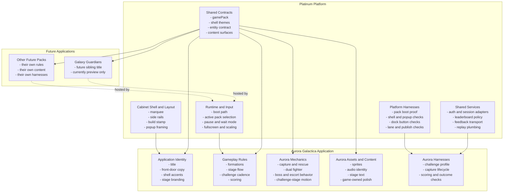

# Platinum Architectural Overview

This document is the maintained short visual overview of how `Platinum` relates
to the applications it hosts.

Use it for the fast answer to:

- what Platinum is
- what Platinum owns
- what applications own
- where the current migration stands

For the canonical full platform guide, use:

- `/Users/steven/Documents/Codex-Test1/PLATINUM.md`

## Diagram

## Current Read

Today the architecture is in this state:

- `Platinum` is real and visible in the shipped product
- `Aurora Galactica` is the first playable application on Platinum
- `Galaxy Guardians` exists as a preview-only sibling application shell
- hosted docs now need to describe the platform separately from the applications it hosts

## Related Docs

- canonical platform guide:
  - `/Users/steven/Documents/Codex-Test1/PLATINUM.md`
- application-layer guide:
  - `/Users/steven/Documents/Codex-Test1/APPLICATIONS_ON_PLATINUM.md`
- repo technical map:
  - `/Users/steven/Documents/Codex-Test1/ARCHITECTURE.md`
- release and testing discipline:
  - `/Users/steven/Documents/Codex-Test1/TESTING_AND_RELEASE_GATES.md`
- launch art direction:
  - `/Users/steven/Documents/Codex-Test1/PLATINUM_LAUNCH_ART_DIRECTION.md`
- forward-looking review:
  - `/Users/steven/Documents/Codex-Test1/PLATINUM_LUECK_REVIEW.md`
