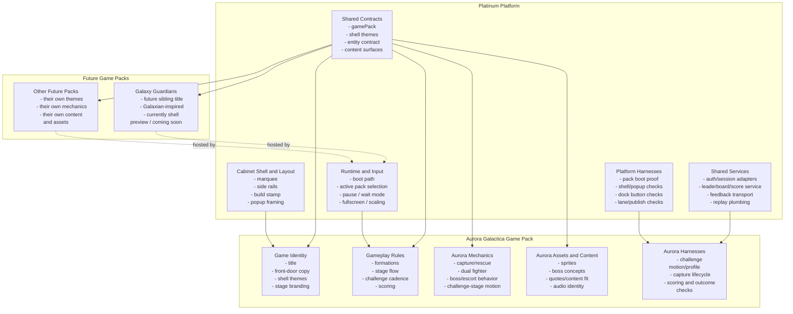

# Platinum Architectural Overview

This document is the maintained high-level picture of how `Platinum` relates to
the games it hosts, starting with `Aurora Galactica`.

Use this as the short visual explanation for:

- what `Platinum` is
- what it owns
- what the game packs own
- where the current migration stands

## Diagram

## Maintained Graphics

The following SVG graphics are maintained alongside this overview and are meant
to be reused in docs, release briefings, and planning artifacts:

- public-facing platform hero:
  - `/Users/stevenwoods/Documents/Codex-Test1/reference-artifacts/diagrams/platinum/platinum-hero.svg`
- platform stack:
  - `/Users/stevenwoods/Documents/Codex-Test1/reference-artifacts/diagrams/platinum/platinum-platform-stack.svg`
- platform versus game-pack ownership:
  - `/Users/stevenwoods/Documents/Codex-Test1/reference-artifacts/diagrams/platinum/platinum-pack-separation.svg`
- migration state and next-step framing:
  - `/Users/stevenwoods/Documents/Codex-Test1/reference-artifacts/diagrams/platinum/platinum-migration-state.svg`
- Aurora pack card:
  - `/Users/stevenwoods/Documents/Codex-Test1/reference-artifacts/diagrams/platinum/aurora-pack-card.svg`
- Galaxy Guardians pack card:
  - `/Users/stevenwoods/Documents/Codex-Test1/reference-artifacts/diagrams/platinum/galaxy-guardians-pack-card.svg`
- launch shell art direction:
  - `/Users/stevenwoods/Documents/Codex-Test1/PLATINUM_LAUNCH_ART_DIRECTION.md`

## Separation Summary

### Platinum owns

- the cabinet shell and frame metaphor
- the reusable shell frame theme catalog:
  - `platinum-release`
  - preview / sibling frame looks
  - marquee / rail / cabinet chrome treatment
- the pack picker and platform identity surfaces
- the runtime boot/install path for the active pack
- shared services:
  - auth/session
  - score transport
  - feedback transport
  - replay plumbing
- platform-only harnesses and release/publish checks
- the generic contracts that packs plug into

### Aurora owns

- the actual game identity and presentation
- stage themes and stage progression
- enemy families and boss identity
- scoring rules
- challenge-stage behavior
- capture/rescue and dual-fighter logic
- game-specific content such as future boss personality, themed stage text,
  audio identity, and designer-facing definitions

### Future packs own

- their own shell identity within Platinum
- their own gameplay rules
- their own stage, boss, text, and audio definitions
- their own game-pack harnesses

## Current Migration State

Today, the architecture is in this state:

- `Platinum` is real and visible in the product
- `Aurora Galactica` is the first playable game pack hosted on Platinum
- `Galaxy Guardians` exists as a non-playable preview pack in the shell
- platform-only harnesses now exist alongside Aurora gameplay harnesses

This means we are past the “just refactoring Aurora internally” phase.

We are now in the “stabilize the first real platform-hosted game and prepare
for a second pack” phase.

## Current Proof Points

The following are already true:

- Aurora boots through the selected-pack path
- the shell can switch between Aurora and the preview sibling pack
- the shell supports per-pack themes
- the Platinum button and splash are real shell surfaces
- the future-pack preview uses a proper dismissable `Coming Soon` splash
- platform shell behavior is backed by dedicated harnesses

## Remaining Near-Term Goal

Before we move deeply back into game expansion work, the next milestone is:

- rerelease `Aurora Galactica` clearly as a `Platinum`-hosted title on a stable
  platform baseline

After that:

- return to the tracked Aurora gameplay follow-ups
- then prepare the first truly playable sibling pack slice

## Related Docs

- core architecture map:
  - `/Users/stevenwoods/Documents/Codex-Test1/ARCHITECTURE.md`
- Aurora design-authoring view:
  - `/Users/stevenwoods/Documents/Codex-Test1/AURORA_GAME_DESIGNER_VIEW.md`
- content and quote surfaces:
  - `/Users/stevenwoods/Documents/Codex-Test1/CONTENT_PLAN.md`
- audio/event planning:
  - `/Users/stevenwoods/Documents/Codex-Test1/AUDIO_PLAN.md`
