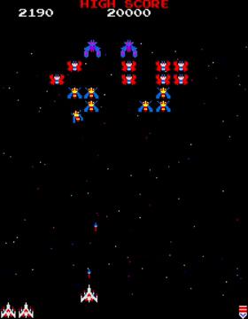

# Aurora Galactica

Classic fixed-screen browser shooter with keyboard controls, capture-and-rescue mechanics, multi-stage progression, and arcade-style tuning.

Current shipping target:

- a polished four-stage slice:
  - Stage `1`
  - Stage `2`
  - Stage `3` challenging stage
  - Stage `4`

Expansion beyond Stage `4` is currently treated as post-`1.0` work unless it
directly supports polishing this slice.

Release dashboard:

- live page:
  - `https://sgwoods.github.io/Aurora-Galactica/release-dashboard.html`
- source data:
  - `/Users/stevenwoods/Documents/Codex-Test1/release-dashboard.json`

Project guide:

- live page:
  - `https://sgwoods.github.io/Aurora-Galactica/project-guide.html`
- source data:
  - `/Users/stevenwoods/Documents/Codex-Test1/project-guide.json`
  - plus the maintained source docs it renders from:
    - `/Users/stevenwoods/Documents/Codex-Test1/README.md`
    - `/Users/stevenwoods/Documents/Codex-Test1/PLAN.md`
    - `/Users/stevenwoods/Documents/Codex-Test1/PRODUCT_ROADMAP.md`
    - `/Users/stevenwoods/Documents/Codex-Test1/ARCHITECTURE.md`
    - `/Users/stevenwoods/Documents/Codex-Test1/SOURCE_MAP.md`
    - `/Users/stevenwoods/Documents/Codex-Test1/EXTERNAL_SERVICES.md`
    - `/Users/stevenwoods/Documents/Codex-Test1/REFERENCE_BASELINE.md`
    - `/Users/stevenwoods/Documents/Codex-Test1/CONTRIBUTING.md`
    - `/Users/stevenwoods/Documents/Codex-Test1/RELEASE_POLICY.md`

Player guide:

- live page:
  - `https://sgwoods.github.io/Aurora-Galactica/player-guide.html`
- source data:
  - `/Users/stevenwoods/Documents/Codex-Test1/player-guide.json`
- generated local dev page:
  - `/Users/stevenwoods/Documents/Codex-Test1/dist/dev/player-guide.html`

Repository roles:

- development repo:
  - `https://github.com/sgwoods/Codex-Test1`
- public release repo:
  - `https://github.com/sgwoods/Aurora-Galactica`
- external runtime and tooling services:
  - `/Users/stevenwoods/Documents/Codex-Test1/EXTERNAL_SERVICES.md`

## Live

After GitHub Pages deploys, play at:

- production:
  - `https://sgwoods.github.io/Aurora-Galactica/`
- beta:
  - `https://sgwoods.github.io/Aurora-Galactica/beta/`

The root Aurora build is the official public production lane, even while the product is still prerelease in SemVer terms. The `/beta/` lane is a manually promoted public checkpoint used for less-frequent milestone playtesting. Day-to-day engineering work continues in `Codex-Test1` as the pre-production development line.

## Screenshot



## Run Locally (macOS / Chrome)

1. Open Terminal in this folder:
   ```bash
   cd /Users/stevenwoods/Documents/Codex-Test1
   ```
2. Build the current local dev output:
   ```bash
   npm run build
   ```
3. Start the local game and viewer services:
   ```bash
   npm run local:resume
   ```
4. Open:
   - `http://localhost:8000`
   - `http://127.0.0.1:4311/`

If you only want the game server, the lower-level command is:

```bash
python3 -m http.server 8000 --directory dist/dev
```

To stop the locally tracked game and viewer services cleanly:

```bash
npm run local:stop
```

## Controls

- `Left/Right` or `A/D`: Move
- `Ctrl`: Left-handed cabinet-style move left on the web
- `Command`: Left-handed cabinet-style move right on the web
- `Space`: Fire (arcade-style shot cap)
- `P` or pause icon: Pause
- `F`: Fullscreen
- `U`: Ultra scale toggle
- `Enter`: Start / Restart
- `F1` or `?`: Open in-game feedback form
- `ℹ` icon: Open the player guide inside the game
- `🕹` icon: Open the controls reference inside the game
- `🎞` icon: Watch recent local replays saved on this device
- `Export Log` button: Download the current gameplay session as JSON

## What Is Implemented

- Fixed arcade playfield with integer scaling and fullscreen letterboxing
- Stage progression with challenge stages
- Stage 1 scripted opening timing for consistency
- Boss capture beam, ship capture, rescue, and dual-fighter fire mode
- Enemy dive behavior and tuned missile pacing/spread
- Pixel-art sprite rendering and starfield
- Synthesized arcade-style SFX
- Local high score persistence via browser storage

## Development

- Editable source files live in:
  - `src/index.template.html`
  - `src/styles.css`
  - `src/js/00-boot.js`
  - `src/js/10-gameplay.js`
  - `src/js/20-render.js`
  - `src/js/90-harness.js`
- Source orientation guide:
  - `/Users/stevenwoods/Documents/Codex-Test1/SOURCE_MAP.md`
- Contributor guide:
  - `/Users/stevenwoods/Documents/Codex-Test1/CONTRIBUTING.md`
- Home machine setup:
  - `/Users/stevenwoods/Documents/Codex-Test1/HOME_MACHINE_SETUP.md`
- Home Codex prompt:
  - `/Users/stevenwoods/Documents/Codex-Test1/HOME_CODEX_PROMPT.md`
- Repo-managed Codex skill source:
  - `/Users/stevenwoods/Documents/Codex-Test1/codex-skills/aurora-dev-refresh/SKILL.md`
- Architecture overview:
  - `/Users/stevenwoods/Documents/Codex-Test1/ARCHITECTURE.md`
- Reference baseline:
  - `/Users/stevenwoods/Documents/Codex-Test1/REFERENCE_BASELINE.md`
- Local dev artifact:
  - `dist/dev/index.html`
- Build the served file from source with:
  ```bash
  npm run build
  ```
- Build outputs are generated into:
  - `/Users/stevenwoods/Documents/Codex-Test1/dist/dev/`
  - `/Users/stevenwoods/Documents/Codex-Test1/dist/beta/`
  - `/Users/stevenwoods/Documents/Codex-Test1/dist/production/`
- Do not hand-edit generated files under `dist/`; treat them as disposable build output.
- Start the local artifact review viewer with:
  ```bash
  npm run log-viewer
  ```
  Then open:
  - `http://127.0.0.1:4311/`
  The viewer loads repaired run videos, keeps the event stream aligned beside playback, supports paused zoom/pan and region clipping, and can draft Codex context or GitHub issues from the selected moment.
  It expects run artifacts to live under:
  - `/Users/stevenwoods/Documents/Codex-Test1/harness-artifacts/`
  With one `summary.json` per run folder and neighboring files such as:
  - `neo-galaga-session-*.json`
  - `neo-galaga-video-*.review.webm`
  The viewer discovers runs recursively, so batch folders may contain nested run folders as long as each run keeps that local structure.
- Promote the current built artifacts to the hosted `beta` lane with:
  ```bash
  npm run promote:beta
  ```
  This creates or refreshes:
  - `/Users/stevenwoods/Documents/Codex-Test1/dist/beta/`
  from the current dev build in:
  - `/Users/stevenwoods/Documents/Codex-Test1/dist/dev/`
  Publish the generated `dist/beta/` snapshot into `https://github.com/sgwoods/Aurora-Galactica` when you want the hosted `https://sgwoods.github.io/Aurora-Galactica/beta/` lane to move.
- Promote the current dev build into the stable production artifact with:
  ```bash
  npm run promote:production
  ```
  This creates or refreshes:
  - `/Users/stevenwoods/Documents/Codex-Test1/dist/production/`
- Sync the separate public repo from the latest build metadata with:
  ```bash
  npm run sync:public
  ```
  This updates the canonical Aurora public/status files:
  - `/Users/stevenwoods/GitPages/public/aurora-galactica.html`
  - `/Users/stevenwoods/GitPages/public/data/projects/aurora-galactica.json`
  And it keeps the legacy compatibility aliases current:
  - `/Users/stevenwoods/GitPages/public/codex-test1.html`
  - `/Users/stevenwoods/GitPages/public/data/projects/codex-test1.json`
  It does not update `/Users/stevenwoods/GitPages/public/index.html` directly.
- Verify that the public repo content reflects the current build metadata with:
  ```bash
  npm run verify:public
  ```
- Build script:
  - `tools/build/build-index.js`
- Public-pages sync script:
  - `tools/build/sync-public-pages.js`
- Public-pages verification script:
  - `tools/build/verify-public-sync.js`
- Local dev build metadata output:
  - `dist/dev/build-info.json`
- Release notes source:
  - `release-notes.json`
- Release/versioning policy:
  - `/Users/stevenwoods/Documents/Codex-Test1/RELEASE_POLICY.md`
- Product roadmap:
  - `/Users/stevenwoods/Documents/Codex-Test1/PRODUCT_ROADMAP.md`
- Project guide source:
  - `/Users/stevenwoods/Documents/Codex-Test1/project-guide.json`
- Generated local dev project guide:
  - `/Users/stevenwoods/Documents/Codex-Test1/dist/dev/project-guide.html`
- Generated local dev player guide:
  - `/Users/stevenwoods/Documents/Codex-Test1/dist/dev/player-guide.html`
- This page is regenerated during `npm run build` from the guide config and the maintained docs above.

## End-To-End Workflow

### 1. Develop In Source

- Make gameplay, UI, harness, or documentation changes in:
  - `/Users/stevenwoods/Documents/Codex-Test1/src/`
  - maintained docs such as:
    - `/Users/stevenwoods/Documents/Codex-Test1/README.md`
    - `/Users/stevenwoods/Documents/Codex-Test1/PLAN.md`
    - `/Users/stevenwoods/Documents/Codex-Test1/ARCHITECTURE.md`
    - `/Users/stevenwoods/Documents/Codex-Test1/SOURCE_MAP.md`
  - structured release/project data such as:
    - `/Users/stevenwoods/Documents/Codex-Test1/project-guide.json`
    - `/Users/stevenwoods/Documents/Codex-Test1/release-dashboard.json`
    - `/Users/stevenwoods/Documents/Codex-Test1/release-notes.json`

### 2. Build Local Outputs

- Run:
  ```bash
  npm run build
  ```
- This regenerates:
  - `/Users/stevenwoods/Documents/Codex-Test1/dist/dev/index.html`
  - `/Users/stevenwoods/Documents/Codex-Test1/dist/dev/project-guide.html`
  - `/Users/stevenwoods/Documents/Codex-Test1/dist/dev/release-dashboard.html`
  - `/Users/stevenwoods/Documents/Codex-Test1/dist/dev/build-info.json`

### 3. Test Against The Built App

- Manual local play should use the generated dev build:
  ```bash
  npm run local:resume
  ```
- This brings up:
  - `http://localhost:8000`
  - `http://127.0.0.1:4311/`
- Harness/browser checks also run against `dist/dev/`, not raw source.
- The log viewer is separate and reads run artifacts from:
  - `/Users/stevenwoods/Documents/Codex-Test1/harness-artifacts/`

### 4. Promote A Beta Snapshot

- When the current build is worth external testing, run:
  ```bash
  npm run promote:beta
  ```
- This creates a beta-ready snapshot in:
  - `/Users/stevenwoods/Documents/Codex-Test1/dist/beta/`

### 5. Publish Hosted Beta

- Preferred:
  ```bash
  npm run publish:beta
  ```
- This command now refreshes the beta lane from the current `HEAD` automatically:
  - rebuilds `dist/dev`
  - promotes to `dist/beta`
  - runs beta preflight
  - publishes the lane
- Optional manual inspection steps still exist:
  ```bash
  npm run promote:beta
  npm run publish:check:beta
  npm run publish:beta:raw
  ```
- This clones `sgwoods/Aurora-Galactica`, copies:
  - `/Users/stevenwoods/Documents/Codex-Test1/dist/beta/`
  into the `/beta/` folder, commits, and pushes.
- Then GitHub Pages updates:
  - `https://sgwoods.github.io/Aurora-Galactica/beta/`

### 6. Publish Hosted Production

- Preferred:
  ```bash
  npm run publish:production
  ```
- This command now refreshes the production lane from the current `HEAD` automatically:
  - rebuilds `dist/dev`
  - promotes to `dist/production`
  - runs production preflight
  - publishes the lane
- Optional manual inspection steps still exist:
  ```bash
  npm run promote:production
  npm run publish:check:production
  npm run publish:production:raw
  ```
- This clones `sgwoods/Aurora-Galactica`, copies:
  - `/Users/stevenwoods/Documents/Codex-Test1/dist/production/`
  into the root published surface, commits, and pushes.
- Then GitHub Pages updates:
  - `https://sgwoods.github.io/Aurora-Galactica/`

### 7. Sync Public Project Status

- The separate public project-summary repo is not the game host.
- It is updated from the current production build metadata with:
  ```bash
  npm run sync:public
  ```
- That updates Aurora’s public project/status surfaces in `sgwoods/public`, not the playable game itself.
- Release history:
  - `/Users/stevenwoods/Documents/Codex-Test1/release-history/`
- Auto deploy workflow: `.github/workflows/pages.yml`
- Cross-repo public-pages sync workflow:
  - `.github/workflows/sync-public-pages.yml`
- Durable reference material:
  - `/Users/stevenwoods/Documents/Codex-Test1/reference-artifacts/`
  - challenge-stage baseline:
    - `/Users/stevenwoods/Documents/Codex-Test1/reference-artifacts/analyses/first-challenge-stage/README.md`

## Versioning

- Current versioning uses three release surfaces with build metadata:
  - pre-production:
    - prerelease SemVer from `package.json`
  - production:
    - stable public label without the prerelease suffix
  - production beta:
    - promoted public beta label
- Local and deployed builds carry:
  - version
  - build number
  - short commit
  - branch / dirty state
  - Eastern release timestamp
- The settings drawer also shows the latest human-written release note from:
  - `/Users/stevenwoods/Documents/Codex-Test1/release-notes.json`
- Each release can also keep a structured session summary and optional raw transcript under:
  - `/Users/stevenwoods/Documents/Codex-Test1/release-history/`
- The separate public project pages repo is synced from `dist/production/build-info.json` and `release-notes.json`
  - CI uses the `PUBLIC_REPO_SYNC_TOKEN` secret when available
  - The token should have `contents:write` access to `sgwoods/public`
- Example production build label:
  - `0.5.0+build.9.sha.457df28`
- Example production beta build label:
  - `0.5.0-beta.1+build.9.sha.457df28.beta`
- See:
  - `/Users/stevenwoods/Documents/Codex-Test1/RELEASE_POLICY.md`

## Session Logging

- The game records keyboard events, major lifecycle events, and periodic gameplay snapshots
- Exported logs are downloaded as JSON from the in-game `Export Log` button
- Each export includes build metadata, browser/user agent, viewport info, input events, and game-state snapshots
- Player-triggered exports are browser downloads, not repo-local harness artifacts
  - they usually land in the user’s downloads directory
- The in-game `🎞` replay surface is separate and keeps recent local replay state in browser storage
- The canonical developer review archive is still:
  - `harness-artifacts/`
- See the formal distinction in:
  - `/Users/stevenwoods/Documents/Codex-Test1/ARTIFACT_POLICY.md`

## Gameplay Harness

- A local replay harness can run the game in Chrome, replay a saved session JSON, and write fresh `.webm` and `.json` artifacts into `harness-artifacts/`
- It uses your installed `/Applications/Google Chrome.app`
- Harness execution and artifact generation are local-only on your Mac; it does not use cloud compute
- Run it with a previously exported session:
  ```bash
  npm run harness -- --session /absolute/path/to/neo-galaga-session.json
  ```
- Or run one of the built-in scenarios:
  ```bash
  npm run harness -- --scenario stage3-challenge
  npm run harness -- --scenario stage3-challenge-persona --persona expert
  npm run harness -- --scenario stage3-transition
  npm run harness -- --scenario stage3-perfect-transition
  npm run harness -- --scenario stage4-five-ships
  npm run harness -- --scenario stage4-survival
  npm run harness -- --scenario stage1-descent
  npm run harness -- --scenario rescue-dual
  npm run harness -- --scenario capture-rescue-dual
  npm run harness -- --scenario carried-boss-diving-release
  npm run harness -- --scenario carried-boss-formation-hostile
  npm run harness -- --scenario natural-capture-cycle
  npm run harness -- --scenario stage4-capture-pressure
  npm run harness -- --scenario boss-first-hit
  npm run harness -- --scenario second-capture-current
  npm run harness -- --scenario stage12-variety
  npm run harness -- --scenario stage4-squadron-bonus
  npm run harness -- --scenario carried-fighter-standby
  npm run harness -- --scenario carried-fighter-attacking
  ```
- Or run a seeded batch:
  ```bash
  npm run harness:batch -- --profile personas
  npm run harness:batch -- --profile distribution
  npm run harness:batch -- --profile quick
  npm run harness:batch -- --profile fidelity
  npm run harness:batch -- --profile default
  npm run harness:batch -- --profile deep
  ```
- Output is written to a timestamped folder under:
  - `/Users/stevenwoods/Documents/Codex-Test1/harness-artifacts/`
- The log viewer reads that same tree recursively. A run folder is considered review-ready when it contains:
  - `summary.json`
  - a neighboring session log:
    - `neo-galaga-session-*.json`
  - a browser-friendly repaired review video when available:
    - `neo-galaga-video-*.review.webm`
  - fallback raw videos such as `.webm` or `.mkv` can still be discovered, but the repaired `.review.webm` is the preferred review artifact.
- Every new harness run should be treated as incomplete until the artifact-quality check passes:
  ```bash
  npm run harness:check:video-artifact
  ```
- If the quality check fails while reviewing logs or videos:
  - file an immediate bug because the recorder/export path is no longer trustworthy
  - suggest the repair path:
    ```bash
    npm run harness:repair:videos
    ```
  - and avoid using the affected video for synchronized analysis until it has a repaired browser-friendly review artifact
- The harness writes a `summary.json` beside the generated artifacts, including:
  - seed used for the run
  - selected self-play persona when used:
    - `novice`
    - `advanced`
    - `expert`
    - `professional`
- Stage 4 now has a dedicated capture-pressure scenario as well:
  - `stage4-capture-pressure`
  - purpose: stress a natural capture into carrying-boss return under Stage 4 timing
  - note: this scenario is currently most useful as a focused capture-pressure probe, not a full Stage 4 replacement for `stage4-five-ships` or `stage4-survival`
  - stage clears / challenge clears / ship losses
  - per-loss context such as recent attack starts, recent enemy bullets, nearby snapshot counts, and explicit death causes
  - capture/rescue markers such as capture start, fighter captured, and fighter rescued
  - capture-branch markers such as captured-fighter release / auto-recovery versus captured-fighter-turned-hostile
  - transition markers such as challenge-clear-to-next-stage spawn timing, first visible next-stage snapshot, and whether the game ever showed the next stage before enemies were visible
  - rescue-pipeline metrics such as whether a rescue actually turned into active dual-fighter fire
- Persona self-play is useful for launch-readiness tuning without changing game rules:
  ```bash
  npm run harness -- --scenario stage1-opening --persona novice
  npm run harness -- --scenario stage2-opening --persona advanced
  npm run harness -- --scenario stage4-survival --persona expert
  ```
  - full-run persona distributions are useful for overall game-shape tuning:
    ```bash
    npm run harness:batch -- --profile distribution
    npm run harness:batch -- --profile distribution --repeats 4
    ```
  - the distribution batch runs Stage 1 -> game over for:
    - `novice`
    - `advanced`
    - `expert`
    - `professional`
  - and records:
    - ending stage distribution
    - score distribution
    - game-length distribution
    - lives-left distribution
    - stage-clear counts
    - stage-reach rates by persona
    - aggregated loss causes
  - natural capture-cycle metrics such as capture-start-to-capture timing and captured-to-rescue timing
  - carried-fighter scoring metrics such as standby vs attacking destroy counts and total awarded points
  - special attack squadron bonus metrics such as triggered count, total awarded bonus, max escorts present, and measured escort offset
  - dual-fire metrics such as average spread in the rescue scenario
  - descent-speed metrics such as time from attack start to lower-field crossing
  - whether the generated `.webm` contains audio
- Batch mode also writes:
  - `batch-report.json` with aggregate challenge hits, ship losses, total duration, and audio failures
  - `tuning-report.json` with prioritized findings to guide the next gameplay pass
  - later-stage diagnostics such as first-loss timing, loss clustering, attacker pressure at death, and bullet-vs-collision loss mix
  - the tuning report now considers both ship losses and how much of the stage-pressure scenario survived, so it can distinguish "died early" from "survived the full window but spent too many ships"
- Historical harness videos can be repaired in place into `.review.webm` artifacts and have their neighboring `summary.json` updated with artifact-quality metadata:
  ```bash
  npm run harness:repair:videos
  ```
- Typical batch timings on this machine:
  - `quick`: about `1.5-2 minutes`
  - `default`: about `3-4 minutes`
  - `deep`: about `5-7 minutes`
- You can re-run the analyzer on an existing run folder:
  ```bash
  npm run harness:analyze -- --run /absolute/path/to/harness-artifacts/run-folder
  ```
- You can also regenerate the tuning summary for an existing batch:
  ```bash
  npm run harness:tune -- --batch /absolute/path/to/harness-artifacts/batch-folder
  ```
- You can import the latest self-play capture pair from your Downloads folder into `harness-artifacts/` and analyze it in one step:
  ```bash
  npm run harness:import-latest
  ```
- This import step is the intended bridge from:
  - browser download artifacts in the user’s downloads location
  - to the normalized developer review archive in `harness-artifacts/`
- You can also check for a new self-play run without duplicating already imported files:
  ```bash
  npm run harness:check-latest
  ```
- Optional import flags:
  ```bash
  npm run harness:import-latest -- --session-id ngt-1773602145011-2
  npm run harness:import-latest -- --source /absolute/path/to/folder
  ```
- `harness:check-latest` keeps a small local state file in `harness-artifacts/` so scheduled scans can safely skip runs that were already imported
- Current tuning targets from the latest quick batch:
  - challenge-stage scoring is materially improved, but later-stage visual fidelity still needs work
  - Stage 4 pressure is now much healthier in the five-ship scenario
  - Stage 4 survival is still collision-driven and remains the main gameplay tuning target
  - deeper multi-stage progression is still needed for richer late-stage comparison

## Modem Feedback Integration

The game includes a floating `Feedback` button (top-right).

- Both `Feature Request` and `Bug Report` submissions post to FormSubmit, which forwards them to `default-dimiglyd88@inbox.modem.dev`
- If FormSubmit cannot send directly, the game falls back to opening a prefilled `mailto:` draft
- The submission body includes the report plus game metadata (build, timestamp, stage, score, lives, and user agent)

One-time setup:

- FormSubmit is free and does not require an account
- The first submission to a destination email triggers a confirmation email from FormSubmit that must be clicked once for that exact inbox address
