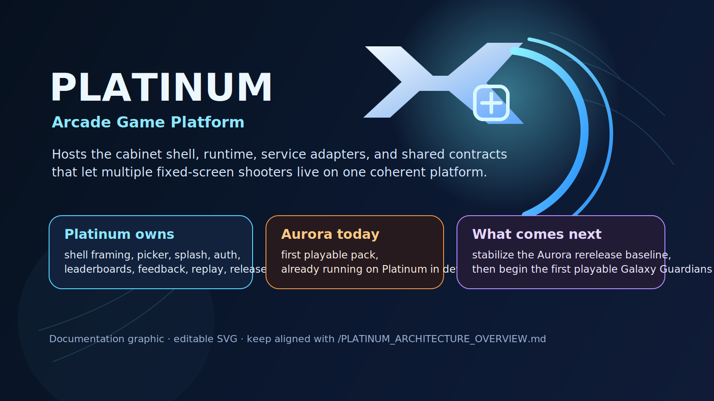
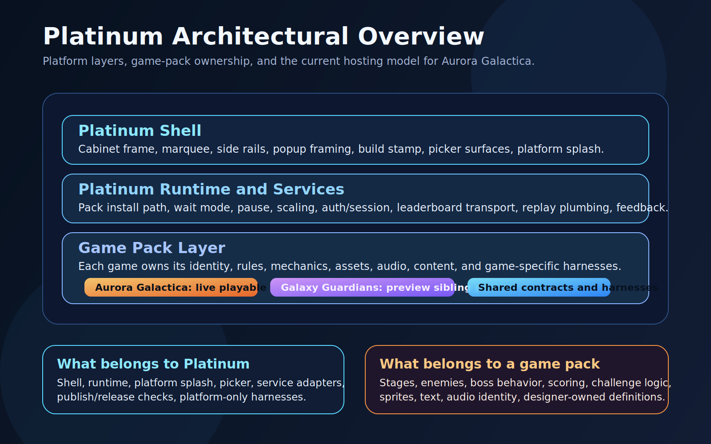
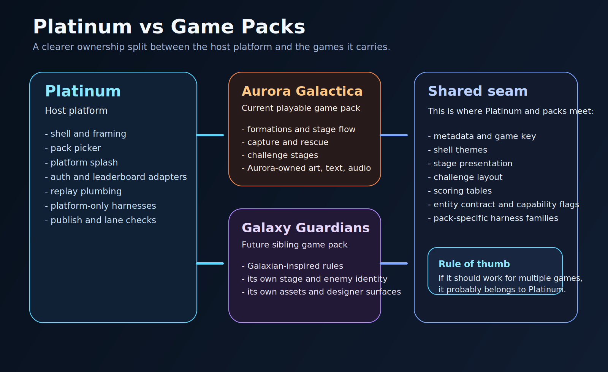
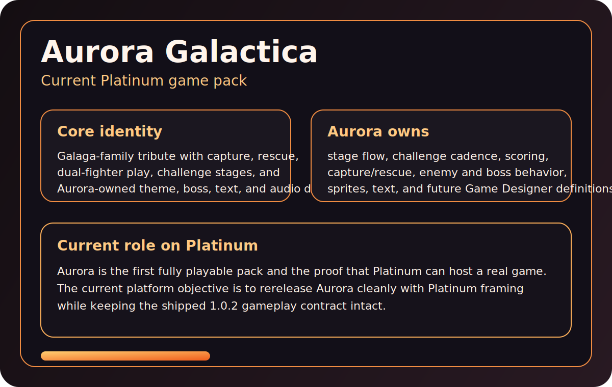
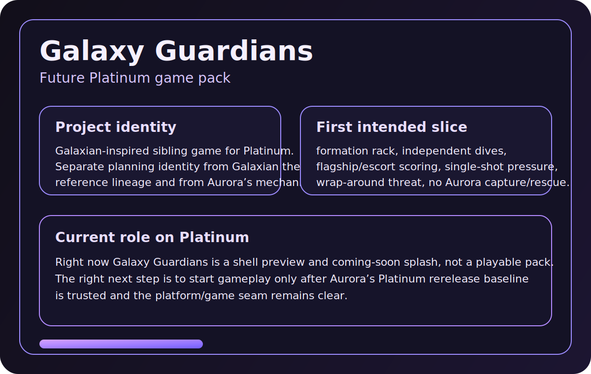

# Aurora Galactica On Platinum

`Aurora Galactica` is the first shipped playable application on the `Platinum`
browser-arcade platform.



## What This Repo Contains

This repo is the engineering source of truth for:

- the `Platinum` platform
- the `Aurora Galactica` application
- the hosted documentation set
- the build, promote, publish, and verification scripts for the release lanes

Think about the product in two layers:

- `Platinum`
  - shared shell, hosted lanes, pack selection, shared services, release tooling, and first-class hosted documentation
- `Aurora Galactica`
  - gameplay rules, stage flow, scoring, capture and rescue, challenge behavior, and Aurora-specific content

## Repository Roles

Aurora currently uses two public GitHub repos, but they do not have the same
job:

- active source repo, issue tracker, planning docs, and engineering workflow:
  - `https://github.com/sgwoods/Codex-Test1`
- public release host and GitHub Pages deployment surface:
  - `https://github.com/sgwoods/Aurora-Galactica`

Use `sgwoods/Codex-Test1` for:

- active issues and bug triage
- planning, roadmap, and release workflow docs
- coding, testing, harnesses, and release scripts
- multi-machine development and release authority

Use `sgwoods/Aurora-Galactica` for:

- hosted `/dev`, `/beta`, and `/production`
- public-facing mirrored release assets
- the public landing surface for the live game

If you are looking for the active issue tracker, use:

- `https://github.com/sgwoods/Codex-Test1/issues`

## Live Lanes

- local `localhost`:
  - `http://127.0.0.1:8000/`
- hosted `/dev`:
  - `https://sgwoods.github.io/Aurora-Galactica/dev/`
- hosted `/beta`:
  - `https://sgwoods.github.io/Aurora-Galactica/beta/`
- hosted `/production`:
  - `https://sgwoods.github.io/Aurora-Galactica/`
- local log viewer:
  - `http://127.0.0.1:4311/`

## First-Class Hosted Documentation

The hosted documentation set should now move with the release lanes.

Primary hosted docs on hosted `/production`:

- project guide:
  - `https://sgwoods.github.io/Aurora-Galactica/project-guide.html`
- Platinum guide:
  - `https://sgwoods.github.io/Aurora-Galactica/platinum-guide.html`
- player guide:
  - `https://sgwoods.github.io/Aurora-Galactica/player-guide.html`
- release dashboard:
  - `https://sgwoods.github.io/Aurora-Galactica/release-dashboard.html`

Equivalent docs should also exist on hosted `/dev` and hosted `/beta`.

## Canonical Source Docs

Best platform overview:

- [PLATINUM.md](PLATINUM.md)
- [PLATINUM_ARCHITECTURE_OVERVIEW.md](PLATINUM_ARCHITECTURE_OVERVIEW.md)

Best application-boundary doc:

- [APPLICATIONS_ON_PLATINUM.md](APPLICATIONS_ON_PLATINUM.md)

Best repo technical map:

- [ARCHITECTURE.md](ARCHITECTURE.md)

Best release and testing gate doc:

- [TESTING_AND_RELEASE_GATES.md](TESTING_AND_RELEASE_GATES.md)
- [DEVELOPMENT_PRINCIPLES.md](DEVELOPMENT_PRINCIPLES.md)

Release planning and readiness docs:

- [PLAN.md](PLAN.md)
- [PRODUCT_ROADMAP.md](PRODUCT_ROADMAP.md)
- [RELEASE_POLICY.md](RELEASE_POLICY.md)
- [RELEASE_READINESS_REVIEW.md](RELEASE_READINESS_REVIEW.md)
- [release-dashboard.json](release-dashboard.json)
- [release-notes.json](release-notes.json)

Best repo-role clarification:

- [REPOSITORY_ROLE_MAP.md](REPOSITORY_ROLE_MAP.md)

## Current Release State

Current live release family:

- hosted `/dev`:
  - `1.2.3+build.532.sha.b959491`
- hosted `/beta`:
  - `1.2.3-beta.1+build.532.sha.b959491.beta`
- hosted `/production`:
  - `1.2.3+build.532.sha.b959491`

What that means:

- Aurora now ships as the first playable application on Platinum
- hosted `/dev`, hosted `/beta`, and hosted `/production` are now explicit lanes
- the shell, picker, and shared docs are part of the product rather than just engineering scaffolding

Current go-forward focus:

- keep the current `1.2.3` trust-and-pilot refresh stable
- use [CONFORMANCE_METRIC_OVERVIEW.md](CONFORMANCE_METRIC_OVERVIEW.md) for the
  current readable quality table before shaping beta work
- use the multi-machine bootstrap and release-authority workflow
- keep folding in the other machine's Galaxians-style second-game work and
  stronger harness/reference analysis
- improve movement fidelity against real Galaga footage
- continue audio identity polish beyond cue timing
- keep the platform/application boundary strong before deeper multi-game growth

## Run Locally

1. Build the current local candidate:

```bash
cd <repo-root>
npm run machine:ensure-browser
npm run build
```

2. Start the local game and log viewer together:

```bash
npm run local:resume
```

3. Open:

- `http://127.0.0.1:8000/`
- `http://127.0.0.1:4311/`

To stop the tracked local services cleanly:

```bash
npm run local:stop
```

Automated browser harnesses use Playwright-managed Chromium, not the user's
installed Google Chrome. In Codex Desktop on macOS, run browser-backed harnesses
with escalated sandbox permissions so Chromium can register its macOS Mach port
without triggering crash dialogs.

## Release Ladder

The expected release ladder is:

1. local `localhost`
2. hosted `/dev`
3. hosted `/beta`
4. hosted `/production`

The intention is:

- local `localhost` for active engineering
- hosted `/dev` for integrated hosted review
- hosted `/beta` for release-candidate validation
- hosted `/production` for the public stable promise

## Release Discipline

For every meaningful `x.y` release, we now want a full documentation pass to be
part of the real gate between hosted `/beta` and hosted `/production`.

That means refreshing:

- release notes
- release dashboard
- README and planning docs
- platform and application docs
- testing and release-gate docs
- hosted project, Platinum, and player guides

See:

- [TESTING_AND_RELEASE_GATES.md](TESTING_AND_RELEASE_GATES.md)
- [RELEASE_POLICY.md](RELEASE_POLICY.md)

## Related Visuals








