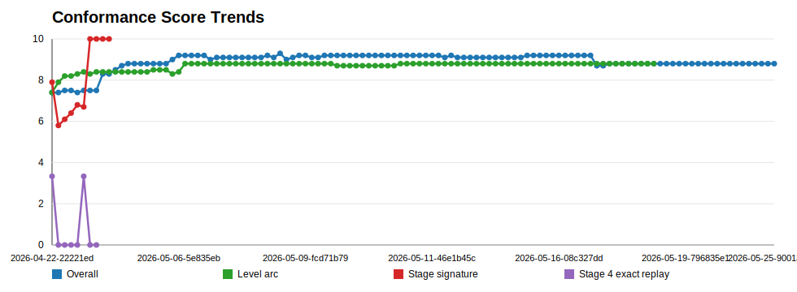
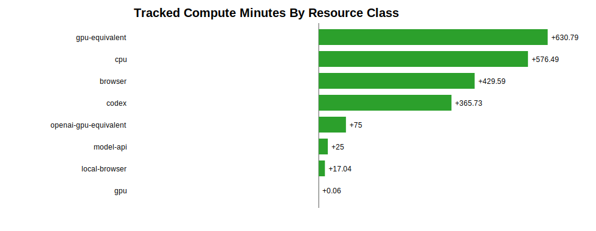
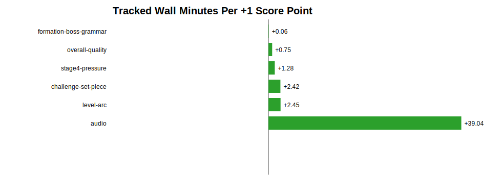
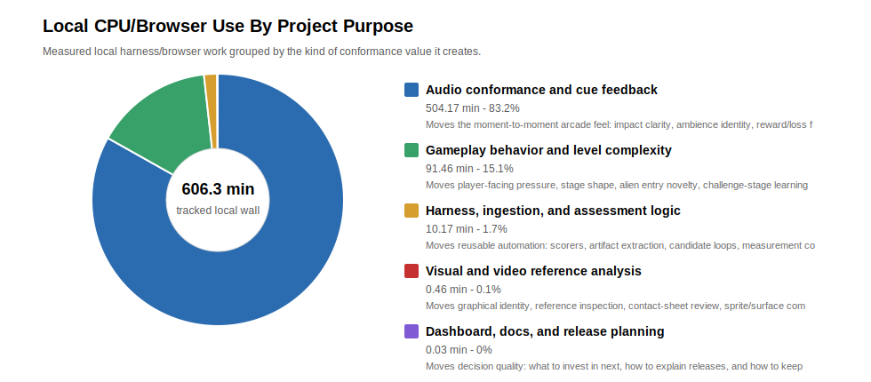
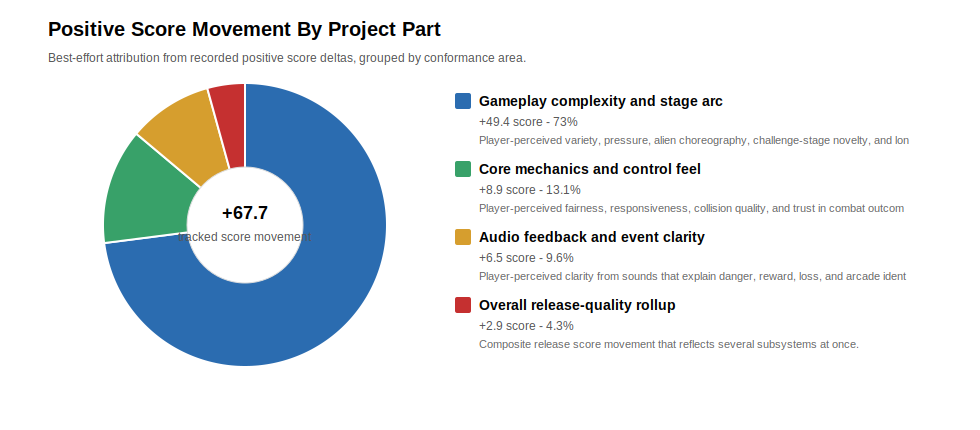

# Release Conformance Dashboard

Generated: `2026-05-25T18:07:54.053Z`

This is the primary at-a-glance planning artifact for Aurora conformance work. It answers what we are trying to improve, why it matters, how close it is to a significant user-facing release gate, and what the next investment should be.

Local dashboard: `http://127.0.0.1:4312/local-dev/conformance-dashboard.html` after `npm run local:resume`. Release-lane dashboard: `conformance-dashboard.html` is generated into `dist/dev`, copied through beta/production promotion, and published with the lane bundle.

## Game Scope

The dashboard data is game-selectable. Current default: `Aurora Galactica` (Active conformance investment). Available game profiles: `Aurora Galactica`, `Galaxy Guardians`.

Aurora remains the active investment target, but Galaxy Guardians is also represented as a preview/ingestion profile so the dashboard can switch subjects as the conformance project rotates between games.

## Current Release Gate

| Gate | Current | Target | Notes |
| --- | --- | --- | --- |
| Overall quality | 8.8/10 | >=9.3 | Full score refresh after all major cycles |
| Audio identity | 7.3/10 | >=7.5 | Primary user-experience gap |
| Challenge-stage set-piece conformance | 4.3/10 | >=5.0 before next beta claim; >=6.0 next major gate; >=9.0 mature | Strict movement/graphics/alien-novelty gate; safety does not inflate this score |
| Direct target sprite conformance | 6.2/10 | >=5.5 before next beta claim; >=7.5 mature preview | Strict runtime-vs-promoted-target-crop row; static proxy scores do not satisfy this gate |
| Level arc | 8.8/10 | >=8.8 | Long-play gameplay-quality gate |
| Alien entry and challenge-stage novelty | 8.2/10 | >=7.5 first gate; >=9.0 mature | New high-priority long-cycle gameplay-authenticity gate |
| Boss entry and formation grammar | 9.4/10 | >=8.0 first gate; >=9.0 mature | New measured gate for stage choreography |
| Alien entry / formations | 10/10 measured | >=9.2 with path/rack scorer | Now backed by dedicated alien-entry/challenge variation scorer |
| Challenge variation | 4.3/10 measured | >=9.2 with dedicated scorer | Dedicated stage-by-stage challenge conformance gate |
| Visual look and feel | 8.6/10 | >=8.4 | New explicit gate; first-pass scorer measured |
| Arcade frame and popup surfaces | 9.2/10 | >=9.4 | Split from generic UI shell before final gate |
| No-regression guardrails | movement/combat/capture >=10; challenge timing >=9.8 | Maintain | Hard blockers |

## How To Read Scores

An `x/10` score is a measured roll-up at the current scorer resolution, not a claim of arcade-perfect behavior. A `10/10` metric means no known measured gap under the current harness and evidence coverage. It should be treated as a guardrail pass until broader reference, expert-play, visual, audio, and edge-case evidence increases confidence.

| Read | Meaning |
| --- | --- |
| 10/10 | No known measured gap under the current scorer. Protect as a guardrail; do not read as perfect. |
| 9.x | Strong measured conformance with remaining risk mostly in edge cases, coverage, or polish. |
| 8.x | Good conformance, but attentive players or designers may notice scenario-specific gaps. |
| 7.x | Material conformance gap with user-experience or reference-identity impact. |
| Confidence | How much trust to place in this score as a release signal. |
| Resolution | How fine-grained the scorer is and what kinds of blind spots may remain. |

## Priority Table

| Priority | Metric | Current | Confidence | Resolution | Cost / resources | Tracked spend | Major-gate target | Measurement status | Why this matters | Effort / time estimate | Recommended next step | Evidence |
| --- | --- | --- | --- | --- | --- | --- | --- | --- | --- | --- | --- | --- |
| 1 | Challenge-stage set-piece conformance: movement, graphics, alien novelty | 4.3/10 | medium-high for gap direction; medium-low for exact lift estimate | strict stage-by-stage challenge scorer using 1/10 baseline for interest, movement, and graphics; no-shot/no-kill is treated as a guardrail rather than score inflation | high; cpu, browser, gpu | 162 runs; 24 min wall; 39.8 min CPU | >=5.0 before next beta claim; 6.0 after three authored challenges; 9.0+ mature | Strict dedicated stage-by-stage scorer; current high-priority gameplay-authenticity gap | The challenging stages should be spectacular safe Galaga-like bonus exhibitions. Current safety is good, but movement variation, alien novelty, and graphical conformance are not yet close. | High; long-cycle CPU/browser extraction plus gameplay authoring and sprite-motion/reference labeling | Stage 3: rebuild Challenging Stage 1 against the Galaga challenge-1 arrival and late-wave references with visibly longer movement and readable exits. | reference-artifacts/analyses/challenge-stage-conformance/2026-05-25-9001395d8/report.json |
| 2 | Audio identity, event feedback, and cue alignment | 7.3/10 | medium-high | 21 cue/event comparisons with waveform, spectral, overlap, alignment, and semantic event-mapping features | high; cpu, model-api, openai-api | 309 runs; 253.7 min wall; 459.4 min CPU | 7.5-8.0 | Measured release category; weakest axis | Largest current score gap and high user-experience impact: shots, explosions, boss damage, challenge results, capture/rescue feedback. | High; 3-6 hrs local/model-assisted analysis | Challenge Perfect runtime trial rejected perfect-clean-onset-soft-tail; do not directly promote the focused keeper. Do not promote Challenge Perfect from isolated onset/body candidates. Replace the next audio strategy with full-phrase/segment-boundary work: stabilize the scorer on canonical reference-vs-reference capture, then generate candidates that optimize onset, body, tail, and live capture segmentation together. | reference-artifacts/analyses/quality-conformance/2026-05-25-9001395d8/report.json; reference-artifacts/analyses/aurora-audio-cue-contracts/2026-05-17-f9e7374c-dirty-125733/report.json |
| 3 | Alien entry and broad challenge-stage novelty | 8.2/10 | medium | composite proxy from opening timing, geometry, and movement grammar | estimated; cpu, browser | 113 runs; 26.4 min wall; 34.9 min CPU | 7.5 first gate; 9.0+ mature | Dedicated long-cycle broad scorer; useful diagnostic but less strict than set-piece score | Regular-stage alien entry, challenge-stage trajectories, and new-alien introduction still need stronger reference grounding; this broad metric should not mask the stricter challenge-stage gap. | High; long-cycle CPU/browser extraction plus reference contact-sheet and path-labeling pass | Attack Regular-entry geometry separation: Minimum regular geometry distance 0.083; mean regular geometry distance 0.127; closest pair mid-run-entry-variant / late-run-cleanup-or-failure. | reference-artifacts/analyses/alien-entry-challenge-variation/2026-05-16-82fd62cb/report.json |
| 4 | Level arc and encounter shape | 8.8/10 | medium-high | multi-submetric level-arc report with stage families, challenge layers, pressure, reward, and persona evidence | low; cpu, browser | 162 runs; 24 min wall; 39.8 min CPU | 8.8-9.0 | Measured release category | Controls whether long play feels like Galaga-like escalation rather than repeated pressure. | Medium-high; 2-5 hrs | Use the top-ranked opportunity window to add or widen deterministic evidence before changing gameplay tuning. | reference-artifacts/analyses/level-arc-conformance/2026-05-25-9001395d8/report.json |
| 4.5 | Direct target sprite and impact feedback conformance | 6.2/10 | medium | scorer-backed artifact with selected harness windows | estimated; cpu | 16 runs; 17.6 min wall; 20.4 min CPU | >=5.5 before next beta claim; >=7.5 mature preview | Application artifact scorecard measured; strict direct target-crop row is intentionally sobering | The player-visible ship, enemy, hit, and explosion shapes are a first-glance arcade quality signal. Static sprite proxy scores must not hide the stricter target-crop gap. | Medium-high; 2-5 hrs renderer/crop/harness work plus visual review | Raise direct sprite target score and impact/explosion feedback together; current impact/explosion static read is 5.9/10. | reference-artifacts/analyses/application-artifact-conformance/latest.json |
| 5 | Boss entry and formation grammar | 9.4/10 | medium | first-class boss/formation scorer using stage-window event grammar, boss timing, escort composition, challenge identity, and explicit path/slot measurement debt | high; cpu, browser | 162 runs; 24 min wall; 39.8 min CPU | 8.0-8.5 first gate; 9.0+ with path/slot extraction | Measured release category; new first-class axis | Boss entries, escorts, formation settling, and challenge set pieces are core Galaga choreography and directly affect whether stages feel authored. | Medium-high; 2-5 hrs, then recurring low-cost guardrail | Label boss, escort, rack-settle, and challenge path families from Galaga reference contact sheets or video traces, then replace heuristic coverage with direct shape-distance scoring. | reference-artifacts/analyses/quality-conformance/2026-05-25-9001395d8/report.json |
| 6 | Overall visual look and feel: gameplay, start page, typography complexity | 8.6/10 | medium-low | first-pass visual scorer when available; still needs reference-backed contact sheets and sprite/style sub-scorers | medium; cpu, browser, gpu | 1 runs; 0.1 min wall; 0.1 min CPU | 8.4-8.8 | Measured visual scorer; medium-low confidence | A high score can still feel off if start text, density, contrast, alien readability, and arcade typography do not cohere. | Medium; next pass should add reference-backed contact sheets and GPU/model-assisted review | Defer unless new ingestion evidence reveals a larger graphics-conformance gap. | reference-artifacts/analyses/aurora-visual-look-conformance/2026-05-08-fee8820-dirty/report.json |
| 7 | Stage 4 pressure exact replay / pressure curve precision | 6/10 | medium | narrow pressure/loss replay windows; exact replay coverage still limited | medium; cpu, browser | 28 runs; 12.8 min wall; 18.5 min CPU | 8.2-8.6 | Measured level-arc weak submetric | Pressure should be learnable and reproducible, not merely present in one run. | Medium-high; prior runs ~12.8 min wall / 18.5 min CPU | Run focused source-window replay matching after the Stage 12 loop validates candidate mechanics. | reference-artifacts/analyses/level-arc-conformance/2026-05-25-9001395d8/report.json |
| 8 | Alien entry to levels: formation, timing, and methods | 10/10 | medium | composite proxy from opening timing, geometry, and movement grammar | estimated; cpu, browser | 113 runs; 26.4 min wall; 34.9 min CPU | 9.0-9.4 with path and rack-slot scorer | Dedicated alien-entry submetric | Entry formations and rack timing are a first-order arcade authenticity signal before combat even starts. | Medium; 1-3 hrs plus visual review | Raise regular-stage minimum signature distance and add stage-specific alien entry scripts before retuning broad level arc. | reference-artifacts/analyses/alien-entry-challenge-variation/2026-05-16-82fd62cb/report.json |
| 9 | Challenge-stage variation and new alien/formations introduction | 4.3/10 | medium | strict dedicated stage-by-stage challenge conformance report when available; fallback proxy uses challenge timing, challenge identity, and non-repetition | estimated; cpu, browser | 113 runs; 26.4 min wall; 34.9 min CPU | 9.0-9.4 with dedicated scorer | Dedicated stage-by-stage challenge conformance report | Challenge stages should teach new motion/reward patterns, not only pause normal combat. | Medium-high; 2-4 hrs | Close dedicated challenge-stage gaps: current challenge stages are functionally safe but not yet fully credible Galaga-like bonus exhibitions: strict movement is 4.3/10, strict graphics is 4.6/10, alien/stage novelty is 3.9/10, player shot opportunity is 5.6/10, target-video object-track fit is 3.6/10, and sprite-motion correspondence is 7.83/10 with target timing status frame-labeled-segmented-reference-windows. Diagnostic legacy coverage was 6.8/10, which is why the old read was too generous. | reference-artifacts/analyses/challenge-stage-conformance/2026-05-25-9001395d8/report.json |
| 10 | Progression and persona depth | 8.4/10 | medium | scorer-backed artifact with selected harness windows | estimated; cpu | 16 runs; 17.6 min wall; 20.4 min CPU | 9.1+ | Measured release category | Keeps the game learnable across skill levels and supports later-stage quality. | Low-medium; 1-2 hrs | Resolve remaining ordering edge case after higher-value audio/level-arc work. | reference-artifacts/analyses/quality-conformance/2026-05-25-9001395d8/report.json |
| 11 | Stage 1 opening timing fidelity | 8.5/10 | medium | scorer-backed artifact with selected harness windows | medium; cpu, browser | 16 runs; 17.6 min wall; 20.4 min CPU | 8.8-9.2 | Measured release category | First impression and direct reference feel. | Low-medium; 1-2 hrs | Defer until higher-gap audio and level-arc candidates have been exercised. | reference-artifacts/analyses/quality-conformance/2026-05-25-9001395d8/report.json |
| 12 | Arcade console frame UI style | 9.2/10 | medium | UI shell proxy; dedicated visual/modal rubric still needed | medium; cpu, browser, gpu | 16 runs; 17.6 min wall; 20.4 min CPU | 9.4-9.6 | Measured as UI shell; needs separate arcade-frame style rubric | The cabinet frame is the constant product surface around every game. | Medium; 1-3 hrs visual QA | Defer unless new ingestion evidence reveals a larger graphics-conformance gap. | reference-artifacts/analyses/quality-conformance/2026-05-25-9001395d8/report.json |
| 13 | Popup/help/scoring/leaderboard surface formatting | 9.2/10 | medium | UI shell proxy; dedicated visual/modal rubric still needed | medium; cpu, browser | 16 runs; 17.6 min wall; 20.4 min CPU | 9.4-9.6 | Measured through UI shell suite; needs modal-specific scoring | Popup surfaces carry learning, scoring trust, feedback, and player records. | Low-medium; 1-2 hrs | Defer unless new ingestion evidence reveals a larger graphics-conformance gap. | reference-artifacts/analyses/quality-conformance/2026-05-25-9001395d8/report.json |
| 14 | Dive fairness and safety | 9.1/10 | medium-high | seed/persona safety guardrails and pressure-sensitive collision checks | guardrail; cpu | 44 runs; 30.5 min wall; 38.9 min CPU | 9.3+ | Measured release category | Protects user trust while pressure is increased. | Guardrail; 30-90 min per risky gameplay cycle | Keep as required guardrail for pressure/reward changes. | reference-artifacts/analyses/quality-conformance/2026-05-25-9001395d8/report.json |
| 15 | Player movement conformance | 10/10 | high-current-pass | reference trace plus controlled movement harness checks; expert micro-feel can still exceed scorer resolution | guardrail; cpu, browser | 16 runs; 17.6 min wall; 20.4 min CPU | Maintain 10 | Measured release category | Core control feel is already excellent. | Guardrail only | Do not tune unless a new reference metric proves a gap. | reference-artifacts/analyses/quality-conformance/2026-05-25-9001395d8/report.json |
| 16 | Shot and hit responsiveness | 10/10 | high-current-pass | functional combat-response guardrails; audiovisual semantics are scored separately | guardrail; cpu | 16 runs; 17.6 min wall; 20.4 min CPU | Maintain 10 | Measured release category | Core combat response is already excellent. | Guardrail only | Protect during explosion/audio/event feedback work. | reference-artifacts/analyses/quality-conformance/2026-05-25-9001395d8/report.json |
| 17 | Stage 1 opening geometry fidelity | 10/10 | high-current-pass | opening formation geometry checks; later-stage entry variation is separate | guardrail; cpu, browser | 16 runs; 17.6 min wall; 20.4 min CPU | Maintain 10 | Measured release category | Formation geometry is already locked. | Guardrail only | Protect during alien-entry visual work. | reference-artifacts/analyses/quality-conformance/2026-05-25-9001395d8/report.json |
| 18 | Capture and rescue rule fidelity | 10/10 | high-current-pass | rule/state harness checks; feedback clarity and reward feel are separate | guardrail; cpu | 16 runs; 17.6 min wall; 20.4 min CPU | Maintain 10 | Measured release category | Strong Galaga identity mechanic; should not regress while feedback improves. | Guardrail only | Use as release blocker for capture/rescue-adjacent audio or explosion changes. | reference-artifacts/analyses/quality-conformance/2026-05-25-9001395d8/report.json |
| 19 | Challenge-stage timing fidelity | 10/10 | high-current-pass | challenge timing deltas within tolerance; variation and teaching value are separate | guardrail; cpu, browser | 16 runs; 17.6 min wall; 20.4 min CPU | Maintain 9.8+ | Measured release category | Timing is strong; variation is the gap, not baseline timing. | Guardrail only | Preserve while adding challenge variation scoring. | reference-artifacts/analyses/quality-conformance/2026-05-25-9001395d8/report.json |

## Conformance Analysis And Economics

Every release candidate should include both a conformance read and a resource/time read. The goal is to understand not only whether Aurora moved closer to Galaga-like conformance, but what local compute, browser/video work, GPU/model/API assistance, artifact volume, and retry cost were spent to get there.

| Measure | Current read | Release-documentation use |
| --- | --- | --- |
| Latest overall conformance | 8.8/10 | Primary quality roll-up for release notes and scorecards |
| Latest level-arc conformance | 8.8/10 | Long-play gameplay-shape gate |
| Metric points scanned | 2338 | History depth behind score trends |
| Score deltas found | 167 | Past-goal movement available for review |
| Measured runs | 904 | Tracked harness/model/local compute work |
| Tracked wall time | 971.3 min | Human clock-time planning input |
| Tracked CPU time | 973.2 min | Local compute-cost planning input |
| Tracked artifact growth | 1482.6 MB | Evidence volume and storage/review-cost proxy |

### Latest Self-Critical Work-Block Read

The past focused block substantially improved our honesty and repeatability, but only modestly improved player-facing conformance. Challenge stages are now scored with a strict 1/10 baseline and have risen to 3.8/10; that is a real improvement from the strict 2.5/10 baseline, but still far from human-level Galaga conformance. The biggest remaining failures are movement grammar, alien novelty, stage-to-stage challenge progression, and stable audio runtime promotion.

| Metric | Start | Current | Delta | Read |
| --- | --- | --- | --- | --- |
| Challenge-stage strict conformance | 2.5/10 | 3.8/10 | +1.3 | Highest-priority gameplay authenticity gap. |
| Challenge-stage interesting factor | 2.6/10 | 3.8/10 | +1.2 | Bonus stages should feel authored and exciting, not merely safe. |
| Challenge movement / trajectory conformance | 2.3/10 | 3.4/10 | +1.1 | True alien path grammar and motion shape. |
| Challenge graphical conformance | 2.1/10 | 4.3/10 | +2.2 | Visible alien/sprite/readability fit against target challenge artifacts. |
| Challenge alien novelty | 3.4/10 | 3.4/10 | +0 | Whether later challenges introduce memorable alien families and roles. |
| Challenge stage-to-stage progression | 2.8/10 | 3/10 | +0.2 | Whether the eight challenge stages escalate as distinct lessons. |
| Challenge scoring/shot opportunity | n/a | 5.1/10 | n/a | Whether players get clear, learnable bonus-shot routes. |
| Challenge no-combat safety guardrail | 10/10 | 10/10 | +0 | No enemy shots, no attack starts, no ship deaths in challenge windows. |

Retrospective source: `reference-artifacts/analyses/conformance-investment-retrospective/2026-05-18-e583b558/report.json`

### Compute Application And Impact

The economics view now separates _how_ resources were applied from _what_ improved. GPU-equivalent rows cover declared Codex/OpenAI/model/API/GPU usage; CPU/browser rows cover local harness and runtime work. Impact rows are best-effort groupings of positive score movement by project area.

| GPU-equivalent purpose | Runs | Wall time | Share | Meaning |
| --- | --- | --- | --- | --- |
| Audio conformance and cue feedback | 9 | 235.7 min | 64.4% | Moves the moment-to-moment arcade feel: impact clarity, ambience identity, reward/loss feedback, and player understanding. |
| Gameplay behavior and level complexity | 1 | 75 min | 20.5% | Moves player-facing pressure, stage shape, alien entry novelty, challenge-stage learning value, and long-play texture. |
| Dashboard, docs, and release planning | 2 | 55 min | 15% | Moves decision quality: what to invest in next, how to explain releases, and how to keep dev/beta/prod evidence aligned. |
| Visual and video reference analysis | 1 | 0.1 min | 0% | Moves graphical identity, reference inspection, contact-sheet review, sprite/surface comparison, and readability. |

| Local CPU/browser purpose | Runs | Wall time | Share | Meaning |
| --- | --- | --- | --- | --- |
| Audio conformance and cue feedback | 510 | 504.2 min | 83.2% | Moves the moment-to-moment arcade feel: impact clarity, ambience identity, reward/loss feedback, and player understanding. |
| Gameplay behavior and level complexity | 354 | 91.5 min | 15.1% | Moves player-facing pressure, stage shape, alien entry novelty, challenge-stage learning value, and long-play texture. |
| Harness, ingestion, and assessment logic | 9 | 10.2 min | 1.7% | Moves reusable automation: scorers, artifact extraction, candidate loops, measurement confidence, and future game ingestion. |
| Visual and video reference analysis | 18 | 0.5 min | 0.1% | Moves graphical identity, reference inspection, contact-sheet review, sprite/surface comparison, and readability. |
| Dashboard, docs, and release planning | 6 | 0 min | 0% | Moves decision quality: what to invest in next, how to explain releases, and how to keep dev/beta/prod evidence aligned. |

| Project part | Positive score movement | Share | Player/designer meaning |
| --- | --- | --- | --- |
| Gameplay complexity and stage arc | +49.4 | 73% | Player-perceived variety, pressure, alien choreography, challenge-stage novelty, and long-play learning curve. |
| Core mechanics and control feel | +8.9 | 13.1% | Player-perceived fairness, responsiveness, collision quality, and trust in combat outcomes. |
| Audio feedback and event clarity | +6.5 | 9.6% | Player-perceived clarity from sounds that explain danger, reward, loss, and arcade identity. |
| Overall release-quality rollup | +2.9 | 4.3% | Composite release score movement that reflects several subsystems at once. |

### Resource And Time Usage

| Resource | Measured runs | Wall time | CPU time |
| --- | --- | --- | --- |
| gpu-equivalent | 18 | 630.8 min | 1.2 min |
| cpu | 865 | 576.5 min | 920.6 min |
| browser | 345 | 429.6 min | 659.1 min |
| codex | 13 | 365.7 min | 1.2 min |
| openai-gpu-equivalent | 1 | 75 min | 0 min |
| model-api | 2 | 25 min | 0 min |
| local-browser | 4 | 17 min | 30.8 min |
| gpu | 1 | 0.1 min | 0.1 min |

### Past Goal Spend By Axis

| Axis | Measured runs | Wall time | CPU time |
| --- | --- | --- | --- |
| audio | 309 | 253.7 min | 459.4 min |
| conformance-analysis | 12 | 236.5 min | 2.7 min |
| challenge-perfect | 71 | 180.7 min | 180.1 min |
| audio-runtime-trial | 27 | 162.1 min | 31.9 min |
| audio-activity-profile | 10 | 127.2 min | 14 min |
| challenge-stage | 134 | 103.7 min | 41.9 min |
| audio-risk-stability | 8 | 91.4 min | 2.7 min |
| release-hardening | 1 | 90 min | 0 min |

### Next Goal Estimates

| Priority | Metric | Current | Target | Gap to target | Estimated effort | Expected resources | Tracked spend | Value / cost read | Next action |
| --- | --- | --- | --- | --- | --- | --- | --- | --- | --- |
| 1 | Challenge-stage set-piece conformance: movement, graphics, alien novelty | 4.3/10 | >=5.0 before next beta claim; 6.0 after three authored challenges; 9.0+ mature | +0.7 | High; long-cycle CPU/browser extraction plus gameplay authoring and sprite-motion/reference labeling | cpu, browser, gpu | 162 runs; 24 min wall; 39.8 min CPU | Expected lift 1.8/10 on metric, 0.138/10 overall; investment score 8.4. | Stage 3: rebuild Challenging Stage 1 against the Galaga challenge-1 arrival and late-wave references with visibly longer movement and readable exits. |
| 2 | Audio identity, event feedback, and cue alignment | 7.3/10 | 7.5-8.0 | +0.2 | High; 3-6 hrs local/model-assisted analysis | cpu, model-api, openai-api | 309 runs; 253.7 min wall; 459.4 min CPU | Expected lift 0.7/10 on metric, 0.054/10 overall; investment score 2.67. | Challenge Perfect runtime trial rejected perfect-clean-onset-soft-tail; do not directly promote the focused keeper. Do not promote Challenge Perfect from isolated onset/body candidates. Replace the next audio strategy with full-phrase/segment-boundary work: stabilize the scorer on canonical reference-vs-reference capture, then generate candidates that optimize onset, body, tail, and live capture segmentation together. |
| 3 | Alien entry and broad challenge-stage novelty | 8.2/10 | 7.5 first gate; 9.0+ mature | at target | High; long-cycle CPU/browser extraction plus reference contact-sheet and path-labeling pass | cpu, browser | 113 runs; 26.4 min wall; 34.9 min CPU | Estimated cost/value; dedicated investment candidate not yet generated. | Attack Regular-entry geometry separation: Minimum regular geometry distance 0.083; mean regular geometry distance 0.127; closest pair mid-run-entry-variant / late-run-cleanup-or-failure. |
| 4 | Level arc and encounter shape | 8.8/10 | 8.8-9.0 | at target | Medium-high; 2-5 hrs | cpu, browser | 162 runs; 24 min wall; 39.8 min CPU | Expected lift 0.24/10 on metric, 0.018/10 overall; investment score 1.55. | Use the top-ranked opportunity window to add or widen deterministic evidence before changing gameplay tuning. |
| 4.5 | Direct target sprite and impact feedback conformance | 6.2/10 | >=5.5 before next beta claim; >=7.5 mature preview | at target | Medium-high; 2-5 hrs renderer/crop/harness work plus visual review | cpu | 16 runs; 17.6 min wall; 20.4 min CPU | Estimated cost/value; dedicated investment candidate not yet generated. | Raise direct sprite target score and impact/explosion feedback together; current impact/explosion static read is 5.9/10. |
| 5 | Boss entry and formation grammar | 9.4/10 | 8.0-8.5 first gate; 9.0+ with path/slot extraction | at target | Medium-high; 2-5 hrs, then recurring low-cost guardrail | cpu, browser | 162 runs; 24 min wall; 39.8 min CPU | Expected lift 0.28/10 on metric, 0.022/10 overall; investment score 0.7. | Label boss, escort, rack-settle, and challenge path families from Galaga reference contact sheets or video traces, then replace heuristic coverage with direct shape-distance scoring. |
| 6 | Overall visual look and feel: gameplay, start page, typography complexity | 8.6/10 | 8.4-8.8 | at target | Medium; next pass should add reference-backed contact sheets and GPU/model-assisted review | cpu, browser, gpu | 1 runs; 0.1 min wall; 0.1 min CPU | Expected lift 0.12/10 on metric, 0.009/10 overall; investment score 0.38. | Defer unless new ingestion evidence reveals a larger graphics-conformance gap. |
| 7 | Stage 4 pressure exact replay / pressure curve precision | 6/10 | 8.2-8.6 | +2.2 | Medium-high; prior runs ~12.8 min wall / 18.5 min CPU | cpu, browser | 28 runs; 12.8 min wall; 18.5 min CPU | Expected lift 0.35/10 on metric, 0.027/10 overall; investment score 1.39. | Run focused source-window replay matching after the Stage 12 loop validates candidate mechanics. |

## Ingestion Framework View

This view tracks the evidence pipeline behind the conformance scores: source media, extracted artifacts, annotation state, confidence, linked metric, and the next missing upgrade. It is intended to make long-cycle compute work easier to choose and easier to defend.

| Read | Current value |
| --- | --- |
| Evidence families tracked | 16 |
| Scored or promoted families | 11 |
| High-confidence families | 10 |
| Mixed or low-confidence families | 2 |
| Next best ingestion upgrade | Add Galaga-family visual contact-sheet comparison, sprite readability labels, and model-assisted visual critique. |

| Priority | Source / evidence family | Axis | Artifact type | Coverage | Annotation status | Confidence | Linked metric | Anchor | Missing next |
| --- | --- | --- | --- | --- | --- | --- | --- | --- | --- |
| 1 | Galaga-family reference audio clips | audio identity / event feedback | reference m4a cue clips | 50 clips | clipped, mapped, partially scored | medium-high | Audio identity, event feedback, and cue alignment | src/assets/reference-audio | Add finer event labels for explosion, impact, boss damage, immunity/entry, capture, and rescue semantics. |
| 2 | Aurora audio cue comparison and event-gap reports | audio cue scoring | waveform/spectral/alignment/semantic reports | 21 compared cues; semantic 9.78/10; 0 attention rows | semantic-scored | medium-high | Audio identity, event feedback, and cue alignment | reference-artifacts/analyses/aurora-audio-event-gap/2026-05-25-9001395d8-dirty-065710/report.json | Tune the highest segment-level gap next: challengePerfect onset. Rerun audio comparison and event-gap analysis after the change. |
| 3 | Aurora Audio Conformance Lab v2 | audio candidate loop / family promotion decisions | cue-family risk, candidate history, keeper decision, promotion gate | 8/8 target cues swept; 2 keeper candidates tracked; runtime promotions 0; rejected runtime trials 3 | family-scored | medium-high | Audio identity, event feedback, and cue alignment | reference-artifacts/analyses/aurora-audio-conformance-lab-v2/2026-05-17-f9e7374c-dirty/report.json | challengePerfect: Do not promote Challenge Perfect from isolated onset/body candidates. Replace the next audio strategy with full-phrase/segment-boundary work: stabilize the scorer on canonical reference-vs-reference capture, then generate candidates that optimize onset, body, tail, and live capture segmentation together. |
| 4 | Aurora audio cue contracts | audio semantic contract / theme latitude / promotion safety | cue contract readiness, theme lanes, runtime-trial blockers | 8 contracts; readiness 9.3/10; blocked 5; rejected trials 3 | contract-scored | medium-high | Audio identity, event feedback, and cue alignment | reference-artifacts/analyses/aurora-audio-cue-contracts/2026-05-17-f9e7374c-dirty-125733/report.json | Do not promote Challenge Perfect from isolated onset/body candidates. Replace the next audio strategy with full-phrase/segment-boundary work: stabilize the scorer on canonical reference-vs-reference capture, then generate candidates that optimize onset, body, tail, and live capture segmentation together. |
| 5 | Aurora audio runtime trial decisions | audio promotion evidence / release guardrails | accepted, rejected, and inconclusive live runtime-trial outcomes | challengePerfect runtime-trial-rejected; candidate perfect-clean-onset-soft-tail | trial-recorded | medium-high | Audio identity, event feedback, and cue alignment | reference-artifacts/analyses/aurora-audio-runtime-trials/2026-05-17-f9e7374c-dirty-123945-challenge-perfect-rejected/report.json | Do not promote Challenge Perfect from isolated onset/body candidates. Replace the next audio strategy with full-phrase/segment-boundary work: stabilize the scorer on canonical reference-vs-reference capture, then generate candidates that optimize onset, body, tail, and live capture segmentation together. |
| 6 | Aurora audio risk stability | audio measurement stability / promotion confidence | repeated event-gap volatility report | 8 reports; 19 volatile cues; most volatile captureBeam 3.89/10 range | stability-scored | medium-high | Audio identity, event feedback, and cue alignment | reference-artifacts/analyses/aurora-audio-risk-stability/2026-05-17-f9e7374c-dirty-124419/report.json | Use median/repeated confirmation before promoting audio changes. Start by stabilizing captureBeam scoring, then retest challengePerfect. |
| 7 | Aurora audio promotion stability gate | audio promotion safety / variance-aware gating | candidate, precheck, event-gap, and stability join | 3 cues; 0 runtime trials allowed; 3 stability rejections | variance-gated | medium-high | Audio identity, event feedback, and cue alignment | reference-artifacts/analyses/aurora-audio-promotion-stability-gate/2026-05-17-f9e7374c-dirty-125733/report.json | Do not promote challengePerfect. Preserve the candidate/precheck evidence and either stabilize measurement or generate a candidate whose full-theme win exceeds the current stability threshold. |
| 8 | Aurora audio strategy review | audio conformance strategy / failure analysis | diagnosis, revised strategy, and next calibration experiment | 5 diagnoses; 6 strategy changes; next challengePerfect | strategy-reviewed | medium-high | Audio identity, event feedback, and cue alignment | reference-artifacts/analyses/aurora-audio-strategy-review/2026-05-17-f9e7374c-dirty-125741/report.json | Before any more runtime audio promotion, build a calibration pass that captures Galaga reference cues through the same browser path twice and measures reference-vs-reference, current-vs-current, and current-vs-reference variance for challengePerfect, challengeTransition, gameOver, captureBeam, and stagePulse. |
| 9 | Aurora stagePulse cadence pressure analysis | formation pressure / cadence audio | tracked cadence pressure axes from full audio comparison | pressure 2.7/10; weakest brightness-control | scored | medium-high | Audio identity, event feedback, and cue alignment | reference-artifacts/analyses/aurora-stage-pulse-cadence/2026-05-15-93dbdad8-dirty/report.json | Add a cadence-specific candidate generator that jointly optimizes low-band body, brightness control, zero-crossing calm, and gain. Promote only after both repeated focus gates and full audio-theme comparison improve. |
| 10 | Boss entry and formation grammar scorer | formation grammar / boss entry / challenge identity | event grammar, timing, stage-signature, and measurement-debt report | 11 boss/formation windows | scored | medium | Boss entry and formation grammar | reference-artifacts/analyses/formation-boss-grammar-conformance/2026-05-25-9001395d8/report.json | Promote frame-level boss/escort path traces and formation rack slot coordinates so visual choreography can be scored directly. |
| 11 | Level arc and encounter-shape evidence | level arc / challenge / reward | stage signatures, pressure windows, persona reports | 6/6 stage families; 11/6 evidence windows | scored | medium-high | Level arc and encounter shape | reference-artifacts/analyses/level-arc-conformance/2026-05-25-9001395d8/report.json | Add more long-play reference windows and expert-route scoring for challenge/reward opportunities. |
| 12 | Stage 4 pressure and loss-window diagnostics | pressure / fairness | loss windows, replay geometry, collision traces | 3 promoted windows | mined, replay-diagnostic | medium | Stage 4 pressure exact replay / pressure curve precision | reference-artifacts/analyses/aurora-stage4-loss-windows/2026-05-07-fb2f674/report.json | Improve exact replay matching and preserve per-frame attacker/player/shot geometry for candidate tuning. |
| 13 | Aurora visual look screenshots | visual look / UI readability | browser screenshots plus DOM/canvas metrics | 4 surfaces | first-pass scored | medium-low | Overall visual look and feel | reference-artifacts/analyses/aurora-visual-look-conformance/2026-05-08-fee8820-dirty/report.json | Add Galaga-family visual contact-sheet comparison, sprite readability labels, and model-assisted visual critique. |
| 14 | Aurora evidence-cycle windows | general ingestion framework | manifests, contact sheets, traces, event logs, audio timelines | 4 planned windows | seed-plan-only | medium | Level arc / challenge variation / visual look | reference-artifacts/analyses/evidence-cycle-dashboard/evidence-cycle-dashboard.json | Refresh evidence-cycle dashboard and promote window status into a canonical reference-corpus manifest. |
| 15 | Reference manifests and event logs inventory | source provenance / annotation coverage | source-manifest.json and reference-events.json | 15 manifests; 11 event logs | mixed | mixed | All conformance metrics | reference-artifacts/analyses | Normalize provenance, duration, source confidence, and linked metric fields into a generated corpus manifest. |
| 16 | Reference contact sheets and frame evidence | visual / motion / entry formation | contact sheets and still frames | 66 contact/frame evidence files | extracted, partially labeled | medium | Visual look, alien entry, challenge variation | reference-artifacts/analyses | Attach contact-sheet families to metric rows and add image-level comparison scores. |

### Charts

## New First-Class Axes Added

- Alien entry to levels: formation layout, timing, path method, and whether different stages enter differently.
- Boss entry and formation grammar: boss timing, escort composition, formation settle evidence, challenge pattern identity, stage variation, and path/slot precision.
- Challenge-stage variation: new alien types, new entry formations/styles, path families, reward/result feedback, and teaching value.
- Overall visual look and feel: gameplay readability, start/attract typography density, copy complexity, color discipline, and reference contact sheets.
- Arcade console frame UI: cabinet frame, bezel/rails, build/date trust signals, button density, and arcade-style containment.
- Popup/help/scoring surfaces: help, scoring, leaderboard, account, feedback, and game-over result formatting as their own modal-quality family.

## Maintenance Rules

- Refresh this artifact after each full quality score, investment-priority run, or major conformance loop.
- Before a serious `/dev`, `/beta`, or `/production` release candidate, refresh `npm run harness:analyze:conformance-economics` and `npm run harness:build:release-conformance-dashboard` so release docs include conformance, resource/time, chart, past-goal, and next-goal reads.
- Any long-cycle local compute or model/API/GPU-assisted assessment should be wrapped with `npm run harness:measure` and declared with its axis and resource classes.
- Ship the read-only conformance dashboard with each `/dev`, `/beta`, and `/production` lane; keep raw ingestion workspaces and unreviewed evidence engineering-owned unless a Root-gated evidence browser is explicitly approved.
- Treat rows marked estimated/composite as measurement debt: useful for planning, but not release-proof until backed by a harness.
- Keep user-facing release gates separate from harness-learning wins. A rejected candidate still belongs in artifacts when it teaches the loop what not to keep.
- Prefer work with a large score gap, high user-experience impact, reusable ingestion/harness value, and clear guardrails.

## Evidence Index

- Quality report: `reference-artifacts/analyses/quality-conformance/2026-05-25-9001395d8/report.json`
- Investment priority report: `reference-artifacts/analyses/conformance-investment-priorities/2026-05-19-fba7f625/report.json`
- Level-arc report: `reference-artifacts/analyses/level-arc-conformance/2026-05-25-9001395d8/report.json`
- Economics report: `reference-artifacts/analyses/conformance-economics/2026-05-25-abc27c36c/report.json`
- Equal current quality-category weight: `0.077`
