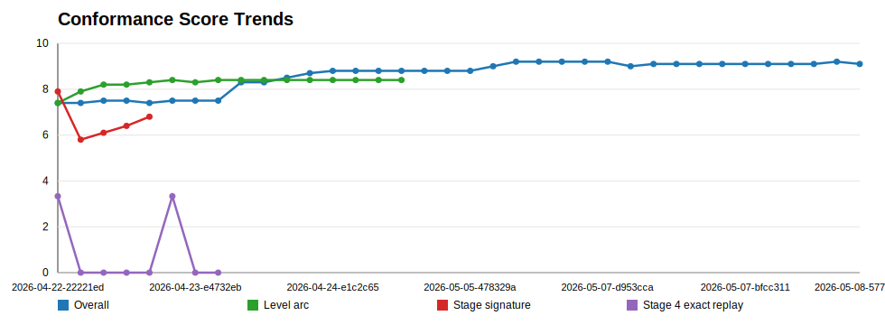
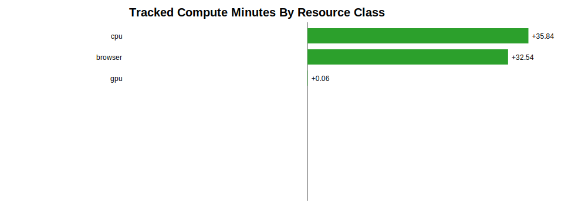

# Release Conformance Dashboard

Generated: `2026-05-08T16:16:16.212Z`

This is the primary at-a-glance planning artifact for Aurora conformance work. It answers what we are trying to improve, why it matters, how close it is to a significant user-facing release gate, and what the next investment should be.

Local dashboard: `http://127.0.0.1:4312/local-dev/conformance-dashboard.html` after `npm run local:resume`. Release-lane dashboard: `conformance-dashboard.html` is generated into `dist/dev`, copied through beta/production promotion, and published with the lane bundle.

## Game Scope

The dashboard data is game-selectable. Current default: `Aurora Galactica` (Active conformance investment). Available game profiles: `Aurora Galactica`, `Galaxy Guardians`.

Aurora remains the active investment target, but Galaxy Guardians is also represented as a preview/ingestion profile so the dashboard can switch subjects as the conformance project rotates between games.

## Current Release Gate

| Gate | Current | Target | Notes |
| --- | --- | --- | --- |
| Overall quality | 9.2/10 | >=9.3 | Full score refresh after all major cycles |
| Audio identity | 7.4/10 | >=7.5 | Primary user-experience gap |
| Level arc | 8.4/10 | >=8.8 | Long-play gameplay-quality gate |
| Alien entry / formations | 9/10 composite | >=9.2 with dedicated scorer | New explicit gate |
| Challenge variation | 9/10 composite | >=9.2 with dedicated scorer | New explicit gate |
| Visual look and feel | 8.6/10 | >=8.4 | New explicit gate; first-pass scorer measured |
| Arcade frame and popup surfaces | 9.2/10 | >=9.4 | Split from generic UI shell before final gate |
| No-regression guardrails | movement/combat/capture >=10; challenge timing >=9.8 | Maintain | Hard blockers |

## How To Read Scores

An `x/10` score is a measured roll-up at the current scorer resolution, not a claim of arcade-perfect behavior. A `10/10` metric means no known measured gap under the current harness and evidence coverage. It should be treated as a guardrail pass until broader reference, expert-play, visual, audio, and edge-case evidence increases confidence.

| Read | Meaning |
| --- | --- |
| 10/10 | No known measured gap under the current scorer. Protect as a guardrail; do not read as perfect. |
| 9.x | Strong measured conformance with remaining risk mostly in edge cases, coverage, or polish. |
| 8.x | Good conformance, but attentive players or designers may notice scenario-specific gaps. |
| 7.x | Material conformance gap with user-experience or reference-identity impact. |
| Confidence | How much trust to place in this score as a release signal. |
| Resolution | How fine-grained the scorer is and what kinds of blind spots may remain. |

## Priority Table

| Priority | Metric | Current | Confidence | Resolution | Cost / resources | Tracked spend | Major-gate target | Measurement status | Why this matters | Effort / time estimate | Recommended next step | Evidence |
| --- | --- | --- | --- | --- | --- | --- | --- | --- | --- | --- | --- | --- |
| 1 | Audio identity, event feedback, and cue alignment | 7.4/10 | medium-high | 21 cue/event comparisons with waveform, spectral, overlap, alignment, and semantic event-mapping features | high; cpu, model-api, openai-api | 21 runs; 16.6 min wall; 28.6 min CPU | 7.5-8.0 | Measured release category; weakest axis | Largest current score gap and high user-experience impact: shots, explosions, boss damage, challenge results, capture/rescue feedback. | High; 3-6 hrs local/model-assisted analysis | Split or further label shared shot/impact/explosion reference mappings, especially playerShot/enemyShot/bossHit and enemyHit/enemyBoom, then rerun audio comparison and semantic event-gap analysis. | reference-artifacts/analyses/quality-conformance/2026-05-08-dfb47de/report.json |
| 2 | Level arc and encounter shape | 8.4/10 | medium-high | multi-submetric level-arc report with stage families, challenge layers, pressure, reward, and persona evidence | low; cpu, browser | 65 runs; 6.1 min wall; 9.8 min CPU | 8.8-9.0 | Measured release category | Controls whether long play feels like Galaga-like escalation rather than repeated pressure. | Medium-high; 2-5 hrs | Promote mid-run pressure event coverage by widening the Stage 6 evidence window for flank-dive and wave-clear semantics before changing gameplay tuning. | reference-artifacts/analyses/level-arc-conformance/2026-05-08-fdcefbe/report.json |
| 3 | Overall visual look and feel: gameplay, start page, typography complexity | 8.6/10 | medium-low | first-pass visual scorer when available; still needs reference-backed contact sheets and sprite/style sub-scorers | medium; cpu, browser, gpu | 1 runs; 0.1 min wall; 0.1 min CPU | 8.4-8.8 | Measured visual scorer; medium-low confidence | A high score can still feel off if start text, density, contrast, alien readability, and arcade typography do not cohere. | Medium; next pass should add reference-backed contact sheets and GPU/model-assisted review | Promote reference-backed visual contact sheets and add sprite/popup/style sub-scorers. | reference-artifacts/analyses/aurora-visual-look-conformance/2026-05-08-fee8820-dirty/report.json |
| 4 | Stage 4 pressure exact replay / pressure curve precision | 7.5/10 | medium | narrow pressure/loss replay windows; exact replay coverage still limited | medium; cpu, browser | 28 runs; 12.8 min wall; 18.5 min CPU | 8.2-8.6 | Measured level-arc weak submetric | Pressure should be learnable and reproducible, not merely present in one run. | Medium-high; prior runs ~12.8 min wall / 18.5 min CPU | Run focused source-window replay matching after the Stage 12 loop validates candidate mechanics. | reference-artifacts/analyses/level-arc-conformance/2026-05-08-fdcefbe/report.json |
| 5 | Alien entry to levels: formation, timing, and methods | 9/10 | medium | composite proxy from opening timing, geometry, and movement grammar | estimated; cpu, browser | 42 runs; 6.4 min wall; 8.8 min CPU | 9.0-9.4 with dedicated scorer | Composite proxy: stage opening timing + geometry + movement grammar | Entry formations and rack timing are a first-order arcade authenticity signal before combat even starts. | Medium; 1-3 hrs plus visual review | Promote alien-entry as its own scored submetric; compare stage-entry contact sheets and timing traces across early/mid/late levels. | reference-artifacts/analyses/quality-conformance/2026-05-08-dfb47de/report.json; reference-artifacts/analyses/level-arc-conformance/2026-05-08-fdcefbe/report.json |
| 6 | Challenge-stage variation and new alien/formations introduction | 9/10 | medium | composite proxy from challenge timing, challenge identity, and non-repetition | estimated; cpu, browser | 42 runs; 6.4 min wall; 8.8 min CPU | 9.0-9.4 with dedicated scorer | Composite proxy: challenge timing + challenge identity + non-repetition | Challenge stages should teach new motion/reward patterns, not only pause normal combat. | Medium-high; 2-4 hrs | Add a challenge-variation metric for alien type introduction, path families, result feedback, and bonus opportunity clarity. | reference-artifacts/analyses/quality-conformance/2026-05-08-dfb47de/report.json; reference-artifacts/analyses/level-arc-conformance/2026-05-08-fdcefbe/report.json |
| 7 | Progression and persona depth | 8.8/10 | medium | scorer-backed artifact with selected harness windows | estimated; cpu | 3 runs; 3.2 min wall; 3.7 min CPU | 9.1+ | Measured release category | Keeps the game learnable across skill levels and supports later-stage quality. | Low-medium; 1-2 hrs | Resolve remaining ordering edge case after higher-value audio/level-arc work. | reference-artifacts/analyses/quality-conformance/2026-05-08-dfb47de/report.json |
| 8 | Stage 1 opening timing fidelity | 8.5/10 | medium | scorer-backed artifact with selected harness windows | medium; cpu, browser | 3 runs; 3.2 min wall; 3.7 min CPU | 8.8-9.2 | Measured release category | First impression and direct reference feel. | Low-medium; 1-2 hrs | Tune only after audio and level-arc priorities unless regressions appear. | reference-artifacts/analyses/quality-conformance/2026-05-08-dfb47de/report.json |
| 9 | Arcade console frame UI style | 9.2/10 | medium | UI shell proxy; dedicated visual/modal rubric still needed | medium; cpu, browser, gpu | 3 runs; 3.2 min wall; 3.7 min CPU | 9.4-9.6 | Measured as UI shell; needs separate arcade-frame style rubric | The cabinet frame is the constant product surface around every game. | Medium; 1-3 hrs visual QA | Split frame style from generic shell integrity: rails, bezel density, labels, chroming, build/date treatment. | reference-artifacts/analyses/quality-conformance/2026-05-08-dfb47de/report.json |
| 10 | Popup/help/scoring/leaderboard surface formatting | 9.2/10 | medium | UI shell proxy; dedicated visual/modal rubric still needed | medium; cpu, browser | 3 runs; 3.2 min wall; 3.7 min CPU | 9.4-9.6 | Measured through UI shell suite; needs modal-specific scoring | Popup surfaces carry learning, scoring trust, feedback, and player records. | Low-medium; 1-2 hrs | Add modal-specific scorer for help, scoring, feedback, account, leaderboard, and game-over result screens. | reference-artifacts/analyses/quality-conformance/2026-05-08-dfb47de/report.json |
| 11 | Dive fairness and safety | 9.1/10 | medium-high | seed/persona safety guardrails and pressure-sensitive collision checks | guardrail; cpu | 31 runs; 16 min wall; 22.2 min CPU | 9.3+ | Measured release category | Protects user trust while pressure is increased. | Guardrail; 30-90 min per risky gameplay cycle | Keep as required guardrail for pressure/reward changes. | reference-artifacts/analyses/quality-conformance/2026-05-08-dfb47de/report.json |
| 12 | Player movement conformance | 10/10 | high-current-pass | reference trace plus controlled movement harness checks; expert micro-feel can still exceed scorer resolution | guardrail; cpu, browser | 3 runs; 3.2 min wall; 3.7 min CPU | Maintain 10 | Measured release category | Core control feel is already excellent. | Guardrail only | Do not tune unless a new reference metric proves a gap. | reference-artifacts/analyses/quality-conformance/2026-05-08-dfb47de/report.json |
| 13 | Shot and hit responsiveness | 10/10 | high-current-pass | functional combat-response guardrails; audiovisual semantics are scored separately | guardrail; cpu | 3 runs; 3.2 min wall; 3.7 min CPU | Maintain 10 | Measured release category | Core combat response is already excellent. | Guardrail only | Protect during explosion/audio/event feedback work. | reference-artifacts/analyses/quality-conformance/2026-05-08-dfb47de/report.json |
| 14 | Stage 1 opening geometry fidelity | 10/10 | high-current-pass | opening formation geometry checks; later-stage entry variation is separate | guardrail; cpu, browser | 3 runs; 3.2 min wall; 3.7 min CPU | Maintain 10 | Measured release category | Formation geometry is already locked. | Guardrail only | Protect during alien-entry visual work. | reference-artifacts/analyses/quality-conformance/2026-05-08-dfb47de/report.json |
| 15 | Capture and rescue rule fidelity | 10/10 | high-current-pass | rule/state harness checks; feedback clarity and reward feel are separate | guardrail; cpu | 3 runs; 3.2 min wall; 3.7 min CPU | Maintain 10 | Measured release category | Strong Galaga identity mechanic; should not regress while feedback improves. | Guardrail only | Use as release blocker for capture/rescue-adjacent audio or explosion changes. | reference-artifacts/analyses/quality-conformance/2026-05-08-dfb47de/report.json |
| 16 | Challenge-stage timing fidelity | 9.9/10 | high-current-pass | challenge timing deltas within tolerance; variation and teaching value are separate | guardrail; cpu, browser | 3 runs; 3.2 min wall; 3.7 min CPU | Maintain 9.8+ | Measured release category | Timing is strong; variation is the gap, not baseline timing. | Guardrail only | Preserve while adding challenge variation scoring. | reference-artifacts/analyses/quality-conformance/2026-05-08-dfb47de/report.json |

## Conformance Analysis And Economics

Every release candidate should include both a conformance read and a resource/time read. The goal is to understand not only whether Aurora moved closer to Galaga-like conformance, but what local compute, browser/video work, GPU/model/API assistance, artifact volume, and retry cost were spent to get there.

| Measure | Current read | Release-documentation use |
| --- | --- | --- |
| Latest overall conformance | 9.1/10 | Primary quality roll-up for release notes and scorecards |
| Latest level-arc conformance | 8.4/10 | Long-play gameplay-shape gate |
| Metric points scanned | 561 | History depth behind score trends |
| Score deltas found | 74 | Past-goal movement available for review |
| Measured runs | 92 | Tracked harness/model/local compute work |
| Tracked wall time | 35.8 min | Human clock-time planning input |
| Tracked CPU time | 55.9 min | Local compute-cost planning input |
| Tracked artifact growth | 208.1 MB | Evidence volume and storage/review-cost proxy |

### Resource And Time Usage

| Resource | Measured runs | Wall time | CPU time |
| --- | --- | --- | --- |
| cpu | 92 | 35.8 min | 55.9 min |
| browser | 51 | 32.5 min | 52.2 min |
| gpu | 1 | 0.1 min | 0.1 min |

### Past Goal Spend By Axis

| Axis | Measured runs | Wall time | CPU time |
| --- | --- | --- | --- |
| conformance-economics | 68 | 17.8 min | 24.8 min |
| audio | 21 | 16.6 min | 28.6 min |
| stage4-pressure | 28 | 12.8 min | 18.5 min |
| level-arc | 39 | 3.2 min | 5.1 min |
| quality-score | 3 | 3.2 min | 3.7 min |
| conformance-loop | 26 | 2.9 min | 4.7 min |
| visual-look | 1 | 0.1 min | 0.1 min |
| economics | 1 | 0 min | 0 min |

### Next Goal Estimates

| Priority | Metric | Current | Target | Gap to target | Estimated effort | Expected resources | Tracked spend | Value / cost read | Next action |
| --- | --- | --- | --- | --- | --- | --- | --- | --- | --- |
| 1 | Audio identity, event feedback, and cue alignment | 7.4/10 | 7.5-8.0 | +0.1 | High; 3-6 hrs local/model-assisted analysis | cpu, model-api, openai-api | 21 runs; 16.6 min wall; 28.6 min CPU | Expected lift 0.7/10 on metric, 0.064/10 overall; investment score 3.11. | Split or further label shared shot/impact/explosion reference mappings, especially playerShot/enemyShot/bossHit and enemyHit/enemyBoom, then rerun audio comparison and semantic event-gap analysis. |
| 2 | Level arc and encounter shape | 8.4/10 | 8.8-9.0 | +0.4 | Medium-high; 2-5 hrs | cpu, browser | 65 runs; 6.1 min wall; 9.8 min CPU | Expected lift 0.24/10 on metric, 0.022/10 overall; investment score 1.95. | Promote mid-run pressure event coverage by widening the Stage 6 evidence window for flank-dive and wave-clear semantics before changing gameplay tuning. |
| 3 | Overall visual look and feel: gameplay, start page, typography complexity | 8.6/10 | 8.4-8.8 | at target | Medium; next pass should add reference-backed contact sheets and GPU/model-assisted review | cpu, browser, gpu | 1 runs; 0.1 min wall; 0.1 min CPU | Expected lift 0.12/10 on metric, 0.011/10 overall; investment score 0.45. | Promote reference-backed visual contact sheets and add sprite/popup/style sub-scorers. |
| 4 | Stage 4 pressure exact replay / pressure curve precision | 7.5/10 | 8.2-8.6 | +0.7 | Medium-high; prior runs ~12.8 min wall / 18.5 min CPU | cpu, browser | 28 runs; 12.8 min wall; 18.5 min CPU | Expected lift 0.35/10 on metric, 0.032/10 overall; investment score 1.76. | Run focused source-window replay matching after the Stage 12 loop validates candidate mechanics. |
| 5 | Alien entry to levels: formation, timing, and methods | 9/10 | 9.0-9.4 with dedicated scorer | at target | Medium; 1-3 hrs plus visual review | cpu, browser | 42 runs; 6.4 min wall; 8.8 min CPU | Estimated cost/value; dedicated investment candidate not yet generated. | Promote alien-entry as its own scored submetric; compare stage-entry contact sheets and timing traces across early/mid/late levels. |
| 6 | Challenge-stage variation and new alien/formations introduction | 9/10 | 9.0-9.4 with dedicated scorer | at target | Medium-high; 2-4 hrs | cpu, browser | 42 runs; 6.4 min wall; 8.8 min CPU | Estimated cost/value; dedicated investment candidate not yet generated. | Add a challenge-variation metric for alien type introduction, path families, result feedback, and bonus opportunity clarity. |
| 7 | Progression and persona depth | 8.8/10 | 9.1+ | +0.3 | Low-medium; 1-2 hrs | cpu | 3 runs; 3.2 min wall; 3.7 min CPU | Estimated cost/value; dedicated investment candidate not yet generated. | Resolve remaining ordering edge case after higher-value audio/level-arc work. |
| 8 | Stage 1 opening timing fidelity | 8.5/10 | 8.8-9.2 | +0.3 | Low-medium; 1-2 hrs | cpu, browser | 3 runs; 3.2 min wall; 3.7 min CPU | Expected lift 0.18/10 on metric, 0.016/10 overall; investment score 0.86. | Tune only after audio and level-arc priorities unless regressions appear. |

## Ingestion Framework View

This view tracks the evidence pipeline behind the conformance scores: source media, extracted artifacts, annotation state, confidence, linked metric, and the next missing upgrade. It is intended to make long-cycle compute work easier to choose and easier to defend.

| Read | Current value |
| --- | --- |
| Evidence families tracked | 8 |
| Scored or promoted families | 6 |
| High-confidence families | 3 |
| Mixed or low-confidence families | 2 |
| Next best ingestion upgrade | Add Galaga-family visual contact-sheet comparison, sprite readability labels, and model-assisted visual critique. |

| Priority | Source / evidence family | Axis | Artifact type | Coverage | Annotation status | Confidence | Linked metric | Anchor | Missing next |
| --- | --- | --- | --- | --- | --- | --- | --- | --- | --- |
| 1 | Galaga-family reference audio clips | audio identity / event feedback | reference m4a cue clips | 50 clips | clipped, mapped, partially scored | medium-high | Audio identity, event feedback, and cue alignment | src/assets/reference-audio | Add finer event labels for explosion, impact, boss damage, immunity/entry, capture, and rescue semantics. |
| 2 | Aurora audio cue comparison and event-gap reports | audio cue scoring | waveform/spectral/alignment/semantic reports | 21 compared cues; semantic n/a/10; n/a attention rows | semantic-scored | medium-high | Audio identity, event feedback, and cue alignment | reference-artifacts/analyses/aurora-audio-event-gap/2026-05-08-ebd04ec-dirty/report.json | Split or further label shared shot/impact/explosion reference mappings so playerShot, enemyShot, bossHit, enemyHit, and enemyBoom remain distinct. |
| 3 | Level arc and encounter-shape evidence | level arc / challenge / reward | stage signatures, pressure windows, persona reports | 6/6 stage families; 6/6 evidence windows | scored | medium-high | Level arc and encounter shape | reference-artifacts/analyses/level-arc-conformance/2026-05-08-fdcefbe/report.json | Add more long-play reference windows and expert-route scoring for challenge/reward opportunities. |
| 4 | Stage 4 pressure and loss-window diagnostics | pressure / fairness | loss windows, replay geometry, collision traces | 3 promoted windows | mined, replay-diagnostic | medium | Stage 4 pressure exact replay / pressure curve precision | reference-artifacts/analyses/aurora-stage4-loss-windows/2026-05-07-fb2f674/report.json | Improve exact replay matching and preserve per-frame attacker/player/shot geometry for candidate tuning. |
| 5 | Aurora visual look screenshots | visual look / UI readability | browser screenshots plus DOM/canvas metrics | 4 surfaces | first-pass scored | medium-low | Overall visual look and feel | reference-artifacts/analyses/aurora-visual-look-conformance/2026-05-08-fee8820-dirty/report.json | Add Galaga-family visual contact-sheet comparison, sprite readability labels, and model-assisted visual critique. |
| 6 | Aurora evidence-cycle windows | general ingestion framework | manifests, contact sheets, traces, event logs, audio timelines | 4 planned windows | seed-plan-only | medium | Level arc / challenge variation / visual look | reference-artifacts/analyses/evidence-cycle-dashboard/evidence-cycle-dashboard.json | Refresh evidence-cycle dashboard and promote window status into a canonical reference-corpus manifest. |
| 7 | Reference manifests and event logs inventory | source provenance / annotation coverage | source-manifest.json and reference-events.json | 10 manifests; 6 event logs | mixed | mixed | All conformance metrics | reference-artifacts/analyses | Normalize provenance, duration, source confidence, and linked metric fields into a generated corpus manifest. |
| 8 | Reference contact sheets and frame evidence | visual / motion / entry formation | contact sheets and still frames | 27 contact/frame evidence files | extracted, partially labeled | medium | Visual look, alien entry, challenge variation | reference-artifacts/analyses | Attach contact-sheet families to metric rows and add image-level comparison scores. |

### Charts

## New First-Class Axes Added

- Alien entry to levels: formation layout, timing, path method, and whether different stages enter differently.
- Challenge-stage variation: new alien types, new entry formations/styles, path families, reward/result feedback, and teaching value.
- Overall visual look and feel: gameplay readability, start/attract typography density, copy complexity, color discipline, and reference contact sheets.
- Arcade console frame UI: cabinet frame, bezel/rails, build/date trust signals, button density, and arcade-style containment.
- Popup/help/scoring surfaces: help, scoring, leaderboard, account, feedback, and game-over result formatting as their own modal-quality family.

## Maintenance Rules

- Refresh this artifact after each full quality score, investment-priority run, or major conformance loop.
- Before a serious `/dev`, `/beta`, or `/production` release candidate, refresh `npm run harness:analyze:conformance-economics` and `npm run harness:build:release-conformance-dashboard` so release docs include conformance, resource/time, chart, past-goal, and next-goal reads.
- Any long-cycle local compute or model/API/GPU-assisted assessment should be wrapped with `npm run harness:measure` and declared with its axis and resource classes.
- Ship the read-only conformance dashboard with each `/dev`, `/beta`, and `/production` lane; keep raw ingestion workspaces and unreviewed evidence engineering-owned unless a Root-gated evidence browser is explicitly approved.
- Treat rows marked estimated/composite as measurement debt: useful for planning, but not release-proof until backed by a harness.
- Keep user-facing release gates separate from harness-learning wins. A rejected candidate still belongs in artifacts when it teaches the loop what not to keep.
- Prefer work with a large score gap, high user-experience impact, reusable ingestion/harness value, and clear guardrails.

## Evidence Index

- Quality report: `reference-artifacts/analyses/quality-conformance/2026-05-08-dfb47de/report.json`
- Investment priority report: `reference-artifacts/analyses/conformance-investment-priorities/2026-05-08-fdcefbe/report.json`
- Level-arc report: `reference-artifacts/analyses/level-arc-conformance/2026-05-08-fdcefbe/report.json`
- Economics report: `reference-artifacts/analyses/conformance-economics/2026-05-08-fdcefbe/report.json`
- Equal current quality-category weight: `0.091`
