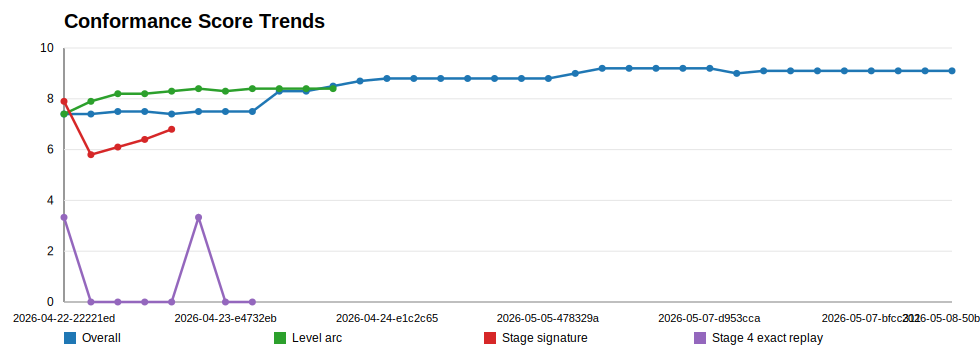
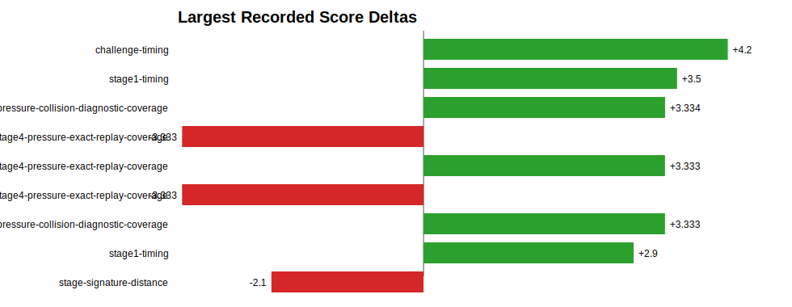
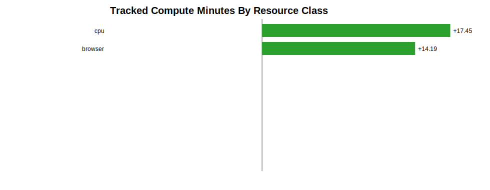

# Release Conformance Dashboard

Generated: `2026-05-08T10:56:44.173Z`

This is the primary at-a-glance planning artifact for Aurora conformance work. It answers what we are trying to improve, why it matters, how close it is to a significant user-facing release gate, and what the next investment should be.

Local internal dashboard: `http://127.0.0.1:4312/local-dev/conformance-dashboard.html` after `npm run local:resume`. Refresh the underlying local page data with `npm run dev:conformance-dashboard` when running a live planning cycle.

## Current Release Gate

| Gate | Current | Target | Notes |
| --- | --- | --- | --- |
| Overall quality | 9.1/10 | >=9.3 | Full score refresh after all major cycles |
| Audio identity | 6.3/10 | >=7.5 | Primary user-experience gap |
| Level arc | 8.4/10 | >=8.8 | Long-play gameplay-quality gate |
| Alien entry / formations | 9/10 composite | >=9.2 with dedicated scorer | New explicit gate |
| Challenge variation | 9/10 composite | >=9.2 with dedicated scorer | New explicit gate |
| Visual look and feel | 7.4/10 | >=8.4 | New explicit gate; currently estimated |
| Arcade frame and popup surfaces | 9.2/10 | >=9.4 | Split from generic UI shell before final gate |
| No-regression guardrails | movement/combat/capture >=10; challenge timing >=9.8 | Maintain | Hard blockers |

## Priority Table

| Priority | Metric | Current | Major-gate target | Measurement status | Why this matters | Effort / time estimate | Recommended next step | Evidence |
| --- | --- | --- | --- | --- | --- | --- | --- | --- |
| 1 | Audio identity, event feedback, and cue alignment | 6.3/10 | 7.5-8.0 | Measured release category; weakest axis | Largest current score gap and high user-experience impact: shots, explosions, boss damage, challenge results, capture/rescue feedback. | High; 3-6 hrs local/model-assisted analysis | Run a longer audio segmentation/model-assisted analysis cycle. | reference-artifacts/analyses/quality-conformance/2026-05-08-50be6cf/report.json |
| 2 | Level arc and encounter shape | 8.4/10 | 8.8-9.0 | Measured release category | Controls whether long play feels like Galaga-like escalation rather than repeated pressure. | Medium-high; 2-5 hrs | Apply one narrow Stage 12 reward candidate and rerun the frozen conformance loop. | reference-artifacts/analyses/level-arc-conformance/2026-05-08-d8240f0/report.json |
| 3 | Overall visual look and feel: gameplay, start page, typography complexity | 7.4/10 | 8.4-8.8 | Estimated; needs dedicated visual conformance scorer | A high score can still feel off if start text, density, contrast, alien readability, and arcade typography do not cohere. | Medium; 2-4 hrs, screenshot/contact-sheet driven | Create a visual-look scorer covering start/attract page, gameplay readability, typography density, color discipline, and reference contact sheets. | UI shell suite plus generated frame/contact-sheet artifacts |
| 4 | Stage 4 pressure exact replay / pressure curve precision | 7.5/10 | 8.2-8.6 | Measured level-arc weak submetric | Pressure should be learnable and reproducible, not merely present in one run. | Medium-high; prior runs ~12.8 min wall / 18.5 min CPU | Run focused source-window replay matching after the Stage 12 loop validates candidate mechanics. | reference-artifacts/analyses/level-arc-conformance/2026-05-08-d8240f0/report.json |
| 5 | Alien entry to levels: formation, timing, and methods | 9/10 | 9.0-9.4 with dedicated scorer | Composite proxy: stage opening timing + geometry + movement grammar | Entry formations and rack timing are a first-order arcade authenticity signal before combat even starts. | Medium; 1-3 hrs plus visual review | Promote alien-entry as its own scored submetric; compare stage-entry contact sheets and timing traces across early/mid/late levels. | reference-artifacts/analyses/quality-conformance/2026-05-08-50be6cf/report.json; reference-artifacts/analyses/level-arc-conformance/2026-05-08-d8240f0/report.json |
| 6 | Challenge-stage variation and new alien/formations introduction | 9/10 | 9.0-9.4 with dedicated scorer | Composite proxy: challenge timing + challenge identity + non-repetition | Challenge stages should teach new motion/reward patterns, not only pause normal combat. | Medium-high; 2-4 hrs | Add a challenge-variation metric for alien type introduction, path families, result feedback, and bonus opportunity clarity. | reference-artifacts/analyses/quality-conformance/2026-05-08-50be6cf/report.json; reference-artifacts/analyses/level-arc-conformance/2026-05-08-d8240f0/report.json |
| 7 | Progression and persona depth | 8.8/10 | 9.1+ | Measured release category | Keeps the game learnable across skill levels and supports later-stage quality. | Low-medium; 1-2 hrs | Resolve remaining ordering edge case after higher-value audio/level-arc work. | reference-artifacts/analyses/quality-conformance/2026-05-08-50be6cf/report.json |
| 8 | Stage 1 opening timing fidelity | 8.5/10 | 8.8-9.2 | Measured release category | First impression and direct reference feel. | Low-medium; 1-2 hrs | Tune only after audio and level-arc priorities unless regressions appear. | reference-artifacts/analyses/quality-conformance/2026-05-08-50be6cf/report.json |
| 9 | Arcade console frame UI style | 9.2/10 | 9.4-9.6 | Measured as UI shell; needs separate arcade-frame style rubric | The cabinet frame is the constant product surface around every game. | Medium; 1-3 hrs visual QA | Split frame style from generic shell integrity: rails, bezel density, labels, chroming, build/date treatment. | reference-artifacts/analyses/quality-conformance/2026-05-08-50be6cf/report.json |
| 10 | Popup/help/scoring/leaderboard surface formatting | 9.2/10 | 9.4-9.6 | Measured through UI shell suite; needs modal-specific scoring | Popup surfaces carry learning, scoring trust, feedback, and player records. | Low-medium; 1-2 hrs | Add modal-specific scorer for help, scoring, feedback, account, leaderboard, and game-over result screens. | reference-artifacts/analyses/quality-conformance/2026-05-08-50be6cf/report.json |
| 11 | Dive fairness and safety | 9.1/10 | 9.3+ | Measured release category | Protects user trust while pressure is increased. | Guardrail; 30-90 min per risky gameplay cycle | Keep as required guardrail for pressure/reward changes. | reference-artifacts/analyses/quality-conformance/2026-05-08-50be6cf/report.json |
| 12 | Player movement conformance | 10/10 | Maintain 10 | Measured release category | Core control feel is already excellent. | Guardrail only | Do not tune unless a new reference metric proves a gap. | reference-artifacts/analyses/quality-conformance/2026-05-08-50be6cf/report.json |
| 13 | Shot and hit responsiveness | 10/10 | Maintain 10 | Measured release category | Core combat response is already excellent. | Guardrail only | Protect during explosion/audio/event feedback work. | reference-artifacts/analyses/quality-conformance/2026-05-08-50be6cf/report.json |
| 14 | Stage 1 opening geometry fidelity | 10/10 | Maintain 10 | Measured release category | Formation geometry is already locked. | Guardrail only | Protect during alien-entry visual work. | reference-artifacts/analyses/quality-conformance/2026-05-08-50be6cf/report.json |
| 15 | Capture and rescue rule fidelity | 10/10 | Maintain 10 | Measured release category | Strong Galaga identity mechanic; should not regress while feedback improves. | Guardrail only | Use as release blocker for capture/rescue-adjacent audio or explosion changes. | reference-artifacts/analyses/quality-conformance/2026-05-08-50be6cf/report.json |
| 16 | Challenge-stage timing fidelity | 9.9/10 | Maintain 9.8+ | Measured release category | Timing is strong; variation is the gap, not baseline timing. | Guardrail only | Preserve while adding challenge variation scoring. | reference-artifacts/analyses/quality-conformance/2026-05-08-50be6cf/report.json |

## Conformance Analysis And Economics

Every release candidate should include both a conformance read and a resource/time read. The goal is to understand not only whether Aurora moved closer to Galaga-like conformance, but what local compute, browser/video work, GPU/model/API assistance, artifact volume, and retry cost were spent to get there.

| Measure | Current read | Release-documentation use |
| --- | --- | --- |
| Latest overall conformance | 9.1/10 | Primary quality roll-up for release notes and scorecards |
| Latest level-arc conformance | 8.4/10 | Long-play gameplay-shape gate |
| Metric points scanned | 492 | History depth behind score trends |
| Score deltas found | 68 | Past-goal movement available for review |
| Measured runs | 65 | Tracked harness/model/local compute work |
| Tracked wall time | 17.4 min | Human clock-time planning input |
| Tracked CPU time | 24.4 min | Local compute-cost planning input |
| Tracked artifact growth | 179.5 MB | Evidence volume and storage/review-cost proxy |

### Resource And Time Usage

| Resource | Measured runs | Wall time | CPU time |
| --- | --- | --- | --- |
| cpu | 65 | 17.4 min | 24.4 min |
| browser | 36 | 14.2 min | 20.6 min |

### Past Goal Spend By Axis

| Axis | Measured runs | Wall time | CPU time |
| --- | --- | --- | --- |
| conformance-economics | 64 | 17.4 min | 24.4 min |
| stage4-pressure | 28 | 12.8 min | 18.5 min |
| quality-score | 3 | 3.2 min | 3.7 min |
| level-arc | 34 | 1.4 min | 2.2 min |
| conformance-loop | 21 | 1.1 min | 1.7 min |
| economics | 1 | 0 min | 0 min |

### Next Goal Estimates

| Priority | Metric | Current | Target | Gap to target | Estimated effort | Expected resources | Next action |
| --- | --- | --- | --- | --- | --- | --- | --- |
| 1 | Audio identity, event feedback, and cue alignment | 6.3/10 | 7.5-8.0 | +1.2 | High; 3-6 hrs local/model-assisted analysis | cpu, model-api, openai-api | Run a longer audio segmentation/model-assisted analysis cycle. |
| 2 | Level arc and encounter shape | 8.4/10 | 8.8-9.0 | +0.4 | Medium-high; 2-5 hrs | cpu, browser | Apply one narrow Stage 12 reward candidate and rerun the frozen conformance loop. |
| 3 | Overall visual look and feel: gameplay, start page, typography complexity | 7.4/10 | 8.4-8.8 | +1 | Medium; 2-4 hrs, screenshot/contact-sheet driven | cpu, browser, gpu | Create a visual-look scorer covering start/attract page, gameplay readability, typography density, color discipline, and reference contact sheets. |
| 4 | Stage 4 pressure exact replay / pressure curve precision | 7.5/10 | 8.2-8.6 | +0.7 | Medium-high; prior runs ~12.8 min wall / 18.5 min CPU | cpu, browser | Run focused source-window replay matching after the Stage 12 loop validates candidate mechanics. |
| 5 | Alien entry to levels: formation, timing, and methods | 9/10 | 9.0-9.4 with dedicated scorer | at target | Medium; 1-3 hrs plus visual review | cpu, browser | Promote alien-entry as its own scored submetric; compare stage-entry contact sheets and timing traces across early/mid/late levels. |
| 6 | Challenge-stage variation and new alien/formations introduction | 9/10 | 9.0-9.4 with dedicated scorer | at target | Medium-high; 2-4 hrs | cpu, browser | Add a challenge-variation metric for alien type introduction, path families, result feedback, and bonus opportunity clarity. |
| 7 | Progression and persona depth | 8.8/10 | 9.1+ | +0.3 | Low-medium; 1-2 hrs | cpu | Resolve remaining ordering edge case after higher-value audio/level-arc work. |
| 8 | Stage 1 opening timing fidelity | 8.5/10 | 8.8-9.2 | +0.3 | Low-medium; 1-2 hrs | cpu, browser | Tune only after audio and level-arc priorities unless regressions appear. |

### Charts

## New First-Class Axes Added

- Alien entry to levels: formation layout, timing, path method, and whether different stages enter differently.
- Challenge-stage variation: new alien types, new entry formations/styles, path families, reward/result feedback, and teaching value.
- Overall visual look and feel: gameplay readability, start/attract typography density, copy complexity, color discipline, and reference contact sheets.
- Arcade console frame UI: cabinet frame, bezel/rails, build/date trust signals, button density, and arcade-style containment.
- Popup/help/scoring surfaces: help, scoring, leaderboard, account, feedback, and game-over result formatting as their own modal-quality family.

## Maintenance Rules

- Refresh this artifact after each full quality score, investment-priority run, or major conformance loop.
- Before a serious `/dev`, `/beta`, or `/production` release candidate, refresh `npm run harness:analyze:conformance-economics` and `npm run harness:build:release-conformance-dashboard` so release docs include conformance, resource/time, chart, past-goal, and next-goal reads.
- Any long-cycle local compute or model/API/GPU-assisted assessment should be wrapped with `npm run harness:measure` and declared with its axis and resource classes.
- Keep the local dashboard generated from this artifact data; do not link or publish it through player-facing Platinum surfaces until explicitly approved.
- Treat rows marked estimated/composite as measurement debt: useful for planning, but not release-proof until backed by a harness.
- Keep user-facing release gates separate from harness-learning wins. A rejected candidate still belongs in artifacts when it teaches the loop what not to keep.
- Prefer work with a large score gap, high user-experience impact, reusable ingestion/harness value, and clear guardrails.

## Evidence Index

- Quality report: `reference-artifacts/analyses/quality-conformance/2026-05-08-50be6cf/report.json`
- Investment priority report: `reference-artifacts/analyses/conformance-investment-priorities/2026-05-08-d8240f0/report.json`
- Level-arc report: `reference-artifacts/analyses/level-arc-conformance/2026-05-08-d8240f0/report.json`
- Economics report: `reference-artifacts/analyses/conformance-economics/2026-05-08-afc27e6/report.json`
- Equal current quality-category weight: `0.091`
