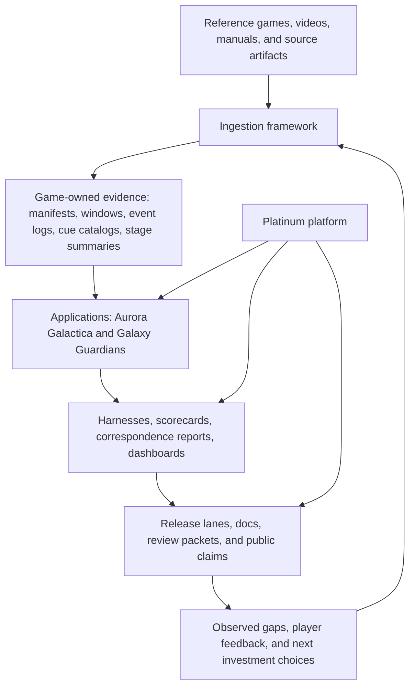
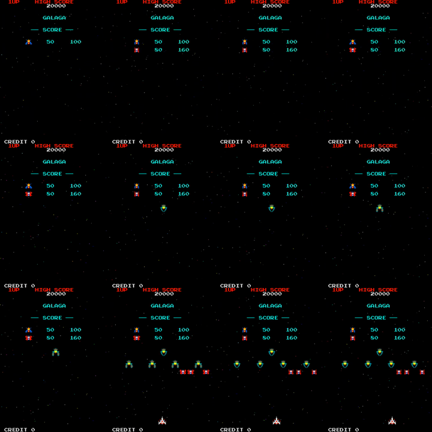
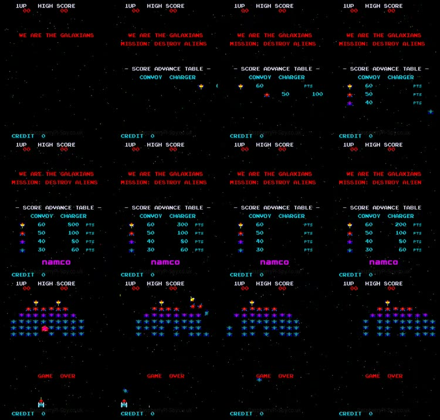
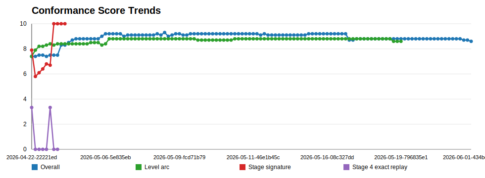
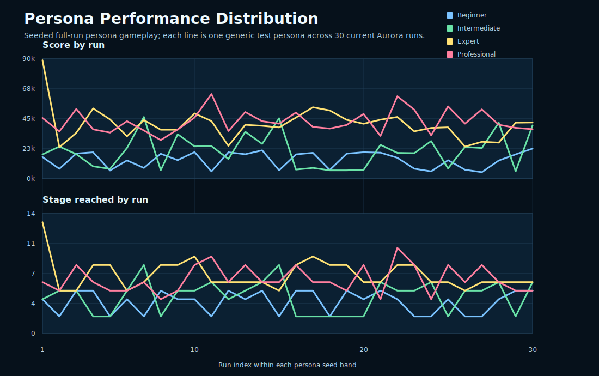
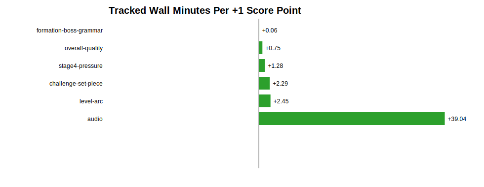
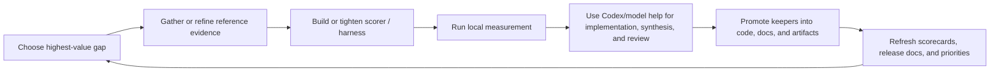

# Platinum, Aurora, and the Conformance Project

Status: living white paper
Current draft: `v0.4.1-draft`
Date: `2026-06-07`
Audience: broad technical readers, interested builders, collaborators, future
reviewers, and public-facing project storytelling

This document is the maintained narrative explanation of what this project is
doing, why it is being built this way, and how the approach evolves over time.
It is intended to be both a promotional piece and a disciplined reminder to the
team: the software, the evidence program, the release process, and the
generative-AI workflow all matter together.

See also:

- [white-paper/README.md](white-paper/README.md)
- [white-paper/CITATION_LEDGER.md](white-paper/CITATION_LEDGER.md)
- [white-paper/REVIEW_CADENCE.md](white-paper/REVIEW_CADENCE.md)

## Overview / Preamble

This project is not only a browser game repo.

It is a deliberate attempt to build a professional software program around a
harder claim:

- that generative AI can help produce serious, well-released software
- that aggressive iteration does not need to mean careless iteration
- that reference-driven quality can be pursued with explicit evidence instead
  of vague taste alone
- that local harnesses, release lanes, review packets, and durable artifacts can
  keep AI-assisted work honest

`Platinum` is the reusable browser-arcade host. `Aurora Galactica` is the first
shipped application on that host. `Galaxy Guardians` is the second-game proof
that the platform, ingestion program, and conformance discipline can grow
beyond a single title.

The larger point is not "we used AI to make a game."

The larger point is that we are building a system in which:

- the product is real
- the releases are real
- the documentation is real
- the tests and harnesses are real
- the evidence is real
- and the model-assisted work is useful because it is forced to leave behind
  rerunnable artifacts

## Section Overview

- `1. Thesis`: what this project is trying to prove.
- `2. Program snapshot`: where Platinum, Aurora, and Galaxy Guardians stand
  right now.
- `3. Five-layer operating model`: platform, games, ingestion, harnesses, and
  release economics as one program.
- `4. Ingestion strategy`: how external evidence becomes structured game truth.
- `5. Challenge-stage ingestion case study`: how richer reference recovery
  changed the plan for Aurora's hardest gameplay gap.
- `6. Harnessing and conformance`: how we measure quality instead of asserting
  it.
- `7. Release discipline`: how dev, beta, and production remain explicit and
  professional.
- `8. Generative AI role`: how model work accelerates the project without
  replacing evidence.
- `9. Working loop`: how the project turns a gap into evidence, implementation,
  measurement, and release learning.
- `10. Historical evolution`: how the project moved from launch to platform to
  multi-game conformance.
- `11. Citation program`: how outside ideas and source recovery work should be
  tracked explicitly.
- `12. Related work`: how outside agent/evaluator work informs the project.
- `13. Internal canonical docs`: how this paper stays short without losing
  traceability.
- `14. Why this project matters`: why the project is larger than a game repo.
- `15. Living-paper policy`: how this white paper should be maintained and
  released over time.

## How To Read This Paper

This page is meant to be the readable narrative layer, not the whole archive.

- Read this paper for the story, the method, and the architectural shape of the
  project.
- Use the diagrams, screenshots, and charts here as anchors, not as the full
  evidence pack.
- If you want implementation detail, detailed metrics, or release-by-release
  operational context, jump into the linked hosted documentation rather than
  making this paper carry everything.

Useful deeper surfaces:

- [project-guide.html](project-guide.html)
- [platinum-guide.html](platinum-guide.html)
- [application-guide.html](application-guide.html)
- [conformance-dashboard.html](conformance-dashboard.html)
- [release-dashboard.html](release-dashboard.html)
- [release-notes.html](release-notes.html)
- [white-paper.pdf](white-paper.pdf)

## First Draft

### 1. Thesis

The core thesis of this project is that generative-AI-assisted software can be
built aggressively without becoming hand-wavy, fragile, or unprofessional.

That requires a few non-negotiable rules:

- the software must ship as a real public product, not just as a demo
- improvements must be tied to evidence whenever the question is measurable
- platform boundaries must stay explicit so reuse is deliberate rather than
  accidental
- release claims must be backed by committed docs, review artifacts, and
  rerunnable checks
- model work should increase leverage, but repeated assessment should
  increasingly move into local CPU/browser harnesses

This is why Platinum, Aurora, Galaxy Guardians, ingestion, harnesses,
scorecards, review packets, and release notes belong in the same story.

The image above is intentionally simple: it reminds the reader that all of the
process, evidence, and release discipline in this paper exist in service of a
real playable artifact, not only a methodology exercise.

Further detail:

- [application-guide.html](application-guide.html)
- [release-notes.html](release-notes.html)

### 2. Program Snapshot

As of `2026-06-07`, the project can be described in one page:

| Area | Current role | Why it matters |
| --- | --- | --- |
| `Platinum` | Shipped browser-arcade host platform | Proves that reusable shell, services, lane model, and release discipline can exist without absorbing game-specific truth. |
| `Aurora Galactica` | First shipped playable Platinum application | Serves as the strongest current proof that the platform can host a real public game and improve its conformance over time. |
| `Galaxy Guardians` | Preview-first second-game and first-class ingestion/conformance target | Proves that the platform and the evidence program can support a second game without simply cloning Aurora. |
| Ingestion framework | Source-to-structured-evidence pipeline | Keeps new-game and fidelity work anchored in manifests, clips, event logs, waveforms, contact sheets, and provenance. |
| Harness and conformance system | Scorecards, correspondence checks, dashboards, and gates | Turns quality claims into measurable, reviewable outputs. |
| Release and economics program | Lane discipline, review packets, docs refresh, local-vs-cloud resource accounting | Makes the project look and behave like a professional release program rather than an endless prototype. |

Current maintained metric read:

| Scope | Current read | Interpretation |
| --- | --- | --- |
| Project conformance economics | `8.7/10` roll-up | Strong broad score, but the next release value depends on closing the worst rows rather than polishing the average. |
| Application artifact conformance | `7.46/10` | The weakest row is `impact-explosion-visual-feedback`, so damage, hit, loss, and explosion feedback remain a major user-experience target. |
| `Aurora` challenge-stage set pieces | `4.3/10` strict score | The clearest gameplay-conformance blocker: movement, graphics, alien novelty, and target-video fit are still far from mature Galaga-like bonus exhibitions. |
| `Aurora` challenge grammar readiness | `25/25` reference-backed first-five group contracts; `8.6/10` control readiness | Analysis is now ahead of runtime implementation; the next useful work is promotion-safe movement grammar, not more broad planning. |
| `Galaxy Guardians` long-surface/persona review | `7.0/10` | Credible second-game process proof, but not yet a production-mature public game; v1 needs opening-slice quality, score/result identity, platform parity, and Watch/Rival/persona reuse. |
| Resource/economics ledger | `904` measured runs, `58,277s` tracked wall time, `58,392s` CPU time, about `1.48GB` artifact accounting | Shows the operating doctrine: turn model-assisted insight into local CPU/browser harnesses and track the cost of quality movement. |

The evidence program also became more concrete in the latest pass:

- release authority moved from `iMacM1` to this MacBook M4 for the current
  release path
- release conformance artifacts, the game conformance catalog, and white-paper
  PDF metadata are refreshed enough for `publish:check:dev`
- hosted `/dev` now carries `1.4.0.1+build.1060.sha.cd66ab6b2`, including the
  consolidated Aurora challenge grammar, Guardians ingestion/conformance
  cleanup, refreshed dashboards, public project guide, white-paper PDF, slides,
  and review packet
- the current cross-thread priority map is preserved in
  [PROJECT_WIDE_WORKSTREAM_ALIGNMENT_2026-06-07.md](PROJECT_WIDE_WORKSTREAM_ALIGNMENT_2026-06-07.md)
- the June 1 preserved-source expansion added richer Galaga, Galaxian, and
  Space Invaders evidence lanes, including manuals, strategy/walkthrough
  bundles, sprite/cue packages, challenge-stage videos, and cabinet/spec
  references
- the public/private artifact boundary is now explicit: source metadata and
  summaries stay in this repo, while copied or derived source bytes belong in
  the companion private artifact store

These pack views help a broad reader understand one of the project’s central
claims: `Aurora Galactica` and `Galaxy Guardians` are not supposed to be two
skins on one game. They are meant to be separate applications living on one
host platform.

> TODO illustration:
> Choose a small three-panel progression strip that shows how the public face
> of the project evolved from `1.0.0` launch to `1.2.0` Platinum framing to
> `1.4.0` multi-game posture. The most illustrative version may be gameplay
> first, shell first, or docs/release-surface first, and we should pick that
> deliberately rather than guessing.

Further detail:

- [project-guide.html](project-guide.html)
- [platinum-guide.html](platinum-guide.html)

### 3. Five-Layer Operating Model

The repo already describes the work as a layered system. The white paper should
make that model legible at a glance.

The important discipline is separation of ownership:

- `Platinum` owns shell, hosting, shared services, contracts, and release
  framing.
- Games own rules, scoring, progression, audiovisual identity, and their own
  conformance truth.
- Ingestion owns provenance and structured evidence.
- Harnesses own repeatable evaluation.
- Release discipline owns the public promise.

When those layers blur, the project becomes harder to explain, harder to test,
and easier to accidentally fake.

Further detail:

- [project-guide.html#platform-vs-applications](project-guide.html#platform-vs-applications)
- [platinum-guide.html](platinum-guide.html)
- [PROJECT_STATE_AND_CONFORMANCE_PROGRAM.md](PROJECT_STATE_AND_CONFORMANCE_PROGRAM.md)

### 4. Ingestion Strategy

Ingestion is the front half of engineering, not a side notebook.

The project does not want new games or fidelity improvements to come mainly
from memory, vibes, or post-hoc rationalization. Instead, it wants evidence to
arrive in structured forms that can be reused:

- source manifests
- preserved clips and windows
- frame contact sheets
- waveforms and spectrograms
- reference-side event logs
- semantic annotations
- confidence notes
- scorer and correspondence targets

For `Aurora`, this keeps Galaga-like timing, audio, pressure, and stage-shape
questions grounded in real artifacts.

For `Galaxy Guardians`, ingestion matters even more. It is the mechanism that
prevents the second game from turning into "Aurora with different labels." The
game should become more complete by promoting `Galaxian` evidence into
game-owned scoring, wave timing, sprite identity, audio expectations, and
runtime correspondence checks.

In short:

- external artifacts teach the game
- ingestion turns artifacts into structured evidence
- the application implements against that evidence
- Platinum stays the host rather than the hidden author of the game

These reference contact sheets are useful because they show the project’s
ingestion claim in a form a non-expert can understand quickly. We are not only
describing classic arcade behavior; we are collecting windows, studying them,
and turning them into reusable evidence.

That claim is now easier to defend concretely because the repo carries
preserved-source lanes as well as derived analyses. The current reference
inventory includes Galaga audio cue packs, Galaga challenge-stage videos,
StrategyWiki sprite/walkthrough bundles, arcade-museum cabinet/spec pages,
Galaxian no-voiceover and full-session gameplay, Galaxian FLAC cue packs,
Galaxian operator/manual material, and early Space Invaders intake packages.
The project is moving source recovery out of memory and into committed
provenance, with copied media bytes separated into the companion private
artifact store when public-hosting would be inappropriate.

The important process upgrade is that ingestion now has required outputs, not
only nice-to-have research notes. A serious game line should maintain:

- an alien/enemy index
- an audio cue index
- a stage or wave index
- a persona index
- sprite/runtime scale evidence
- entry choreography evidence
- target-artifact coverage before major implementation claims

That makes the second and third games less likely to inherit Aurora-specific
assumptions by accident.

> TODO illustration:
> Pick the single best “ingestion in action” image for v1. The strongest option
> might be a contact sheet, a waveform-plus-contact-sheet pair, or a staged
> comparison between raw source footage and the structured artifact family that
> comes out of it.

Further detail:

- [project-guide.html#classic-arcade-ingestion-framework-doc](project-guide.html#classic-arcade-ingestion-framework-doc)
- [application-guide.html](application-guide.html)
- [CLASSIC_ARCADE_INGESTION_FRAMEWORK.md](CLASSIC_ARCADE_INGESTION_FRAMEWORK.md)
- [reference-artifacts/preserved-sources/README.md](reference-artifacts/preserved-sources/README.md)

### 5. Challenge-Stage Ingestion Case Study

Aurora's challenge stages are the clearest example of why the project had to
get more serious about ingestion and annotation.

The user-visible complaint was simple: the challenge stages did not feel like
classic Galaga-style bonus exhibitions. They were safe, and some broad
coverage checks passed, but they lacked the thing that players actually learn
and remember: coherent group arrivals, varied alien families, readable
scoreable lanes, stage-to-stage novelty, and the sense that each challenge is a
designed set piece rather than a generic wave.

That exposed a weakness in the earlier measurement model. Old diagnostics could
say that challenge coverage existed because enemies appeared, did not shoot,
and followed some path families. That was too generous. The stricter model now
starts the player-facing challenge-stage read from a harsh baseline and asks a
more useful question: does this stage create the same kind of spectacle,
movement memory, and perfect-score opportunity as the target examples?

Recent ingestion and annotation work changed the situation in four ways:

| Upgrade | What changed | Impact so far |
| --- | --- | --- |
| Reference recovery | User-supplied and preserved Galaga challenge compilations now provide media-backed windows for the tracked challenge family. | The bottleneck moved from "find examples" to "label and implement against examples." |
| Stage labeling | The project now treats stages as ordinary play stages and names bonus windows as `Challenging Stage 3-4`, `Challenging Stage 7-8`, and so on. | Human review, docs, harnesses, and developer tools have clearer shared language. |
| Object-track analysis | CPU object tracking converts challenge clips into per-group target vectors: entry side, timing, path range, lower-field travel, and path-family hints. | Target-track readiness and control readiness are now around `8.6/10`, giving implementation a concrete target shape. |
| Candidate guards | Runtime candidates are checked against target-video fit and human-perfect potential before promotion. | The process has already prevented bad promotions, including a Stage 3 candidate that slightly improved expected-label fit but reduced human-perfect potential by `1.6/10`. |

The honest current read is mixed.

On the positive side, the challenge-stage work has improved the project
faster than a purely subjective tuning pass could have. The latest target
structure covers `8` tracked challenge windows and `40` reference-backed
groups. The harness can generate paired target-vs-current videos from stage
start, contact sheets, timing drift summaries, target trajectory controls, and
candidate before/after reports. That is a large process gain, and it should
make future Aurora, Galaxy Guardians, and third-game work cheaper and less
guessy.

On the negative side, the same evidence makes the gameplay gap harder to hide.
The strict challenge-stage score is still only about `4.3/10`: movement
`4.2/10`, graphics `4.5/10`, alien novelty `3.9/10`, target-video object-track
fit `3.6/10`, and zero release-ready challenge contracts. The no-shot and
no-ship-loss safety rule is strong, but safety is now treated as a guardrail,
not as proof of conformance. A safe challenge stage can still be boring,
visually weak, or badly paced.

That distinction matters for the project's AI-assisted method. This work is a
success as ingestion, annotation, and evaluator-building. It is not yet a
success as shipped player experience. The next phase must convert the evidence
into runtime movement grammar that can produce better stages without endless
manual special cases.

The next-work categories are therefore specific:

1. Promote five-group labels for each challenge window: first visible frame,
   entry side, exit side, path family, scoreable band, alien family, and
   perfect-bonus opportunity.
2. Build a reusable movement-grammar layer that represents group arrivals,
   arcs, loops, ladders, hooks, crossings, serpentine paths, and exits as
   editable contracts rather than one-off constants.
3. Keep a human-perfect guard in the candidate loop so conformance does not
   improve by making stages less playable or less learnable.
4. Add active sprite-motion evidence for challenge aliens, because static
   sprite crops do not capture flapping, pulsing, dive poses, or specialty
   target identity.
5. Use paired target/current clips and contact sheets as review artifacts
   whenever a challenge-stage change is claimed.
6. Generalize the same grammar to normal-stage entry behavior, not only
   challenge stages, so the platform can support game-specific variation
   without hard-coding Aurora's current patterns into Platinum.

The reason this should speed quality improvement is that it changes the shape
of the work. Instead of asking the model or a human to "make the stage feel more
Galaga-like," the system can ask a narrower question: which group contract is
missing, which trajectory differs, which alien family is wrong, and which
candidate improves target fit without reducing perfect-score readability?

Further detail:

- [application-guide.html#challenge-stage-conformance](application-guide.html#challenge-stage-conformance)
- [GALAGA_TARGET_ARTIFACT_COVERAGE.md](GALAGA_TARGET_ARTIFACT_COVERAGE.md)
- [LEVEL_VISUAL_TIMING_ALIGNMENT.md](LEVEL_VISUAL_TIMING_ALIGNMENT.md)
- [AURORA_SPRITE_MOTION_CORRESPONDENCE.md](AURORA_SPRITE_MOTION_CORRESPONDENCE.md)

### 6. Harnessing And Conformance

This project is serious about the difference between "better" and "better by a
rerunnable measure."

The conformance system exists so that quality can be described with more
precision than a mood:

- timing correspondence
- sequence correspondence
- outcome correspondence
- spatial correspondence
- visual correspondence
- audio correspondence
- persona and progression correspondence

The current Aurora scorecard turns this into a twelve-category quality model.
That matters for two reasons.

First, it helps choose investments that are actually player-visible.

Second, it protects the team from false confidence. A `10/10` is explicitly not
"perfect"; it means "maxed at current scorer resolution." Better evidence or a
better evaluator can lower a score while making the project more truthful.

The harness program also stays intentionally classified:

- `platform` harnesses protect shell, hosting, docs, and shared services
- `application` harnesses protect game-specific rules and behavior
- `boundary` harnesses protect the seam between Platinum and the games

Representative committed commands in this strategy include:

- `npm run harness:measure`
- `npm run review:code`
- `npm run review:ledger`
- `npm run harness:check:galaxy-guardians-first-class-conformance`

This is the deeper quality claim of the project: bugs, polish, and release
readiness should increasingly move from memory and opinion into explicit checks,
artifacts, and dashboards.

The value of these charts is not only that they look rigorous. They show that
the project tries to externalize quality questions into surfaces that can be
inspected, debated, and rerun.

The newest dashboard makes the current prioritization uncomfortable in the
right way. Basic challenge timing, combat response, capture/rescue rules, and
several shell surfaces pass as guardrails. But the strict challenge-stage
set-piece scorer is only `4.3/10`, with movement `4.2/10`, graphics `4.5/10`,
novelty `3.9/10`, target-video object-track fit `3.6/10`, and zero release-ready
challenge contracts. That score is not a failure of the process. It is the
process doing its job: replacing a too-generous broad proxy with a more honest
stage-by-stage conformance read.

Further detail:

- [conformance-dashboard.html](conformance-dashboard.html)
- [project-guide.html#release-conformance-dashboard-doc](project-guide.html#release-conformance-dashboard-doc)
- [project-guide.html#conformance-economics-doc](project-guide.html#conformance-economics-doc)

### 7. Release Discipline And Professionalism

The project treats release engineering as part of product quality.

That means the release lanes are not cosmetic:

1. local `localhost`
2. hosted `/dev`
3. hosted `/beta`
4. hosted `/production`

Each lane carries a different stability promise, documentation expectation, and
testing posture. The project is intentionally trying to behave like a software
program with real public accountability:

- release notes are first-class
- docs are part of the release surface
- review packets and review-learning ledgers are durable evidence
- the white paper must read well both as hosted HTML and as printable PDF
- production claims should come from an approved beta lineage
- major releases should refresh dashboards, scorecards, and strategic docs

This matters because AI-assisted speed is only impressive if the public result
still feels trustworthy.

The "reviewer" mentality should therefore be explicit. The paper is not done
just because the words are present. The release surface should also be reviewed
for lane coherence, build metadata, conformance freshness, and historical path
drift.

As of this draft, the current production recommendation is deliberately
conservative:

- hosted `/production` remains the stable public `1.4.0` line
- hosted `/dev` and `/beta` are review lanes for the next candidate family
- the MacBook M4 is now release authority
- the current candidate is suitable for dev-lane review after preflight, but
  not yet a new `1.4.1` production promise
- challenge-stage quality and documentation consistency remain the two clearest
  reasons to defer production

That restraint is part of the method. The project should not treat a passing
publish script as the same thing as a strong public release story.

The reviewer pass should keep looking for:

- repeated ideas that can be tightened
- diagrams or images that create awkward whitespace or weak page breaks
- TODOs that are unclear or more revealing of indecision than of real planning
- HTML reading flow on desktop and mobile
- PDF export quality, especially around image scale, table breaks, and diagram
  legibility

Further detail:

- [release-dashboard.html](release-dashboard.html)
- [release-notes.html](release-notes.html)
- [project-guide.html#testing-doc](project-guide.html#testing-doc)
- [project-guide.html#code-review-model-doc](project-guide.html#code-review-model-doc)
- [white-paper/REVIEWER_CHECKLIST.md](white-paper/REVIEWER_CHECKLIST.md)
- [white-paper/REVIEW_CADENCE.md](white-paper/REVIEW_CADENCE.md)

### 8. How Generative AI Fits

The project does use generative AI heavily, but not as a substitute for
engineering structure.

The intended operating doctrine is:

- use models to design evaluators, synthesize options, write code, review code,
  summarize evidence, and tighten the next decision
- use local CPU/browser harnesses for repeated measurement, sweeps, and
  regression checks
- convert model-assisted insight into committed repo artifacts whenever
  possible
- log resource use and compare spend against score movement
- keep human review, public release notes, and versioned documentation in the
  loop

The repo already describes one part of this explicitly as a
"Karpathy-loop-like" pattern:

- inspect concrete examples
- improve the dataset and evaluator
- make a small candidate change
- run it
- study failures
- fold the learning back into the system

That is a strong fit for the broader project identity. The point is not merely
to ask a model for code. The point is to build a system in which model help
leaves behind better evaluators, better artifacts, and cheaper future
decisions.

These charts help keep the AI story grounded. The point is not only that model
assistance exists; it is that the project is trying to compare that assistance
with local repeatable measurement and with visible quality movement.

The current economics ledger is intentionally imperfect but already useful:

- `904` measured runs are logged
- local CPU accounts for `576.5` tracked wall minutes
- browser-backed local work accounts for `429.6` tracked wall minutes
- declared GPU-equivalent/Codex/model/API work accounts for `630.8` tracked
  wall minutes, but remains under-instrumented and partly overlapping by design
- audio work consumed the largest local-compute block, while gameplay complexity
  and stage arc account for the largest positive score movement

This is exactly the planning tension the project wants to expose. If audio
keeps consuming large compute blocks for modest score movement, the next
investment should either improve the audio evaluator itself or shift energy to
the higher-value challenge-stage movement grammar.

Further detail:

- [project-guide.html#conformance-economics-doc](project-guide.html#conformance-economics-doc)
- [CONFORMANCE_ECONOMICS.md](CONFORMANCE_ECONOMICS.md)

### 9. Working Loop

The operating loop of this project is more important than any single feature.

This loop explains how the project tries to be both aggressive and controlled.
The aggressiveness comes from fast iteration and model-assisted leverage. The
control comes from evidence, harnesses, explicit ownership boundaries, and
release discipline.

> TODO illustration:
> Add one compact “question -> evidence -> harness -> change -> rerun” visual
> from a real case study. Audio cue alignment, stage-opening timing, or a
> Galaxy Guardians reference-promotion slice are the strongest current
> candidates, but we should choose the one that is most legible to a broad
> reader.

### 10. Historical Evolution So Far

The release notes already show a clear arc, and the white paper should make it
easy to retell.

| Release | Meaning | Strategic shift |
| --- | --- | --- |
| `1.0.0` | First public Aurora launch | The project became a real public product with live scoring, pilot identity, replay visibility, and a real release ladder. |
| `1.2.0` | Platinum Release 1 | Aurora was reframed as the first application on a reusable platform, making platform/application separation explicit. |
| `1.4.0` | Current multi-game and conformance baseline | The public line now carries stronger documentation, review evidence, persona/replay follow-through, and a clearer Galaxy Guardians posture. |

This means the project has already moved through three meaningful phases:

1. prove a public game can ship
2. prove the host platform is real
3. prove multi-game and conformance maturity can become part of the release
   identity

The next phase should be to prove that this method scales:

- deeper Aurora conformance
- stronger Galaxy Guardians first-class completeness
- cleaner shared Platinum operations
- more reusable ingestion and assessment infrastructure
- a third-game intake path, currently represented by Space Invaders / Windigo
  Invaders preserved-source and planning lanes

> TODO illustration:
> Build a release-history gallery with one screenshot or architectural surface
> per milestone. The current paper names the milestones clearly, but a short
> visual strip would make the progression easier to absorb at a glance.

Further detail:

- [release-notes.html](release-notes.html)
- [project-guide.html#release-note-140-beta-1-doc](project-guide.html#release-note-140-beta-1-doc)
- [project-guide.html#release-note-130-production-refresh-doc](project-guide.html#release-note-130-production-refresh-doc)

### 11. Citation Program

This white paper should not quietly absorb ideas or source recovery work
without naming them.

We want a maintained citation program that records:

- what outside work or source material influenced us
- how we used it
- what we learned from it
- what changed in the repo because of it
- what still needs to be recovered, linked, or tightened

The living ledger for that work starts here:

- [white-paper/CITATION_LEDGER.md](white-paper/CITATION_LEDGER.md)

The source-recovery side of that program now has a matching repo-owned surface:

- [reference-artifacts/preserved-sources/README.md](reference-artifacts/preserved-sources/README.md)
- [REFERENCE_MEDIA_INVENTORY.md](REFERENCE_MEDIA_INVENTORY.md)

That matters because provenance is not only a footnote here. It is a release
quality concern. If a timing study, audio comparison, or historical claim
depends on a file that only exists in somebody’s old downloads folder, the
project is less professional than it looks.

The first open citation debt is the prior standalone assessment of the
Karpathy-style research/evaluator loop. The repo contains the conceptual thread
already, but the older assessment should be recovered and linked directly in a
future white-paper release rather than reconstructed from memory.

Further detail:

- [white-paper/CITATION_LEDGER.md](white-paper/CITATION_LEDGER.md)

### 12. Related Work

This project should periodically stop and look outward.

The right pattern is not to stuff the paper with literature. The right pattern
is to do focused searches, add high-signal sources, explain their relevance in
plain language, and keep the public references linked to a maintained log.

Current seeded related-work set:

- [Anthropic, "Building effective agents" (2024-12-19)](https://www.anthropic.com/engineering/building-effective-agents): relevant because it argues for simple, composable agent patterns and evaluator-optimizer loops rather than ornamental workflow complexity.
- [Anthropic, "Writing effective tools for agents - with agents" (2025-09-11)](https://www.anthropic.com/engineering/writing-tools-for-agents): relevant because our harnesses, scripts, and release tools are all explicit contracts between model assistance and deterministic system behavior.
- [Anthropic, "Demystifying evals for AI agents" (2026-01-09)](https://www.anthropic.com/engineering/demystifying-evals-for-ai-agents): relevant because it reinforces our investment in transcripts, graders, repeated trials, and measurable evaluator quality instead of anecdotal confidence.
- [Anthropic, "Trustworthy agents in practice" (2026-04-09)](https://www.anthropic.com/engineering/building-trustworthy-agents): relevant because it frames guardrails, reviews, and operator-visible controls as part of the product surface, not only as implementation details.
- [METR, "Measuring AI Ability to Complete Long Tasks" (2025-03-19)](https://metr.org/blog/2025-03-19-measuring-ai-ability-to-complete-long-tasks/): relevant because it gives a sharper lens on what kinds of work current agents can sustain autonomously, which is directly relevant to our preference for small evaluator-visible loops and local reruns over vague claims of full autonomy.
- [OpenAI, "PaperBench" (2025-04-02)](https://openai.com/index/paperbench/): relevant because it shows how large agentic tasks become more reviewable when decomposed into explicit rubrics and many individually gradable subtasks, which is close to how our own harnesses and conformance categories create reviewable surfaces.

Maintained deeper log:

- [white-paper/RELATED_WORK.md](white-paper/RELATED_WORK.md)

### 13. Internal Canonical Docs

This paper should stay readable because the repo already has deeper canonical
surfaces nearby.

The shortest list of internal references that best supports the claims here is:

- [project-guide.html](project-guide.html)
- [platinum-guide.html](platinum-guide.html)
- [application-guide.html](application-guide.html)
- [conformance-dashboard.html](conformance-dashboard.html)
- [release-dashboard.html](release-dashboard.html)
- [CLASSIC_ARCADE_INGESTION_FRAMEWORK.md](CLASSIC_ARCADE_INGESTION_FRAMEWORK.md)
- [PROJECT_STATE_AND_CONFORMANCE_PROGRAM.md](PROJECT_STATE_AND_CONFORMANCE_PROGRAM.md)
- [CONFORMANCE_ECONOMICS.md](CONFORMANCE_ECONOMICS.md)
- [REFERENCE_MEDIA_INVENTORY.md](REFERENCE_MEDIA_INVENTORY.md)
- [GAME_CONFORMANCE_CATALOG.md](GAME_CONFORMANCE_CATALOG.md)
- [RELEASE_CONFORMANCE_DASHBOARD.md](RELEASE_CONFORMANCE_DASHBOARD.md)
- [reference-artifacts/preserved-sources/README.md](reference-artifacts/preserved-sources/README.md)

If the main paper starts to feel long, that is usually a sign that one of these
surfaces should carry more of the detail instead.

### 14. Why This Project Matters

The project matters because it is trying to demonstrate a concrete alternative
to two weak extremes.

It is not:

- slow, ceremonial process that kills iteration
- or fast AI-assisted output that cannot explain or defend itself

Instead, it aims for a middle path:

- ambitious shipping
- real public releases
- strong platform boundaries
- evidence-backed improvement
- local-first repeated measurement
- model-assisted leverage
- versioned documentation and release storytelling

If that works, the result is more than a good arcade project. It becomes a
useful pattern for how generative AI can participate in professional software
work without dissolving quality standards.

This is also why the paper should remain readable. A broad technical reader
does not need every source artifact inline. They need a coherent narrative,
selected visual proof, and obvious places to go next if they want more depth.

### 15. Living White Paper Policy

This document should evolve the same way the project evolves: intentionally,
versioned, and with historical memory preserved.

Working policy:

- `WHITE_PAPER.md` is the current living draft
- the hosted HTML and printable PDF should be kept aligned as two views of the
  same maintained release surface
- meaningful revisions should be snapshotted under `white-paper/releases/`
- each snapshot should preserve the exact white paper text for that release
- when a release PDF exists, the snapshot should preserve the Markdown, PDF,
  and generated PDF metadata together
- the citation ledger should be updated when outside work materially changes the
  project story
- the related-work log should be refreshed periodically with focused online
  searches and brief relevance commentary
- the recurring reviewer rhythm in `white-paper/REVIEW_CADENCE.md` should be
  treated as normal maintenance, not as a one-off cleanup exercise
- reviewer-checklist expectations should be treated as part of release quality,
  not optional cleanup
- every meaningful software release does not need a new white paper release, but
  every strategic narrative shift probably does

Good triggers for a new white paper release:

- a major public release family
- a major shift in the conformance program
- a stronger second-game milestone
- a meaningful change in the AI/harness/evidence operating model
- recovery of an important citation or conceptual influence

## Immediate Next Additions

- Recover and link the earlier Karpathy-style assessment if it exists outside
  this repo.
- Add one deliberate progression gallery for milestone history and one deliberate
  “evidence in action” case-study image once we decide which examples explain
  the project most clearly.
- Add a compact public diagram that shows the new source-to-metric pipeline:
  preserved source package -> extracted window -> semantic event/crop/path
  target -> runtime capture -> conformance score -> release gate.
- Add a deeper table that compares Aurora, Galaxy Guardians, and Windigo by
  ingestion maturity, not only by current playability.
- Decide which evidence families should be summarized publicly and which should
  remain in the private artifact store behind public-safe metadata.
- Keep the HTML and PDF release surfaces under reviewer scrutiny so that spacing,
  diagrams, repeated ideas, and print behavior all improve with the narrative.
- Keep the audience tuned for a broad technical and builder readership: assume
  interest, assume intelligence, but do not assume deep prior expertise.
