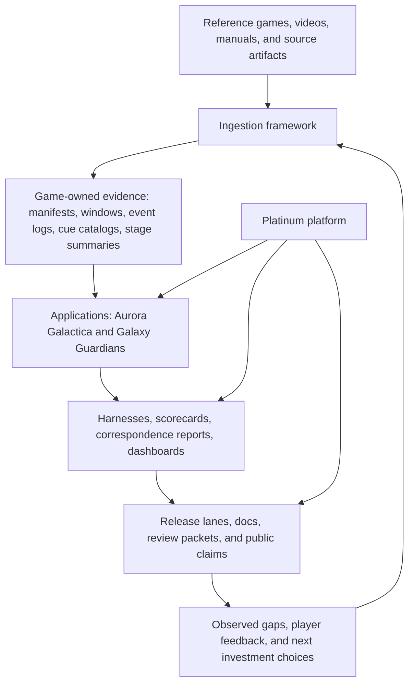
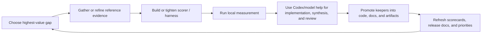

# White Paper Snapshot: Platinum, Aurora, and the Conformance Project

Status: living white paper snapshot
Snapshot version: `v0.1.0`
Snapshot date: `2026-05-16`

This file preserves the first seeded white paper release in a directly
browsable snapshot form for `2026-05-16`.

For the actively edited version, see:

- [../../../WHITE_PAPER.md](../../../WHITE_PAPER.md)

---

## Preserved Draft

Status: living white paper
Current draft: `v0.1.0`
Date: `2026-05-16`
Audience: collaborators, future reviewers, and public-facing project storytelling

This document is the maintained narrative explanation of what this project is
doing, why it is being built this way, and how the approach evolves over time.
It is intended to be both a promotional piece and a disciplined reminder to the
team: the software, the evidence program, the release process, and the
generative-AI workflow all matter together.

See also:

- [../../../white-paper/README.md](../../../white-paper/README.md)
- [../../../white-paper/CITATION_LEDGER.md](../../../white-paper/CITATION_LEDGER.md)

## Overview / Preamble

This project is not only a browser game repo.

It is a deliberate attempt to build a professional software program around a
harder claim:

- that generative AI can help produce serious, well-released software
- that aggressive iteration does not need to mean careless iteration
- that reference-driven quality can be pursued with explicit evidence instead
  of vague taste alone
- that local harnesses, release lanes, review packets, and durable artifacts can
  keep AI-assisted work honest

`Platinum` is the reusable browser-arcade host. `Aurora Galactica` is the first
shipped application on that host. `Galaxy Guardians` is the second-game proof
that the platform, ingestion program, and conformance discipline can grow
beyond a single title.

The larger point is not "we used AI to make a game."

The larger point is that we are building a system in which:

- the product is real
- the releases are real
- the documentation is real
- the tests and harnesses are real
- the evidence is real
- and the model-assisted work is useful because it is forced to leave behind
  rerunnable artifacts

## Section Overview

- `1. Thesis`: what this project is trying to prove.
- `2. Program snapshot`: where Platinum, Aurora, and Galaxy Guardians stand
  right now.
- `3. Five-layer operating model`: platform, games, ingestion, harnesses, and
  release economics as one program.
- `4. Ingestion strategy`: how external evidence becomes structured game truth.
- `5. Harnessing and conformance`: how we measure quality instead of asserting
  it.
- `6. Release discipline`: how dev, beta, and production remain explicit and
  professional.
- `7. Generative AI role`: how model work accelerates the project without
  replacing evidence.
- `8. Historical evolution`: how the project moved from launch to platform to
  multi-game conformance.
- `9. Citation program`: how outside ideas and source work should be tracked.
- `10. Living-paper policy`: how this white paper should be maintained and
  released over time.

## First Draft

### 1. Thesis

The core thesis of this project is that generative-AI-assisted software can be
built aggressively without becoming hand-wavy, fragile, or unprofessional.

That requires a few non-negotiable rules:

- the software must ship as a real public product, not just as a demo
- improvements must be tied to evidence whenever the question is measurable
- platform boundaries must stay explicit so reuse is deliberate rather than
  accidental
- release claims must be backed by committed docs, review artifacts, and
  rerunnable checks
- model work should increase leverage, but repeated assessment should
  increasingly move into local CPU/browser harnesses

This is why Platinum, Aurora, Galaxy Guardians, ingestion, harnesses,
scorecards, review packets, and release notes belong in the same story.

### 2. Program Snapshot

As of `2026-05-16`, the project can be described in one page:

| Area | Current role | Why it matters |
| --- | --- | --- |
| `Platinum` | Shipped browser-arcade host platform | Proves that reusable shell, services, lane model, and release discipline can exist without absorbing game-specific truth. |
| `Aurora Galactica` | First shipped playable Platinum application | Serves as the strongest current proof that the platform can host a real public game and improve its conformance over time. |
| `Galaxy Guardians` | Preview-first second-game and first-class ingestion/conformance target | Proves that the platform and the evidence program can support a second game without simply cloning Aurora. |
| Ingestion framework | Source-to-structured-evidence pipeline | Keeps new-game and fidelity work anchored in manifests, clips, event logs, waveforms, contact sheets, and provenance. |
| Harness and conformance system | Scorecards, correspondence checks, dashboards, and gates | Turns quality claims into measurable, reviewable outputs. |
| Release and economics program | Lane discipline, review packets, docs refresh, local-vs-cloud resource accounting | Makes the project look and behave like a professional release program rather than an endless prototype. |

Current maintained metric read:

| Scope | Current read | Interpretation |
| --- | --- | --- |
| `Aurora Galactica` | `9.2/10` release-quality conformance | Strong shipped baseline with known high-value gaps, especially audio identity and later depth. |
| `Galaxy Guardians` reference preview | `7.6/10` | Credible second-game proof, but intentionally not presented as production-ready parity. |
| `Galaxy Guardians` playtest-weighted preview | `6.9/10` | Useful reminder that a game can have process maturity before it has public-readiness maturity. |
| Local-vs-cloud resource split | about `92.8%` local wall, about `7.4%` declared GPU-equivalent wall | Shows the intended operating doctrine: repeated measurement local, model help strategic. |

### 3. Five-Layer Operating Model

The repo already describes the work as a layered system. The white paper should
make that model legible at a glance.

The important discipline is separation of ownership:

- `Platinum` owns shell, hosting, shared services, contracts, and release
  framing.
- Games own rules, scoring, progression, audiovisual identity, and their own
  conformance truth.
- Ingestion owns provenance and structured evidence.
- Harnesses own repeatable evaluation.
- Release discipline owns the public promise.

When those layers blur, the project becomes harder to explain, harder to test,
and easier to accidentally fake.

### 4. Ingestion Strategy

Ingestion is the front half of engineering, not a side notebook.

The project does not want new games or fidelity improvements to come mainly
from memory, vibes, or post-hoc rationalization. Instead, it wants evidence to
arrive in structured forms that can be reused:

- source manifests
- preserved clips and windows
- frame contact sheets
- waveforms and spectrograms
- reference-side event logs
- semantic annotations
- confidence notes
- scorer and correspondence targets

For `Aurora`, this keeps Galaga-like timing, audio, pressure, and stage-shape
questions grounded in real artifacts.

For `Galaxy Guardians`, ingestion matters even more. It is the mechanism that
prevents the second game from turning into "Aurora with different labels." The
game should become more complete by promoting `Galaxian` evidence into
game-owned scoring, wave timing, sprite identity, audio expectations, and
runtime correspondence checks.

In short:

- external artifacts teach the game
- ingestion turns artifacts into structured evidence
- the application implements against that evidence
- Platinum stays the host rather than the hidden author of the game

### 5. Harnessing And Conformance

This project is serious about the difference between "better" and "better by a
rerunnable measure."

The conformance system exists so that quality can be described with more
precision than a mood:

- timing correspondence
- sequence correspondence
- outcome correspondence
- spatial correspondence
- visual correspondence
- audio correspondence
- persona and progression correspondence

The current Aurora scorecard turns this into a twelve-category quality model.
That matters for two reasons.

First, it helps choose investments that are actually player-visible.

Second, it protects the team from false confidence. A `10/10` is explicitly not
"perfect"; it means "maxed at current scorer resolution." Better evidence or a
better evaluator can lower a score while making the project more truthful.

The harness program also stays intentionally classified:

- `platform` harnesses protect shell, hosting, docs, and shared services
- `application` harnesses protect game-specific rules and behavior
- `boundary` harnesses protect the seam between Platinum and the games

Representative committed commands in this strategy include:

- `npm run harness:measure`
- `npm run review:code`
- `npm run review:ledger`
- `npm run harness:check:galaxy-guardians-first-class-conformance`

This is the deeper quality claim of the project: bugs, polish, and release
readiness should increasingly move from memory and opinion into explicit checks,
artifacts, and dashboards.

### 6. Release Discipline And Professionalism

The project treats release engineering as part of product quality.

That means the release lanes are not cosmetic:

1. local `localhost`
2. hosted `/dev`
3. hosted `/beta`
4. hosted `/production`

Each lane carries a different stability promise, documentation expectation, and
testing posture. The project is intentionally trying to behave like a software
program with real public accountability:

- release notes are first-class
- docs are part of the release surface
- review packets and review-learning ledgers are durable evidence
- production claims should come from an approved beta lineage
- major releases should refresh dashboards, scorecards, and strategic docs

This matters because AI-assisted speed is only impressive if the public result
still feels trustworthy.

### 7. How Generative AI Fits

The project does use generative AI heavily, but not as a substitute for
engineering structure.

The intended operating doctrine is:

- use models to design evaluators, synthesize options, write code, review code,
  summarize evidence, and tighten the next decision
- use local CPU/browser harnesses for repeated measurement, sweeps, and
  regression checks
- convert model-assisted insight into committed repo artifacts whenever
  possible
- log resource use and compare spend against score movement
- keep human review, public release notes, and versioned documentation in the
  loop

The repo already describes one part of this explicitly as a
"Karpathy-loop-like" pattern:

- inspect concrete examples
- improve the dataset and evaluator
- make a small candidate change
- run it
- study failures
- fold the learning back into the system

That is a strong fit for the broader project identity. The point is not merely
to ask a model for code. The point is to build a system in which model help
leaves behind better evaluators, better artifacts, and cheaper future
decisions.

### 8. Working Loop

The operating loop of this project is more important than any single feature.

This loop explains how the project tries to be both aggressive and controlled.
The aggressiveness comes from fast iteration and model-assisted leverage. The
control comes from evidence, harnesses, explicit ownership boundaries, and
release discipline.

### 9. Historical Evolution So Far

The release notes already show a clear arc, and the white paper should make it
easy to retell.

| Release | Meaning | Strategic shift |
| --- | --- | --- |
| `1.0.0` | First public Aurora launch | The project became a real public product with live scoring, pilot identity, replay visibility, and a real release ladder. |
| `1.2.0` | Platinum Release 1 | Aurora was reframed as the first application on a reusable platform, making platform/application separation explicit. |
| `1.4.0` | Current multi-game and conformance baseline | The public line now carries stronger documentation, review evidence, persona/replay follow-through, and a clearer Galaxy Guardians posture. |

This means the project has already moved through three meaningful phases:

1. prove a public game can ship
2. prove the host platform is real
3. prove multi-game and conformance maturity can become part of the release
   identity

The next phase should be to prove that this method scales:

- deeper Aurora conformance
- stronger Galaxy Guardians first-class completeness
- cleaner shared Platinum operations
- more reusable ingestion and assessment infrastructure

### 10. Citation Program

This white paper should not quietly absorb ideas from other work without naming
them.

We want a maintained citation program that records:

- what outside work or source material influenced us
- how we used it
- what we learned from it
- what changed in the repo because of it
- what still needs to be recovered, linked, or tightened

The living ledger for that work starts here:

- [../../../white-paper/CITATION_LEDGER.md](../../../white-paper/CITATION_LEDGER.md)

The first open citation debt is the prior standalone assessment of the
Karpathy-style research/evaluator loop. The repo contains the conceptual thread
already, but the older assessment should be recovered and linked directly in a
future white-paper release rather than reconstructed from memory.

### 11. Why This Project Matters

The project matters because it is trying to demonstrate a concrete alternative
to two weak extremes.

It is not:

- slow, ceremonial process that kills iteration
- or fast AI-assisted output that cannot explain or defend itself

Instead, it aims for a middle path:

- ambitious shipping
- real public releases
- strong platform boundaries
- evidence-backed improvement
- local-first repeated measurement
- model-assisted leverage
- versioned documentation and release storytelling

If that works, the result is more than a good arcade project. It becomes a
useful pattern for how generative AI can participate in professional software
work without dissolving quality standards.

### 12. Living White Paper Policy

This document should evolve the same way the project evolves: intentionally,
versioned, and with historical memory preserved.

Working policy:

- `WHITE_PAPER.md` is the current living draft
- meaningful revisions should be snapshotted under `white-paper/releases/`
- each snapshot should preserve the exact white paper text for that release
- the citation ledger should be updated when outside work materially changes the
  project story
- every meaningful software release does not need a new white paper release, but
  every strategic narrative shift probably does

Good triggers for a new white paper release:

- a major public release family
- a major shift in the conformance program
- a stronger second-game milestone
- a meaningful change in the AI/harness/evidence operating model
- recovery of an important citation or conceptual influence

## Immediate Next Additions

- Recover and link the earlier Karpathy-style assessment if it exists outside
  this repo.
- Add a compact bibliography of internal canonical docs and public release
  notes.
- Add public screenshots or selected dashboard graphics once we choose the
  external-facing presentation style.
- Tighten audience language depending on whether the next target reader is
  collaborators, players, or a broader "AI engineering method" audience.
